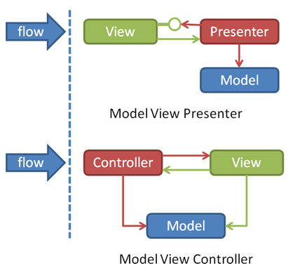
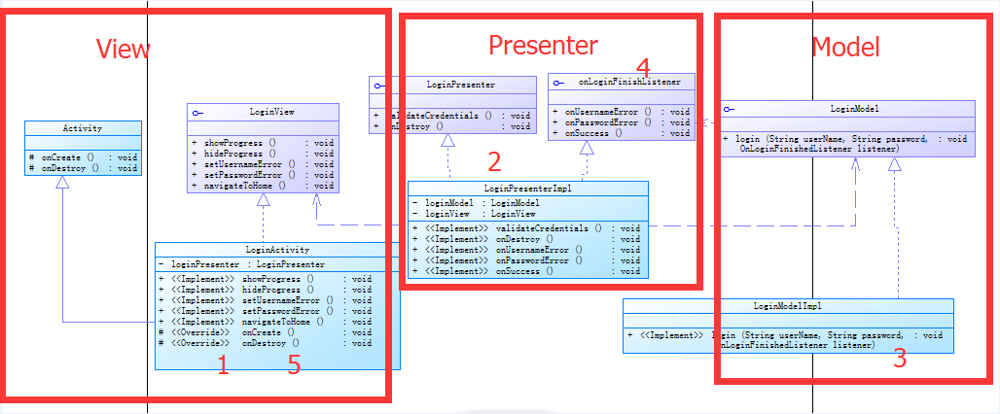
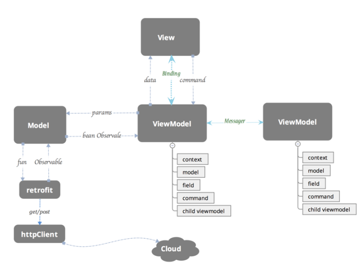
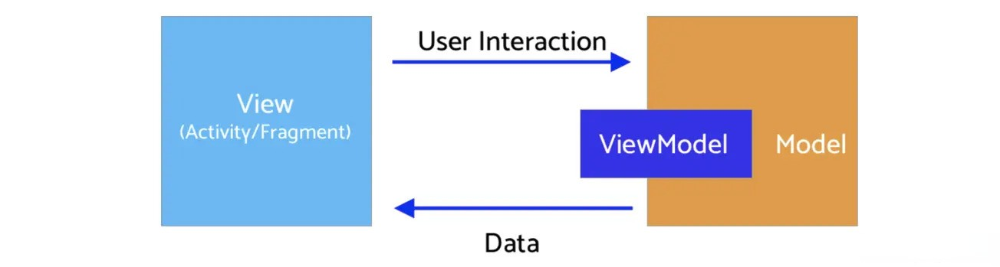
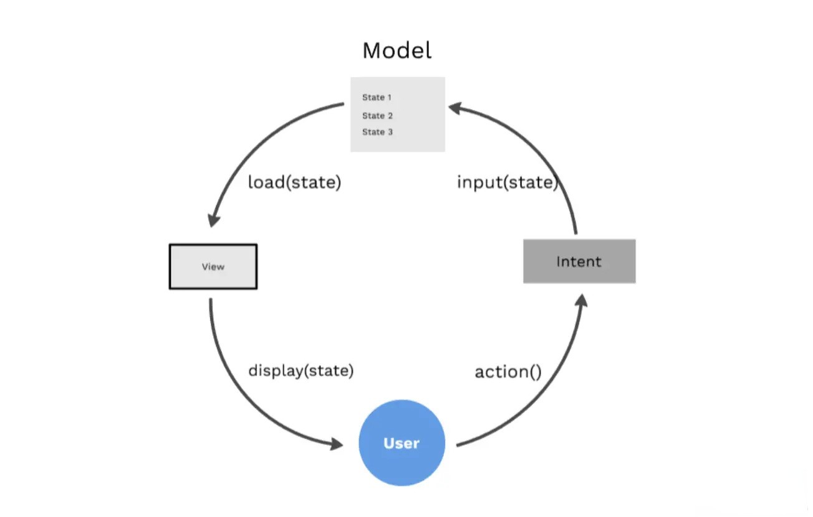

## MVC 对比MVP

>其实最明显的区别就是，MVC中是允许Model和View进行交互的，而MVP中很明显，Model与View之间的交互由Presenter完成。还有一点就是Presenter与View之间的交互是通过接口的。
## MVC
```java
public class MvcLoginActivity extends AppCompatActivity {
    private EditText userNameEt;
    private EditText passwordEt;
    private User user;
 
    @Override
    protected void onCreate(Bundle savedInstanceState) {
        super.onCreate(savedInstanceState);
        setContentView(R.layout.activity_mvc_login);
 
        user = new User();
        userNameEt = findViewById(R.id.user_name_et);
        passwordEt = findViewById(R.id.password_et);
        Button loginBtn = findViewById(R.id.login_btn);
 
        loginBtn.setOnClickListener(new View.OnClickListener() {
            @Override
            public void onClick(View view) {
                login(userNameEt.getText().toString(), passwordEt.getText().toString());
            }
        });
    }
 
    private void login(String userName, String password) {
        if (userName.equals("jere") && password.equals("123")) {
            user.setUserName(userName);
            user.setPassword(password);
            Toast.makeText(MvcLoginActivity.this,
                    userName + " Login Successful",
                    Toast.LENGTH_SHORT)
                    .show();
        } else {
            Toast.makeText(MvcLoginActivity.this,
                    "Login Failed",
                    Toast.LENGTH_SHORT)
                    .show();
        }
    }
}
```
>所有操作都在Activity中
## MVP
### Model层
提供我们想要展示在view层的数据和具体登陆业务逻辑处理的实现
```java
/**
Class Note:模拟登陆的操作的接口，实现类为LoginModelImpl.相当于MVP模式中的Model层
**/
public interface LoginModel {
    void login(String username, String password, OnLoginFinishedListener listener);
}
```
```java
import android.os.Handler;
import android.text.TextUtils;
/**
 * Class Note:延时模拟登陆（2s），如果名字或者密码为空则登陆失败，否则登陆成功
 */
public class LoginModelImpl implements LoginModel {

    @Override
    public void login(final String username, final String password, final OnLoginFinishedListener listener) {

        new Handler().postDelayed(new Runnable() {
            @Override public void run() {
                boolean error = false;
                if (TextUtils.isEmpty(username)){
                    listener.onUsernameError();//model层里面回调listener
                    error = true;
                }
                if (TextUtils.isEmpty(password)){
                    listener.onPasswordError();
                    error = true;
                }
                if (!error){
                    listener.onSuccess();
                }
            }
        }, 2000);
    }
}
```
### View层
负责显示数据、提供友好界面跟用户交互就行。MVP下Activity和Fragment以及View的子类体现在了这一 层，Activity一般也就做加载UI视图、设置监听再交由Presenter处理的一些工作，所以也就需要持有相应Presenter的引用。本层所需要做的操作就是在每一次有相应交互的时候，调用presenter的相关方法就行。
```java
package com.nsu.edu.androidmvpdemo.login;

/**
 * Class Note:登陆View的接口，实现类也就是登陆的activity
 */
public interface LoginView {
    void showProgress();

    void hideProgress();

    void setUsernameError();

    void setPasswordError();

    void navigateToHome();
}
```
```java
import android.app.Activity;
import android.content.Intent;
import android.os.Bundle;
import android.view.View;
import android.widget.EditText;
import android.widget.ProgressBar;
import android.widget.Toast;

import com.nsu.edu.androidmvpdemo.R;

/**
 * Class Note:MVP模式中View层对应一个activity，这里是登陆的activity
 */
public class LoginActivity extends Activity implements LoginView, View.OnClickListener {

    private ProgressBar progressBar;
    private EditText username;
    private EditText password;
    private LoginPresenter presenter;

    @Override
    protected void onCreate(Bundle savedInstanceState) {
        super.onCreate(savedInstanceState);
        setContentView(R.layout.activity_login);

        progressBar = (ProgressBar) findViewById(R.id.progress);
        username = (EditText) findViewById(R.id.username);
        password = (EditText) findViewById(R.id.password);
        findViewById(R.id.button).setOnClickListener(this);

        presenter = new LoginPresenterImpl(this);
    }

    @Override
    protected void onDestroy() {
        presenter.onDestroy();
        super.onDestroy();
    }

    @Override
    public void showProgress() {
        progressBar.setVisibility(View.VISIBLE);
    }

    @Override
    public void hideProgress() {
        progressBar.setVisibility(View.GONE);
    }

    @Override
    public void setUsernameError() {
        username.setError(getString(R.string.username_error));
    }

    @Override
    public void setPasswordError() {
        password.setError(getString(R.string.password_error));
    }

    @Override
    public void navigateToHome() {
// TODO       startActivity(new Intent(this, MainActivity.class));
        Toast.makeText(this,"login success",Toast.LENGTH_SHORT).show();
//        finish();
    }

    @Override
    public void onClick(View v) {
        presenter.validateCredentials(username.getText().toString(), password.getText().toString());
    }

}

```
### Presenter层
Presenter扮演着view和model的中间层的角色。获取model层的数据之后构建view层；也可以收到view层UI上的反馈命令后分发处理逻辑，交给model层做业务操作。它也可以决定View层的各种操作。
```java
/**
 * Class Note:登陆的Presenter 的接口，实现类为LoginPresenterImpl，完成登陆的验证，以及销毁当前view
 */
public interface LoginPresenter {
    void validateCredentials(String username, String password);

    void onDestroy();
}
```
```java
/**
 * Class Note:
 * 1 完成presenter的实现。这里面主要是Model层和View层的交互和操作。
 * 2  presenter里面还有个OnLoginFinishedListener，
 * 其在Presenter层实现，给Model层回调，更改View层的状态，
 * 确保 Model层不直接操作View层。如果没有这一接口在LoginPresenterImpl实现的话，
 * LoginPresenterImpl只 有View和Model的引用那么Model怎么把结果告诉View呢？
 */
public class LoginPresenterImpl implements LoginPresenter, OnLoginFinishedListener {
    private LoginView loginView;
    private LoginModel loginModel;

    public LoginPresenterImpl(LoginView loginView) {
        this.loginView = loginView;
        this.loginModel = new LoginModelImpl();
    }

    @Override
    public void validateCredentials(String username, String password) {
        if (loginView != null) {
            loginView.showProgress();
        }

        loginModel.login(username, password, this);
    }

    @Override
    public void onDestroy() {
        loginView = null;
    }

    @Override
    public void onUsernameError() {
        if (loginView != null) {
            loginView.setUsernameError();
            loginView.hideProgress();
        }
    }

    @Override
    public void onPasswordError() {
        if (loginView != null) {
            loginView.setPasswordError();
            loginView.hideProgress();
        }
    }

    @Override
    public void onSuccess() {
        if (loginView != null) {
            loginView.navigateToHome();
        }
    }
}
```
### 登录回调
```java
/**
 * Class Note:登陆事件监听
 */
public interface OnLoginFinishedListener {

    void onUsernameError();

    void onPasswordError();

    void onSuccess();
}
```
### MVP流程分析
1. Activity做了一些UI初始化的东西并需要实例化对应LoginPresenter的引用和实现 LoginView的接口，监听界面动作
2. 登陆按钮按下后即接收到登陆的事件，在onClick里接收到即通过LoginPresenter的引用把它交给LoginPresenter处理。LoginPresenter接收到了登陆的逻辑就知道要登陆了
3. 然后LoginPresenter显示进度条并且把逻辑交给我们的Model去处理，也就是这里面的LoginModel，（LoginModel的实现类LoginModelImpl），同时会把OnLoginFinishedListener也就是LoginPresenter自身传递给我们的Model（LoginModel）。
4. LoginModel处理完逻辑之后，结果通过OnLoginFinishedListener回调通知LoginPresenter
5. LoginPresenter再把结果返回给view层的Activity，最后activity显示结果

## MVVM

### Model
Model层最大的特点是被赋予了数据获取的职责，与我们平常Model层只定义实体对象的行为截然不同。实例中，数据的获取、存储、数据状态变化都是Model层的任务。Model包括实体模型（Bean）、Retrofit的Service ，获取网络数据接口，本地存储（增删改查）接口，数据变化监听等。Model提供数据获取接口供ViewModel调用，经数据转换和操作并最终映射绑定到View层某个UI元素的属性上。

### View
View层做的就是和UI相关的工作，我们只在XML、Activity和Fragment写View层的代码，View层不做和业务相关的事，也就是我们在Activity不写业务逻辑和业务数据相关的代码，更新UI通过数据绑定实现，尽量在ViewModel里面做（更新绑定的数据源即可），Activity要做的事就是初始化一些控件（如控件的颜色，添加RecyclerView的分割线），View层可以提供更新UI的接口（但是我们更倾向所有的UI元素都是通过数据来驱动更改UI），View层可以处理事件（但是我们更希望UI事件通过Command来绑定）。**简单地说：View层不做任何业务逻辑、不涉及操作数据、不处理数据，UI和数据严格的分开。**
```java
public class MvvmLoginActivity extends AppCompatActivity {
    private LoginViewModel loginVM;
    private EditText userNameEt;
    private EditText passwordEt;

    @Override
    protected void onCreate(Bundle savedInstanceState) {
        super.onCreate(savedInstanceState);
        setContentView(R.layout.activity_mvvm_login);

        userNameEt = findViewById(R.id.user_name_et);
        passwordEt = findViewById(R.id.password_et);
        Button loginBtn = findViewById(R.id.login_btn);
        loginBtn.setOnClickListener(new View.OnClickListener() {
            @Override
            public void onClick(View view) {
                loginVM.login(userNameEt.getText().toString(), passwordEt.getText().toString());
            }
        });

        loginVM = ViewModelProviders.of(this).get(LoginViewModel.class);
        loginVM.getIsLoginSuccessfulLD().observe(this, loginObserver);
    }

    private Observer<Boolean> loginObserver = new Observer<Boolean>() {
        @Override
        public void onChanged(@Nullable Boolean isLoginSuccessFul) {
            if (isLoginSuccessFul) {
                Toast.makeText(MvvmLoginActivity.this,
                        loginVM.getUserName() + " Login Successful",
                        Toast.LENGTH_SHORT)
                        .show();
            } else {
                Toast.makeText(MvvmLoginActivity.this,
                        "Login Failed",
                        Toast.LENGTH_SHORT)
                        .show();
            }
        }
    };
}
```
### ViewModel
ViewModel层做的事情刚好和View层相反，ViewModel只做和业务逻辑和业务数据相关的事，不做任何和UI相关的事情，ViewModel 层不会持有任何控件的引用，更不会在ViewModel中通过UI控件的引用去做更新UI的事情。ViewModel就是专注于业务的逻辑处理，做的事情也都只是对数据的操作（这些数据绑定在相应的控件上会自动去更改UI）。同时DataBinding框架已经支持双向绑定，让我们可以通过双向绑定获取View层反馈给ViewModel层的数据，并对这些数据上进行操作。关于对UI控件事件的处理，我们也希望能把这些事件处理绑定到控件上，并把这些事件的处理统一化，为此我们通过BindingAdapter对一些常用的事件做了封装，把一个个事件封装成一个个Command，对于每个事件我们用一个ReplyCommand去处理就行了，ReplyCommand会把你可能需要的数据带给你，这使得我们在ViewModel层处理事件的时候只需要关心处理数据就行了。再强调一遍：ViewModel 不做和UI相关的事。
```java
public class LoginViewModel extends ViewModel {
    private User user;
    private MutableLiveData<Boolean> isLoginSuccessfulLD;

    public LoginViewModel() {
        this.isLoginSuccessfulLD = new MutableLiveData<>();
        user = new User();
    }

    public MutableLiveData<Boolean> getIsLoginSuccessfulLD() {
        return isLoginSuccessfulLD;
    }

    public void setIsLoginSuccessfulLD(boolean isLoginSuccessful) {
        isLoginSuccessfulLD.postValue(isLoginSuccessful);
    }

    public void login(String userName, String password) {
        if (userName.equals("jere") && password.equals("123")) {
            user.setUserName(userName);
            user.setPassword(password);
            setIsLoginSuccessfulLD(true);
        } else {
            setIsLoginSuccessfulLD(false);
        }
    }

    public String getUserName() {
        return user.getUserName();
    }
}
```
## MVI

* **Model:** 与其他MVVM中的Model不同的是，MVI的Model主要指UI状态（State）。当前界面展示的内容无非就是UI状态的一个快照：例如数据加载过程、控件位置等都是一种UI状态
* **View:** 与其他MVX中的View一致，可能是一个Activity、Fragment或者任意UI承载单元。MVI中的View通过订阅Intent的变化实现界面刷新（不是Activity的Intent、后面介绍）
* **Intent:** 此Intent不是Activity的Intent，用户的任何操作都被包装成Intent后发送给Model进行数据请求
### 单向数据流
用户操作以Intent的形式通知Model => Model基于Intent更新State => View接收到State变化刷新UI。

数据永远在一个环形结构中单向流动，不能反向流动：

这种单向数据流结构的MVI有什么优缺点呢？


* 优点

UI的所有变化来自State，所以只需聚焦State，架构更简单、易于调试
数据单向流动，很容易对状态变化进行跟踪和回溯
state实例都是不可变的，确保线程安全
UI只是反应State的变化，没有额外逻辑，可以被轻松替换或复用


* 缺点

所有的操作最终都会转换成State，所以当复杂页面的State容易膨胀
state是不变的，每当state需要更新时都要创建新对象替代老对象，这会带来一定内存开销
有些事件类的UI变化不适合用state描述，例如弹出一个toast或者snackbar
### Sample
#### 依赖库
```csharp
// Added Dependencies
implementation "androidx.recyclerview:recyclerview:1.1.0"
implementation 'android.arch.lifecycle:extensions:1.1.1'
implementation 'androidx.lifecycle:lifecycle-viewmodel-ktx:2.2.0'
implementation 'androidx.lifecycle:lifecycle-runtime-ktx:2.2.0'
implementation 'com.github.bumptech.glide:glide:4.11.0'

//retrofit
implementation 'com.squareup.retrofit2:retrofit:2.8.1'
implementation "com.squareup.retrofit2:converter-moshi:2.6.2"

//Coroutine
implementation "org.jetbrains.kotlinx:kotlinx-coroutines-android:1.3.6"
implementation "org.jetbrains.kotlinx:kotlinx-coroutines-core:1.3.6"
```
使用以下API
```kotlin
https://reqres.in/api/users
```
#### 数据层
##### User
User的data class
```kotlin
data class User(
    @Json(name = "id")
    val id: Int = 0,
    @Json(name = "first_name")
    val name: String = "",
    @Json(name = "email")
    val email: String = "",
    @Json(name = "avator")
    val avator: String = ""
)
```
##### ApiService
定义ApiService，``getUsers``方法进行数据请求
```kotlin
interface ApiService {

   @GET("users")
   suspend fun getUsers(): List<User>
}
```
##### Retrofit
```kotlin

object RetrofitBuilder {

    private const val BASE_URL = "https://reqres.in/api/user/1"

    private fun getRetrofit() = Retrofit.Builder()
        .baseUrl(BASE_URL)
        .addConverterFactory(MoshiConverterFactory.create())
        .build()


    val apiService: ApiService = getRetrofit().create(ApiService::class.java)

}
```
##### Repository
定义Repository，封装API请求的具体实现
```kotlin

class MainRepository(private val apiService: ApiService) {

    suspend fun getUsers() = apiService.getUsers()

}
```
#### UI层
包括View、ViewModel以及Intent的定义
##### RecyclerView.Adapter
首先，需要一个RecyclerView来呈现列表结果，定义MainAdapter如下：
```kotlin
class MainAdapter(
    private val users: ArrayList<User>
) : RecyclerView.Adapter<MainAdapter.DataViewHolder>() {

    class DataViewHolder(itemView: View) : RecyclerView.ViewHolder(itemView) {
        fun bind(user: User) {
            itemView.textViewUserName.text = user.name
            itemView.textViewUserEmail.text = user.email
            Glide.with(itemView.imageViewAvatar.context)
                .load(user.avatar)
                .into(itemView.imageViewAvatar)
        }
    }

    override fun onCreateViewHolder(parent: ViewGroup, viewType: Int) =
        DataViewHolder(
            LayoutInflater.from(parent.context).inflate(
                R.layout.item_layout, parent,
                false
            )
        )

    override fun getItemCount(): Int = users.size

    override fun onBindViewHolder(holder: DataViewHolder, position: Int) =
        holder.bind(users[position])

    fun addData(list: List<User>) {
        users.addAll(list)
    }

}

```
item_layout.xml
```xml
<?xml version="1.0" encoding="utf-8"?>
<androidx.constraintlayout.widget.ConstraintLayout xmlns:android="http://schemas.android.com/apk/res/android"
    xmlns:app="http://schemas.android.com/apk/res-auto"
    xmlns:tools="http://schemas.android.com/tools"
    android:id="@+id/container"
    android:layout_width="match_parent"
    android:layout_height="60dp">

    <ImageView
        android:id="@+id/imageViewAvatar"
        android:layout_width="60dp"
        android:layout_height="0dp"
        android:padding="4dp"
        app:layout_constraintBottom_toBottomOf="parent"
        app:layout_constraintStart_toStartOf="parent"
        app:layout_constraintTop_toTopOf="parent" />

    <androidx.appcompat.widget.AppCompatTextView
        android:id="@+id/textViewUserName"
        style="@style/TextAppearance.AppCompat.Large"
        android:layout_width="0dp"
        android:layout_height="wrap_content"
        android:layout_marginStart="8dp"
        android:layout_marginTop="4dp"
        app:layout_constraintEnd_toEndOf="parent"
        app:layout_constraintStart_toEndOf="@+id/imageViewAvatar"
        app:layout_constraintTop_toTopOf="parent"/>

    <androidx.appcompat.widget.AppCompatTextView
        android:id="@+id/textViewUserEmail"
        android:layout_width="0dp"
        android:layout_height="wrap_content"
        app:layout_constraintEnd_toEndOf="parent"
        app:layout_constraintStart_toStartOf="@+id/textViewUserName"
        app:layout_constraintTop_toBottomOf="@+id/textViewUserName" />

</androidx.constraintlayout.widget.ConstraintLayout>

```
##### Intent
定义Intent用来包装用户Action
```kotlin
sealed class MainIntent {

    object FetchUser : MainIntent()

}
```
##### State
定义UI层的State结构体
```kotlin
sealed class MainState {

    object Idle : MainState()
    object Loading : MainState()
    data class Users(val user: List<User>) : MainState()
    data class Error(val error: String?) : MainState()

}
```
##### ViewModel
ViewModel是MVI的核心，存放和管理State，同时接受Intent并进行数据请求
```kotlin
class MainViewModel(
    private val repository: MainRepository
) : ViewModel() {

    val userIntent = Channel<MainIntent>(Channel.UNLIMITED)
    private val _state = MutableStateFlow<MainState>(MainState.Idle)
    val state: StateFlow<MainState>
        get() = _state

    init {
        handleIntent()
    }

    private fun handleIntent() {
        viewModelScope.launch {
            userIntent.consumeAsFlow().collect {
                when (it) {
                    is MainIntent.FetchUser -> fetchUser()
                }
            }
        }
    }

    private fun fetchUser() {
        viewModelScope.launch {
            _state.value = MainState.Loading
            _state.value = try {
                MainState.Users(repository.getUsers())
            } catch (e: Exception) {
                MainState.Error(e.localizedMessage)
            }
        }
    }
}
```
我们在`handleIntent`中订阅`userIntent`并根据Action类型执行相应操作。本case中当出现`FetchUser`的Action时，调用`fetchUser`方法请求用户数据。用户数据返回后，会更新State，`MainActivity`订阅此State并刷新界面。
##### ViewModelFactory
构造ViewModel需要Repository，所以通过ViewModelFactory注入必要的依赖
```kotlin
class ViewModelFactory(private val apiService: ApiService) : ViewModelProvider.Factory {

    override fun <T : ViewModel?> create(modelClass: Class<T>): T {
        if (modelClass.isAssignableFrom(MainViewModel::class.java)) {
            return MainViewModel(MainRepository(apiService)) as T
        }
        throw IllegalArgumentException("Unknown class name")
    }

}
```
##### 定义MainActivity
```kotlin
class MainActivity : AppCompatActivity() {

    private lateinit var mainViewModel: MainViewModel
    private var adapter = MainAdapter(arrayListOf())

    override fun onCreate(savedInstanceState: Bundle?) {
        super.onCreate(savedInstanceState)
        setContentView(R.layout.activity_main)
        setupUI()
        setupViewModel()
        observeViewModel()
        setupClicks()
    }

    private fun setupClicks() {
        buttonFetchUser.setOnClickListener {
            lifecycleScope.launch {
                mainViewModel.userIntent.send(MainIntent.FetchUser)
            }
        }
    }


    private fun setupUI() {
        recyclerView.layoutManager = LinearLayoutManager(this)
        recyclerView.run {
            addItemDecoration(
                DividerItemDecoration(
                    recyclerView.context,
                    (recyclerView.layoutManager as LinearLayoutManager).orientation
                )
            )
        }
        recyclerView.adapter = adapter
    }


    private fun setupViewModel() {
        mainViewModel = ViewModelProviders.of(
            this,
            ViewModelFactory(
                ApiHelperImpl(
                    RetrofitBuilder.apiService
                )
            )
        ).get(MainViewModel::class.java)
    }

    private fun observeViewModel() {
        lifecycleScope.launch {
            mainViewModel.state.collect {
                when (it) {
                    is MainState.Idle -> {

                    }
                    is MainState.Loading -> {
                        buttonFetchUser.visibility = View.GONE
                        progressBar.visibility = View.VISIBLE
                    }

                    is MainState.Users -> {
                        progressBar.visibility = View.GONE
                        buttonFetchUser.visibility = View.GONE
                        renderList(it.user)
                    }
                    is MainState.Error -> {
                        progressBar.visibility = View.GONE
                        buttonFetchUser.visibility = View.VISIBLE
                        Toast.makeText(this@MainActivity, it.error, Toast.LENGTH_LONG).show()
                    }
                }
            }
        }
    }

    private fun renderList(users: List<User>) {
        recyclerView.visibility = View.VISIBLE
        users.let { listOfUsers -> listOfUsers.let { adapter.addData(it) } }
        adapter.notifyDataSetChanged()
    }
}

```
MainActivity中订阅mainViewModel.state，根据State处理各种UI显示和刷新。
##### activity_main.xml
```xml
<?xml version="1.0" encoding="utf-8"?>
<androidx.constraintlayout.widget.ConstraintLayout xmlns:android="http://schemas.android.com/apk/res/android"
    xmlns:app="http://schemas.android.com/apk/res-auto"
    xmlns:tools="http://schemas.android.com/tools"
    android:layout_width="match_parent"
    android:layout_height="match_parent"
    tools:context=".ui.main.view.MainActivity">

    <androidx.recyclerview.widget.RecyclerView
        android:id="@+id/recyclerView"
        android:layout_width="match_parent"
        android:layout_height="match_parent"
        android:visibility="gone" />

    <ProgressBar
        android:id="@+id/progressBar"
        android:layout_width="wrap_content"
        android:layout_height="wrap_content"
        app:layout_constraintBottom_toBottomOf="parent"
        app:layout_constraintEnd_toEndOf="parent"
        android:visibility="gone"
        app:layout_constraintStart_toStartOf="parent"
        app:layout_constraintTop_toTopOf="parent" />

    <Button
        android:id="@+id/buttonFetchUser"
        android:layout_width="wrap_content"
        android:layout_height="wrap_content"
        android:text="@string/fetch_user"
        app:layout_constraintBottom_toBottomOf="parent"
        app:layout_constraintEnd_toEndOf="parent"
        app:layout_constraintStart_toStartOf="parent"
        app:layout_constraintTop_toTopOf="parent" />

</androidx.constraintlayout.widget.ConstraintLayout>
```