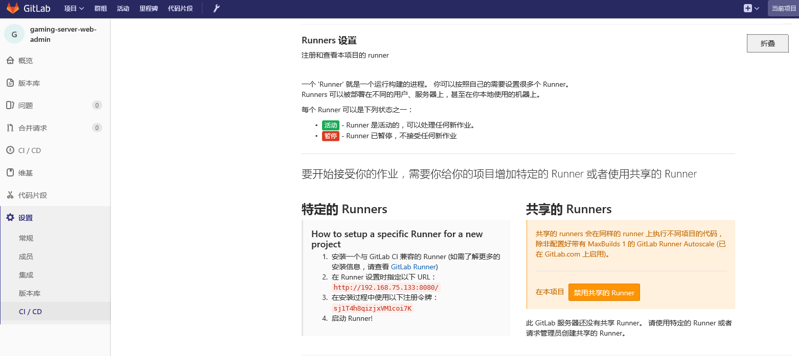
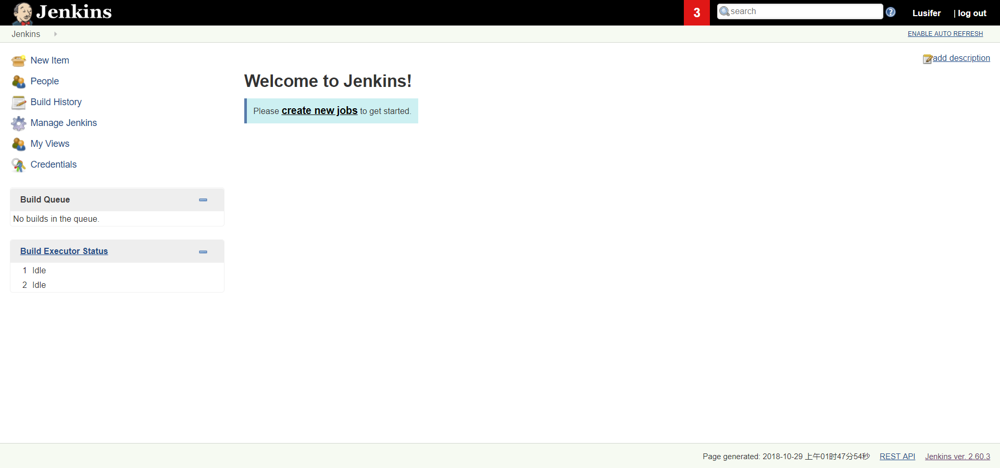
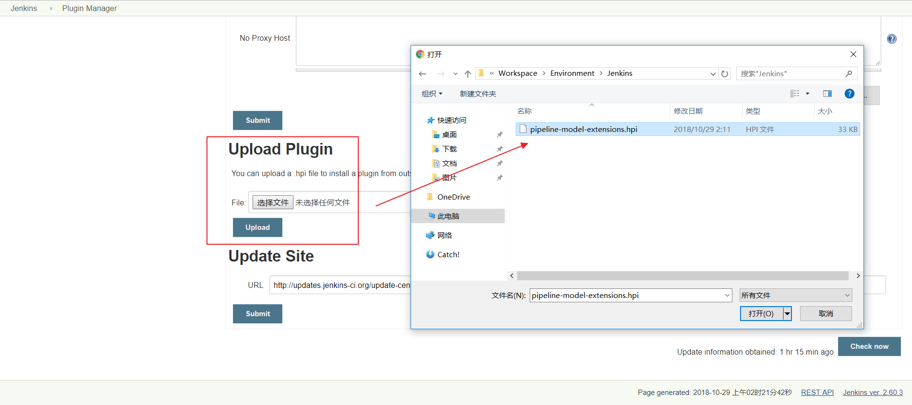
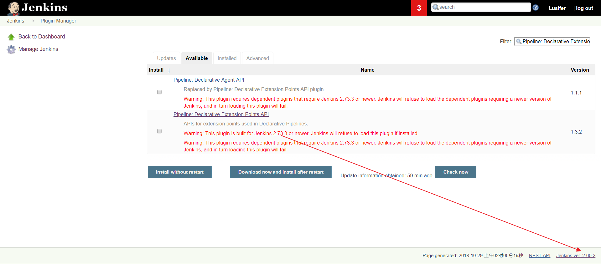

## 基于 Docker 安装 GitLab Runner  
### 环境准备
* 创建工作目录 /usr/local/docker/runner
* 创建构建目录 /usr/local/docker/runner/environment
* 下载 jdk-8u152-linux-x64.tar.gz 并复制到 /usr/local/docker/runner/environment
* 下载 apache-maven-3.5.3-bin.tar.gz 并复制到 /usr/local/docker/runner/environment

### daemon.json
在 /usr/local/docker/runner/environment 目录下创建 daemon.json，用于配置加速器和仓库地址
```json
{
  "registry-mirrors": [
    "https://registry.docker-cn.com"
  ],
  "insecure-registries": [
    "192.168.10.133:5000"
  ]
}
```

### Dockerfile
在 /usr/local/docker/runner/environment 目录下创建 Dockerfile
```dockerfile
FROM gitlab/gitlab-runner
MAINTAINER maodou38 <maodoulove19950815@vip.qq.com>
# 修改软件源
RUN echo 'deb http://mirrors.aliyun.com/ubuntu/ xenial main restricted universe multiverse' > /etc/apt/sources.list && \
    echo 'deb http://mirrors.aliyun.com/ubuntu/ xenial-security main restricted universe multiverse' >> /etc/apt/sources.list && \
    echo 'deb http://mirrors.aliyun.com/ubuntu/ xenial-updates main restricted universe multiverse' >> /etc/apt/sources.list && \
    echo 'deb http://mirrors.aliyun.com/ubuntu/ xenial-backports main restricted universe multiverse' >> /etc/apt/sources.list && \
    apt-get update -y && \
    apt-get clean

# 安装 Docker
RUN apt-get -y install apt-transport-https ca-certificates curl software-properties-common && \
    curl -fsSL http://mirrors.aliyun.com/docker-ce/linux/ubuntu/gpg | apt-key add - && \
    add-apt-repository "deb [arch=amd64] http://mirrors.aliyun.com/docker-ce/linux/ubuntu $(lsb_release -cs) stable" && \
    apt-get update -y && \
    apt-get install -y docker-ce
COPY daemon.json /etc/docker/daemon.json

# 安装 Docker Compose
WORKDIR /usr/local/bin
RUN wget https://raw.githubusercontent.com/topsale/resources/master/docker/docker-compose
RUN chmod +x docker-compose

# 安装 Java
RUN mkdir -p /usr/local/java
WORKDIR /usr/local/java
COPY jdk-8u152-linux-x64.tar.gz /usr/local/java
RUN tar -zxvf jdk-8u152-linux-x64.tar.gz && \
    rm -fr jdk-8u152-linux-x64.tar.gz

# 安装 Maven
RUN mkdir -p /usr/local/maven
WORKDIR /usr/local/maven
# RUN wget https://raw.githubusercontent.com/topsale/resources/master/maven/apache-maven-3.5.3-bin.tar.gz
COPY apache-maven-3.5.3-bin.tar.gz /usr/local/maven
RUN tar -zxvf apache-maven-3.5.3-bin.tar.gz && \
    rm -fr apache-maven-3.5.3-bin.tar.gz
# COPY settings.xml /usr/local/maven/apache-maven-3.5.3/conf/settings.xml

# 配置环境变量
ENV JAVA_HOME /usr/local/java/jdk1.8.0_152
ENV MAVEN_HOME /usr/local/maven/apache-maven-3.5.3
ENV PATH $PATH:$JAVA_HOME/bin:$MAVEN_HOME/bin

WORKDIR /
```

### docker-compose.yml
在 /usr/local/docker/runner 目录下创建 docker-compose.yml
```docker-compse
version: '3.1'
services:
  gitlab-runner:
    build: environment
    restart: always
    container_name: gitlab-runner
    privileged: true
    volumes:
      - ./config:/etc/gitlab-runner
      - /var/run/docker.sock:/var/run/docker.sock
```

### 注册 Runner
```docker
docker exec -it gitlab-runner gitlab-runner register

# 输入 GitLab 地址
Please enter the gitlab-ci coordinator URL (e.g. https://gitlab.com/):
http://192.168.10.132/

# 输入 GitLab Token
Please enter the gitlab-ci token for this runner:
1Lxq_f1NRfCfeNbE5WRh

# 输入 Runner 的说明
Please enter the gitlab-ci description for this runner:
可以为空

# 设置 Tag，可以用于指定在构建规定的 tag 时触发 ci
Please enter the gitlab-ci tags for this runner (comma separated):
deploy

# 这里选择 true ，可以用于代码上传后直接执行
Whether to run untagged builds [true/false]:
true

# 这里选择 false，可以直接回车，默认为 false
Whether to lock Runner to current project [true/false]:
false

# 选择 runner 执行器，这里我们选择的是 shell
Please enter the executor: virtualbox, docker+machine, parallels, shell, ssh, docker-ssh+machine, kubernetes, docker, docker-ssh:
shell
```

### 使用 Runner  

- GitLab CI 地址与令牌参数
项目 –> 设置 –> CI/CD –> Runner 设置


- .gitlab-ci.yml  
在项目工程下编写 .gitlab-ci.yml 配置文件：
```
stages:
  - install_deps
  - test
  - build
  - deploy_test
  - deploy_production

cache:
  key: ${CI_BUILD_REF_NAME}
  paths:
    - node_modules/
    - dist/

# 安装依赖
install_deps:
  stage: install_deps
  only:
    - develop
    - master
  script:
    - npm install

# 运行测试用例
test:
  stage: test
  only:
    - develop
    - master
  script:
    - npm run test

# 编译
build:
  stage: build
  only:
    - develop
    - master
  script:
    - npm run clean
    - npm run build:client
    - npm run build:server

# 部署测试服务器
deploy_test:
  stage: deploy_test
  only:
    - develop
  script:
    - pm2 delete app || true
    - pm2 start app.js --name app

# 部署生产服务器
deploy_production:
  stage: deploy_production
  only:
    - master
  script:
    - bash scripts/deploy/deploy.sh
```
上面的配置把一次 Pipeline 分成五个阶段：
* 安装依赖(install_deps)
* 运行测试(test)
* 编译(build)
* 部署测试服务器(deploy_test)
* 部署生产服务器(deploy_production)

注意： 设置 Job.only 后，只有当 develop 分支和 master 分支有提交的时候才会触发相关的 Jobs。
节点说明：
  * stages：定义构建阶段，这里只有一个阶段 deploy
  * deploy：构建阶段 deploy 的详细配置也就是任务配置
  * script：需要执行的 shell 脚本
  * only：这里的 master 指在提交到 master 时执行
  * tags：与注册 runner 时的 tag 匹配

### 其它命令
* 删除注册信息
```gitlab-ci-multi-runner unregister --name "名称"```
* 查看注册列表
```gitlab-ci-multi-runner list```  

### Dockerfile示例
```
    FROM openjdk:8-jre

MAINTAINER maodou38 <maodoulove19950815@vip.qq.com>

ENV APP_VERSION 1.0.0-SNAPSHOT
ENV DOCKERIZE_VERSION v0.6.1
RUN wget https://github.com/jwilder/dockerize/releases/download/$DOCKERIZE_VERSION/dockerize-linux-amd64-$DOCKERIZE_VERSION.tar.gz \
    && tar -C /usr/local/bin -xzvf dockerize-linux-amd64-$DOCKERIZE_VERSION.tar.gz \
    && rm dockerize-linux-amd64-$DOCKERIZE_VERSION.tar.gz

RUN mkdir /app

COPY myshop-service-user-provider-$APP_VERSION.jar /app/app.jar
ENTRYPOINT ["dockerize", "-timeout", "5m", "-wait", "tcp://192.168.10.131:3306", "java", "-Djava.security.egd=file:/dev/./urandom", "-jar", "/app/app.jar"]

EXPOSE 8501
```


<span style="color:#F00"> DOCKERIZE是一个监听插件，监听依赖服务是否启动</span>


## 基于 Docker 安装 Jenkins

### docker-compose
Jenkins 是一个简单易用的持续集成软件平台，我们依然采用 Docker 的方式部署，docker-compose.yml 配置文件如下：
```
version: '3.1'
services:
  jenkins:
    restart: always
    image: jenkinsci/jenkins
    container_name: jenkins
    ports:
      # 发布端口
      - 8080:8080
      # 基于 JNLP 的 Jenkins 代理通过 TCP 端口 50000 与 Jenkins master 进行通信
      - 50000:50000
    environment:
      TZ: Asia/Shanghai
    volumes:
      - ./data:/var/jenkins_home
```
安装过程中会出现 Docker 数据卷 权限问题，用以下命令解决：
```
chown -R 1000 /usr/local/docker/jenkins/data
```
### 解锁 Jenkins
Jenkins 第一次启动时需要输入一个初始密码用以解锁安装流程，使用 docker logs jenkins 即可方便的查看到初始密码


注意： 安装时可能会因为网速等原因导致安装时间比较长，请大家耐心等待。如果长时间停留在安装页没反应，请尝试使用 F5 刷新一下。

### 使用自定义插件的方式安装
插件是 Jenkins 的核心，其丰富的插件（截止到 2018.10.29 共有 77350 个插件）可以满足不同人群的不同需求

插件地址：https://plugins.jenkins.io/


注意： 除了默认勾选的插件外，一定要勾选 Publish over SSH 插件，这是我们实现持续交付的重点插件。


__开始安装了，根据网络情况，安装时间可能会比较长，请耐心等待__


__很多插件装不上怎么办？不要慌，记住这些插件的名字，咱们稍后可以手动安装__


### 安装成功效果图
创建管理员


安装完成，进入首页


### 附：Jenkins 手动安装插件
- 使用插件管理器安装
Manage Jenkins -> Manage Plugins -> Avaliable


过滤出想要安装的插件，然后点击 Download now and install after restart


- 手动上传 .hpi 文件
点击进入插件中心


点击 Archives


下载需要的版本


在插件管理器中选择 Advanced


选择上传即可


### 重启 Jenkins
```
docker-compose down
docker-compose up -d
```
注意： 请留意需要下载插件的警告信息，如果不满足安装条件，Jenkins 是会拒绝安装的。如下图：

