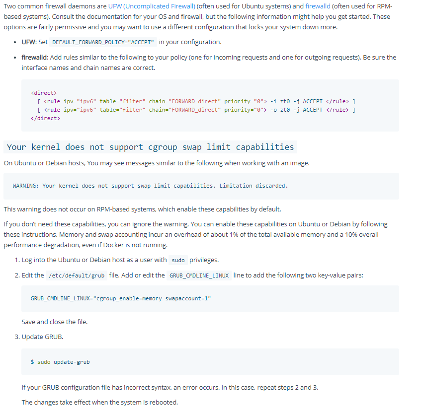

## 配置
> 修改/etc/docker/daemon.json (不推荐)
```
  {
    "hosts": ["unix:///var/run/docker.sock", "tcp://0.0.0.0:2375"]
    }
```
* 如果使用service启动的docker，并不会生效，会报配置错误
> 修改service配置
```
sudo systemctl edit docker.service
```
打开一个覆盖docker.service的配置文件
```
[Service]
ExecStart=
ExecStart=/usr/bin/dockerd -H fd:// -H tcp://0.0.0.0:2375
```
保存，重启systemctl配置
```
sudo systemctl daemon-reload
```
重启docker
```
sudo systemctl restart docker.service
```
检查端口是否开启
```
$ sudo netstat -nltp | grep dockerd
tcp6       0      0 :::2375                 :::*                    LISTEN
```
## 防火墙开启对应端口
- 官网

- centos自定义Service
创建/etc/firewalld/services/docker.xml
```
<?xml version="1.0" encoding="utf-8"?>
<service>
     <short>docker</short>
      <description>docker daemon for remote access</description>
      <port protocol="tcp" port="2375"/>
 </service>
```
查看默认zone(一般是public) 
```
firewall-cmd --get-default-zone
```
在zone中加入这个service
```
firewall-cmd --zone=public --add-service=docker --permanent
```
重新加载
```
firewall-cmd --reload
```
