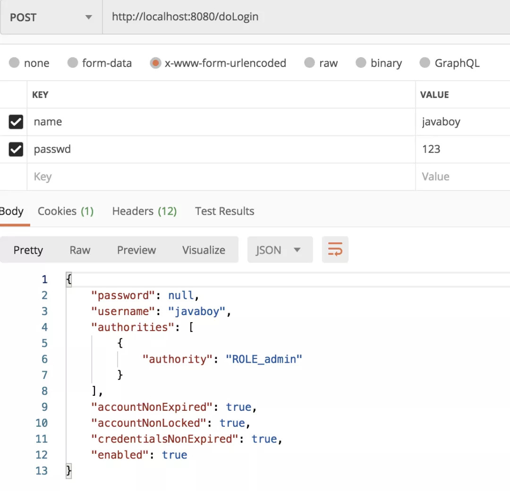

## 登录流程
### 无处不在的 Authentication
在 Spring Security 中有一个非常重要的对象叫做 Authentication，我们可以在任何地方注入 Authentication 进而获取到当前登录用户信息，Authentication 本身是一个接口，它有很多实现类：


> 最常用的是`UsernamePasswordAuthenticationToken`
### 登录流程
认证与授权的相关校验都是在一系列的过滤器链中完成的，在这一系列的过滤器链中，和认证相关的过滤器就是`UsernamePasswordAuthenticationFilter`,其中几个重要方法详解:
```java
public class UsernamePasswordAuthenticationFilter extends
		AbstractAuthenticationProcessingFilter {
	public UsernamePasswordAuthenticationFilter() {
		super(new AntPathRequestMatcher("/login", "POST"));
	}
	public Authentication attemptAuthentication(HttpServletRequest request,
			HttpServletResponse response) throws AuthenticationException {
		String username = obtainUsername(request);
		String password = obtainPassword(request);
		UsernamePasswordAuthenticationToken authRequest = new UsernamePasswordAuthenticationToken(
				username, password);
		setDetails(request, authRequest);
		returnthis.getAuthenticationManager().authenticate(authRequest);
	}
	protected String obtainPassword(HttpServletRequest request) {
		return request.getParameter(passwordParameter);
	}
	protected String obtainUsername(HttpServletRequest request) {
		return request.getParameter(usernameParameter);
	}
	protected void setDetails(HttpServletRequest request,
			UsernamePasswordAuthenticationToken authRequest) {
		authRequest.setDetails(authenticationDetailsSource.buildDetails(request));
	}
}
```
根据这段源码我们可以看出：
1. 首先通过 `obtainUsername` 和 `obtainPassword` 方法提取出请求里边的用户名/密码出来，提取方式就是 `request.getParameter` ，这也是为什么 `Spring Security` 中默认的表单登录要通过` key/value `的形式传递参数，而不能传递 `JSON` 参数，如果像传递 `JSON` 参数，修改这里的逻辑即可。

2. 获取到请求里传递来的用户名/密码之后，接下来就构造一个 `UsernamePasswordAuthenticationToken` 对象，传入 `username` 和 `password`，`username` 对应了 `UsernamePasswordAuthenticationToken` 中的 `principal` 属性，而 `password` 则对应了它的 `credentials` 属性。

3. 接下来 `setDetails` 方法给 `details` `属性赋值，UsernamePasswordAuthenticationToken` 本身是没有 `details` 属性的，这个属性在它的父类 `AbstractAuthenticationToken` 中。`details` 是一个对象，这个对象里边放的是 `WebAuthenticationDetails` 实例，该实例主要描述了两个信息，请求的 `remoteAddress` 以及请求的 `sessionId。`

4. 最后一步，就是调用 `authenticate` 方法去做校验了。

<span style="color:red">请求的具体校验操作</span>

在前面的 `attemptAuthentication` 方法中，该方法的最后一步开始做校验，校验操作首先要获取到一个 `AuthenticationManager`，这里拿到的是 `ProviderManager` ，所以接下来我们就进入到 `ProviderManager` 的 `authenticate` 方法中，当然这个方法也比较长，我这里仅仅摘列出来几个重要的地方：

```java
public Authentication authenticate(Authentication authentication)
		throws AuthenticationException {
	Class<? extends Authentication> toTest = authentication.getClass();
	for (AuthenticationProvider provider : getProviders()) {
		if (!provider.supports(toTest)) {
			continue;
		}
		result = provider.authenticate(authentication);
		if (result != null) {
			copyDetails(authentication, result);
			break;
		}
	}
	if (result == null && parent != null) {
		result = parentResult = parent.authenticate(authentication);
	}
	if (result != null) {
		if (eraseCredentialsAfterAuthentication
				&& (result instanceof CredentialsContainer)) {
			((CredentialsContainer) result).eraseCredentials();
		}
		if (parentResult == null) {
			eventPublisher.publishAuthenticationSuccess(result);
		}
		return result;
	}
	throw lastException;
}
```
这个方法就比较魔幻了，因为几乎关于认证的重要逻辑都将在这里完成：

1. 首先获取 `authentication` 的 `Class`，判断当前 `provider` 是否支持该 `authentication`。
2. 如果支持，则调用 `provider` 的 `authenticate` 方法开始做校验，校验完成后，会返回一个新的 `Authentication`。一会来和大家捋这个方法的具体逻辑。
3. 这里的 `provider` 可能有多个，如果 `provider` 的 `authenticate` 方法没能正常返回一个 `Authentication`，则调用 `provider` 的 `parent` 的 `authenticate` 方法继续校验。
4. `copyDetails` 方法则用来把旧的 `Token` 的 `details` 属性拷贝到新的 `Token` 中来。
5. 接下来会调用 `eraseCredentials` 方法擦除凭证信息，也就是你的密码，这个擦除方法比较简单，就是将 `Token` 中的 `credentials` 属性置空。
6. 最后通过 `publishAuthenticationSuccess` 方法将登录成功的事件广播出去。

大致的流程，就是上面这样，在`for`循环中，第一次拿到的provider 是一个`AnonymousAuthenticationProvider`，这个`provider` 压根就不支持`UsernamePasswordAuthenticationToken`，也就是会直接在 `provider.supports` 方法中返回 `false`，结束 `for` 循环，然后会进入到下一个 `if` 中，直接调用 `parent` 的 `authenticate` 方法进行校验。

而 `parent` 就是 `ProviderManager`，所以会再次回到这个 `authenticate` 方法中。再次回到 `authenticate` 方法中，`provider` 也变成了`DaoAuthenticationProvider`，这个 `provider` 是支持`UsernamePasswordAuthenticationToken` 的，所以会顺利进入到该类的`authenticate` 方法去执行，而 `DaoAuthenticationProvider` 继承自`AbstractUserDetailsAuthenticationProvider` 并且没有重写`authenticate` 方法，所以 我们最终来到`AbstractUserDetailsAuthenticationProvider#authenticate` 方法中：

```java
public Authentication authenticate(Authentication authentication)
		throws AuthenticationException {
	String username = (authentication.getPrincipal() == null) ? "NONE_PROVIDED"
			: authentication.getName();
	user = retrieveUser(username,(UsernamePasswordAuthenticationToken) authentication);
	preAuthenticationChecks.check(user);
	additionalAuthenticationChecks(user,(UsernamePasswordAuthenticationToken) authentication);
	postAuthenticationChecks.check(user);
	Object principalToReturn = user;
	if (forcePrincipalAsString) {
		principalToReturn = user.getUsername();
	}
	return createSuccessAuthentication(principalToReturn, authentication, user);
}
```
1. 首先从 `Authentication` 提取出登录用户名。
2. 然后通过拿着 `username` 去调用 `retrieveUser` 方法去获取当前用户对象，这一步会调用我们自己在登录时候的写的 `loadUserByUsername` 方法，所以这里返回的 `user` 其实就是你的登录对象。
3. 接下来调用 `p`reAuthenticationChecks.check` 方法去检验 `user` 中的各个账户状态属性是否正常，例如账户是否被禁用、账户是否被锁定、账户是否过期等等。
4. `additionalAuthenticationChecks` 方法则是做密码比对的，好多小伙伴好奇 `Spring Security` 的密码加密之后，是如何进行比较的，看这里就懂了，因为比较的逻辑很简单，我这里就不贴代码出来了。
5. 最后在 `postAuthenticationChecks.check` 方法中检查密码是否过期。
6. 接下来有一个 `forcePrincipalAsString` 属性，这个是是否强制将`Authentication` 中的 `principal` 属性设置为字符串，这个属性我们一开始在 `UsernamePasswordAuthenticationFilter` 类中其实就是设置为字符串的（即 `username`），但是默认情况下，当用户登录成功之后， 这个属性的值就变成当前用户这个对象了。之所以会这样，就是因为 `forcePrincipalAsString` 默认为 `false`，不过这块其实不用改，就用 false，这样在后期获取当前用户信息的时候反而方便很多。
7. 最后，通过 `createSuccessAuthentication` 方法构建一个新的 `UsernamePasswordAuthenticationToken`。
### 用户信息保存

`UsernamePasswordAuthenticationFilter` 的父类 `AbstractAuthenticationProcessingFilter` 中，这个类我们经常会见到，因为很多时候当我们想要在 `Spring Security` 自定义一个登录验证码或者将登录参数改为 `JSON` 的时候，我们都需自定义过滤器继承自 `AbstractAuthenticationProcessingFilter` ，毫无疑问，`UsernamePasswordAuthenticationFilter#attemptAuthentication` 方法就是在 `AbstractAuthenticationProcessingFilter` 类的 `doFilter` 方法中被触发的：
```java
public void doFilter(ServletRequest req, ServletResponse res, FilterChain chain)
		throws IOException, ServletException {
	HttpServletRequest request = (HttpServletRequest) req;
	HttpServletResponse response = (HttpServletResponse) res;
	Authentication authResult;
	try {
		authResult = attemptAuthentication(request, response);
		if (authResult == null) {
			return;
		}
		sessionStrategy.onAuthentication(authResult, request, response);
	}
	catch (InternalAuthenticationServiceException failed) {
		unsuccessfulAuthentication(request, response, failed);
		return;
	}
	catch (AuthenticationException failed) {
		unsuccessfulAuthentication(request, response, failed);
		return;
	}
	if (continueChainBeforeSuccessfulAuthentication) {
		chain.doFilter(request, response);
	}
	successfulAuthentication(request, response, chain, authResult);
}
```
从上面的代码中，我们可以看到，当 `attemptAuthentication` 方法被调用时，实际上就是触发了 `UsernamePasswordAuthenticationFilter#attemptAuthentication` 方法，当登录抛出异常的时候，`unsuccessfulAuthentication` 方法会被调用，而当登录成功的时候，`successfulAuthentication` 方法则会被调用，那我们就来看一看 `successfulAuthentication` 方法：
```java
protected void successfulAuthentication(HttpServletRequest request,
		HttpServletResponse response, FilterChain chain, Authentication authResult)
		throws IOException, ServletException {
	SecurityContextHolder.getContext().setAuthentication(authResult);
	rememberMeServices.loginSuccess(request, response, authResult);
	// Fire event
	if (this.eventPublisher != null) {
		eventPublisher.publishEvent(new InteractiveAuthenticationSuccessEvent(
				authResult, this.getClass()));
	}
	successHandler.onAuthenticationSuccess(request, response, authResult);
}
```
在这里有一段很重要的代码，就是 `SecurityContextHolder.getContext().setAuthentication(authResult);` ，登录成功的用户信息被保存在这里，也就是说，在任何地方，如果我们想获取用户登录信息，都可以从 `SecurityContextHolder.getContext()` 中获取到，想修改，也可以在这里修改。

最后大家还看到有一个 `successHandler.onAuthenticationSuccess`，这就是我们在 `SecurityConfig` 中配置登录成功回调方法，就是在这里被触发的。

## 前后端分离
### 登录交互
#### 登录成功
> 使用 `successHandler `处理 `ajax` 请求
```java
.successHandler((req, resp, authentication) -> {
    Object principal = authentication.getPrincipal();
    resp.setContentType("application/json;charset=utf-8");
    PrintWriter out = resp.getWriter();
    out.write(new ObjectMapper().writeValueAsString(principal));
    out.flush();
    out.close();
})
```
`successHandler` 方法的参数是一个 `AuthenticationSuccessHandler` 对象，这个对象中我们要实现的方法是 `onAuthenticationSuccess`。
onAuthenticationSuccess 方法有三个参数，分别是：
* HttpServletRequest
* HttpServletResponse
* Authentication

有了前两个参数，我们就可以在这里随心所欲的返回数据了。利用 `HttpServletRequest` 我们可以做服务端跳转，利用 `HttpServletResponse` 我们可以做客户端跳转，当然，也可以返回 `JSON` 数据。

第三个 `Authentication` 参数则保存了我们刚刚登录成功的用户信息。

配置完成后，我们再去登录，就可以看到登录成功的用户信息通过 `JSON` 返回到前端了，如下：

#### 登录失败
```java
.failureHandler((req, resp, e) -> {
    resp.setContentType("application/json;charset=utf-8");
    PrintWriter out = resp.getWriter();
    out.write(e.getMessage());
    out.flush();
    out.close();
})
```
失败的回调也是三个参数，前两个就不用说了，第三个是一个 `Exception`，对于登录失败，会有不同的原因，`Exception` 中则保存了登录失败的原因，我们可以将之通过 `JSON` 返回到前端。
> 可以详细细分错误类型
```java
resp.setContentType("application/json;charset=utf-8");
PrintWriter out = resp.getWriter();
RespBean respBean = RespBean.error(e.getMessage());
if (e instanceof LockedException) {
    respBean.setMsg("账户被锁定，请联系管理员!");
} elseif (e instanceof CredentialsExpiredException) {
    respBean.setMsg("密码过期，请联系管理员!");
} elseif (e instanceof AccountExpiredException) {
    respBean.setMsg("账户过期，请联系管理员!");
} elseif (e instanceof DisabledException) {
    respBean.setMsg("账户被禁用，请联系管理员!");
} elseif (e instanceof BadCredentialsException) {
    respBean.setMsg("用户名或者密码输入错误，请重新输入!");
}
out.write(new ObjectMapper().writeValueAsString(respBean));
out.flush();
out.close();
```
* 用户名查找失败异常 `UsernameNotFoundException`
* 密码匹配失败 `BadCredentialsException`
源码:
```java
ublic Authentication authenticate(Authentication authentication)
		throws AuthenticationException {
	try {
		user = retrieveUser(username,
				(UsernamePasswordAuthenticationToken) authentication);
	}
	catch (UsernameNotFoundException notFound) {
		logger.debug("User '" + username + "' not found");
		if (hideUserNotFoundExceptions) {
			thrownew BadCredentialsException(messages.getMessage(
					"AbstractUserDetailsAuthenticationProvider.badCredentials",
					"Bad credentials"));
		}
		else {
			throw notFound;
		}
	}
}
```
> 所以默认情况下是不会出现`UsernameNotFoundException`异常
如何区分:
1. 自己定义 `DaoAuthenticationProvider` 代替系统默认的，在定义时将 `hideUserNotFoundExceptions` 属性设置为 `false`。
2. 当用户名查找失败时，不抛出 `UsernameNotFoundException` 异常，而是抛出一个自定义异常，这样自定义异常就不会被隐藏，进而在登录失败的回调中根据自定义异常信息给前端用户一个提示。
3. 当用户名查找失败时，直接抛出 `BadCredentialsException`，但是异常信息为 “用户名不存在”。
### 未认证处理方案
`Spring Security` 中的一个接口 `AuthenticationEntryPoint` ，该接口有一个实现类：`LoginUrlAuthenticationEntryPoint` ，该类中有一个方法 `commence`，如下：
```java
/**
 * Performs the redirect (or forward) to the login form URL.
 */
public void commence(HttpServletRequest request, HttpServletResponse response,
		AuthenticationException authException) {
	String redirectUrl = null;
	if (useForward) {
		if (forceHttps && "http".equals(request.getScheme())) {
			redirectUrl = buildHttpsRedirectUrlForRequest(request);
		}
		if (redirectUrl == null) {
			String loginForm = determineUrlToUseForThisRequest(request, response,
					authException);
			if (logger.isDebugEnabled()) {
				logger.debug("Server side forward to: " + loginForm);
			}
			RequestDispatcher dispatcher = request.getRequestDispatcher(loginForm);
			dispatcher.forward(request, response);
			return;
		}
	}
	else {
		redirectUrl = buildRedirectUrlToLoginPage(request, response, authException);
	}
	redirectStrategy.sendRedirect(request, response, redirectUrl);
}
```
> 默认情况下`useForward`为 `false` ,进了重定向,所以重写这个方法,返回json
```java
.csrf().disable().exceptionHandling()
.authenticationEntryPoint((req, resp, authException) -> {
            resp.setContentType("application/json;charset=utf-8");
            PrintWriter out = resp.getWriter();
            out.write("尚未登录，请先登录");
            out.flush();
            out.close();
        }
);
```
### 注销登录
```java
.and()
.logout()
.logoutUrl("/logout")
.logoutSuccessHandler((req, resp, authentication) -> {
    resp.setContentType("application/json;charset=utf-8");
    PrintWriter out = resp.getWriter();
    out.write("注销成功");
    out.flush();
    out.close();
})
.permitAll()
.and()
```
## 授权操作
### 配置
在 `Spring Security` 的 `configure(HttpSecurity http)` 方法中
```java
http.authorizeRequests()
        .antMatchers("/admin/**").hasRole("admin")
        .antMatchers("/user/**").hasRole("user")
        .anyRequest().authenticated()
        .and()
        ...
        ...
```
这里的匹配规则我们采用了 `Ant` 风格的路径匹配符，`Ant` 风格的路径匹配符在 `Spring` 家族中使用非常广泛，它的匹配规则也非常简单：
| 通配符 | 含义 |
| ---- | ---- |
| ** | 匹配多层路径 |
| *  | 匹配一层路径 |
| ? | 匹配任意单个字符 |
> 注意代码中配置的三条规则的顺序非常重要，和 `Shiro` 类似，`Spring Security` 在匹配的时候也是按照从上往下的顺序来匹配，一旦匹配到了就不继续匹配了，<span style="color:blue">「所以拦截规则的顺序不能写错」</span>。
### 角色继承
上级可能具备下级的所有权限，如果使用角色继承，这个功能就很好实现，我们只需要在 `SecurityConfig` 中添加如下代码来配置角色继承关系即可：
```java
@Bean
RoleHierarchy roleHierarchy() {
    RoleHierarchyImpl hierarchy = new RoleHierarchyImpl();
    hierarchy.setHierarchy("ROLE_admin > ROLE_user");
    return hierarchy;
}
```
注意，在配置时，需要给角色手动加上 `ROLE_` 前缀。上面的配置表示 `ROLE_admin` 自动具备 `ROLE_user` 的权限。
## 自动登录
[Spring Boot + Spring Security 实现自动登录功能](https://mp.weixin.qq.com/s/aSsGNBSWMTsAEXjn9wQnYQ)
```java {8}
@Override
protected void configure(HttpSecurity http) throws Exception {
    http.authorizeRequests()
            .anyRequest().authenticated()
            .and()
            .formLogin()
            .and()
            .rememberMe()
            .and()
            .csrf().disable();
}
```
在登陆页加上一个 `key` 为 `remember-me`,`value` 为 `on` 的 `hidden`
[安全管控](https://mp.weixin.qq.com/s/T6_PBRzIADE71af3yoKB6g)
### 验证码校验
[验证码校验](https://mp.weixin.qq.com/s/LeiwIJVevaU5C1Fn5nNEeg)
### 自定义用户属性
[自定义用户属性](https://mp.weixin.qq.com/s/LeiwIJVevaU5C1Fn5nNEeg)
