## 三层结构

### 容器层

容器层主要由Canvas、Figure、Axes组成。
Canvas是位于最底层的系统层， 在绘图的过程中充当画板的角色， 即放置画布(Figure) 的工具。
Figure是Canvas上方的第一层， 也是需要用户来操作的应用层的第一层， 在绘图的过程中充当画布的角色。
Axes是应用层的第二层， 在绘图的过程中相当于画布上的绘图区的角色。（`plt.subplots()`）

- **Figure：** 指整个图形(可以通过plt.figure) 设置画布的大小和分辨率等)
- **Axes(坐标系) ：** 数据的绘图区域
- **Axis(坐标轴) ：** 坐标系中的一条轴， 包含大小限制、刻度和刻度标签

特点为：

- 一个figure(画布) 可以包含多个axes(坐标系/绘图区) ， 但是一个axes只能属于一个figure。
- 一个axes(坐标系/绘图区) 可以包含多个axis(坐标轴) ， 包含两个即为2d坐标系， 3个即为3d坐标系

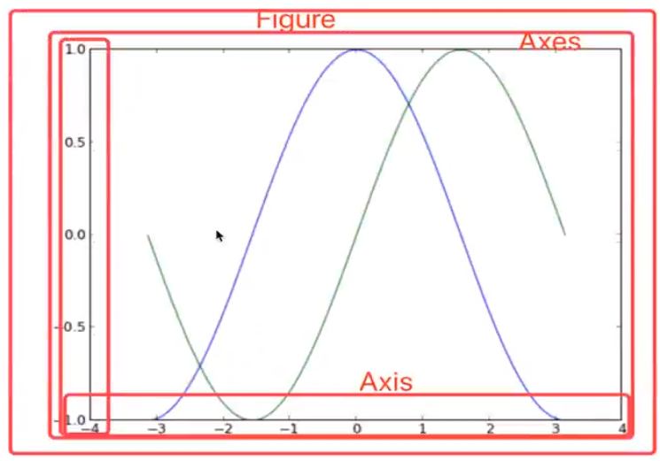

### 辅助显示层

辅助显示层为Axes(绘图区) 内的除了根据数据绘制出的图像以外的内容， 主要包括Axes外观(face color) 、边框线(spines) 、坐标轴(axis) 、坐标轴名称(axis label、坐标轴刻度(tick) 、坐标轴刻度标签(ticklabel) 、网格线(grid) 、图例(legend) 、标题(title) 等内容。
该层的设置可使图像显示更加直观更加容易被用户理解，但又不会对图像产生实质的影响。

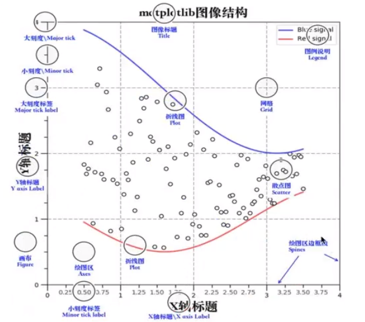

### 图像层

图像层指Axes内通过plot、scatter、bar、histogram、pie等函数根据数据绘制出的图像。

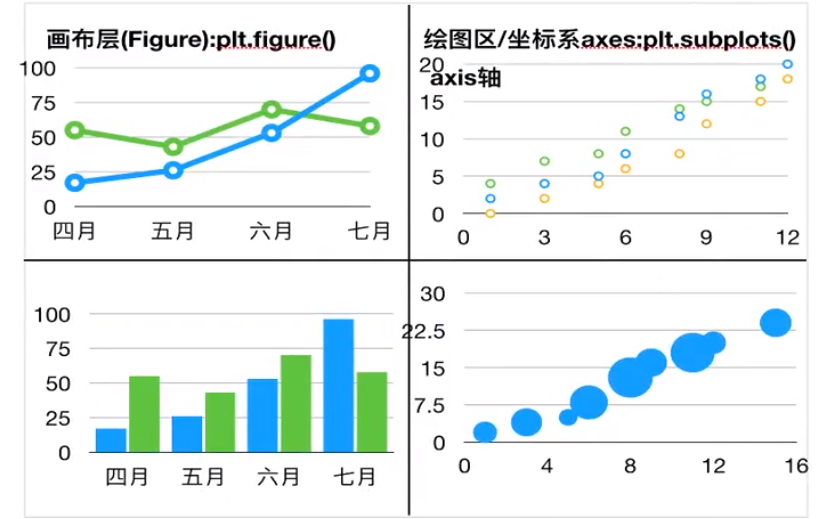

每一个绘图区都可以有不同的图表（散点图、折线图、柱状图等）。

### 总结

- Canvas (画板) 位于最底层， 用户一般接触不到
- Figure (画布) 建立在Canvas之上
- Axes (绘图区) 建立在Figure之上
- 坐标轴(axis) 、图例(legend) 等辅助显示层以及图像层都是建立在Axes之上

## 折线图(plot)与基础绘图功能

### 折线图绘制与保存

##### matplotlib.pyplot模块

matplotlib.pyplot包含了一系列类似于matlab的画图函数。它的函数**作用于当前图形(figure) 的当前坐标系(axes) 。**

```python
import matplotlib.pyplot as plt
```

##### 折线图绘制与显示

**展现上海一周的天气，比如从星期一到星期日的天气温度如下**
步骤如下：

```python
# 1) 创建画布（容器层）
plt.figure()

# 2) 绘制折线图（图像层）
plt.plot([1, 2, 3, 4, 5, 6, 7], [17, 17, 18, 15, 11, 11, 13])

# 3) 显示图像
plt.show()
```

执行结果：

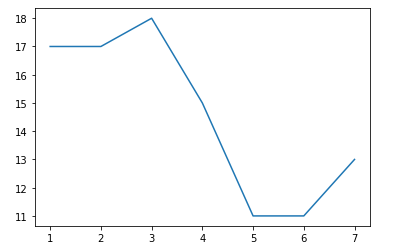

可以看到这样的显示效果并不好，我们可以加入更多的功能：

##### 设置画布属性与图片保存

```python
plt.figure(figsize=(), dpi=)
  fig size: 指定图的长宽，画布大小
  dpi：dot per inch，图像的清晰度
  返回fig对象
plt.savefig(path)
```

代码实现：

```
# 1)创画布，并设套画布属性
plt.figure(figsize=(20, 8), dpi=80)

# 2)保存片到指定路径
plt.savefig("test.png")
```

折线图绘制与显示执行结果：

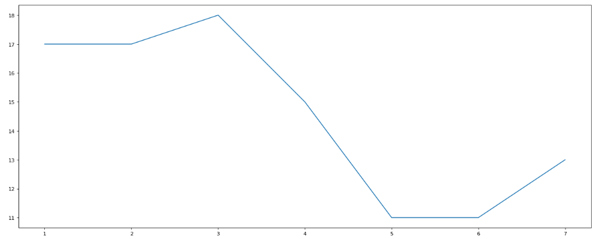

但是如果把保存图片放在show()下面，图片会保存，但是会显示是空白。

- 注意：plt.show()会释放figure资源，如果在显示图像之后保存图片将只能保存空图片。

### 完善原始折线图（辅助显示层）

#### 准备数据并画出初始折线图

**案例：显示温度变化状况**
需求：画出某城市11点到12点1小时内每分钟的温度变化折线图，温度范围在15度~18度。
步骤：

```python
import random
#1、准备数据x、y
x = range(60)
y_shanghai  = [random.uniform(15, 18) for i in x]
#2、创建画布
plt.figure(figsize=(20, 8), dpi=80)
#3、绘制图像
plt.plot(x, y_shanghai)
#4、绘制图像
plt.show()
```

执行结果：

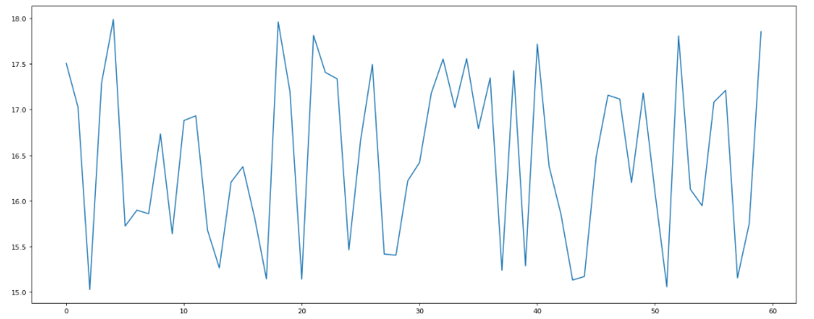

此时可以发现，因为坐标的原因，将温度变化差值显示的非常大，我们需要改变坐标去调整一下。

#### 添加自定义x，y刻度

- plt.xticks(x, **kwargs)
  x：要显示的刻度值

- plt.yticks(y, **kwargs)
  y：要显示的刻度值

增加以下代码：

```python
plt.xticks(x[::5])
#plt.yticks(range(40), [::5])
plt.yticks(range(0, 40, 5))
```

执行结果：

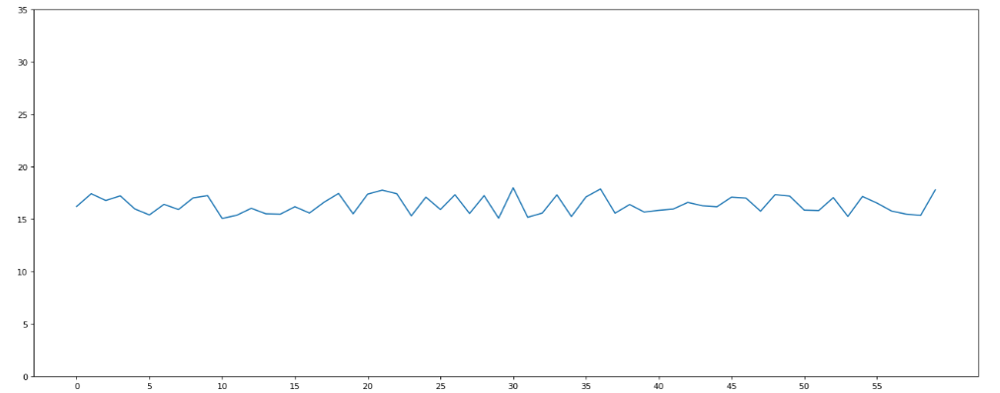

但是我们想要显示的结果是x时x分，再次修改代码：
我们需要x刻度是每五分钟显示一次：
准备x的刻度说明：

```python
x_lable = ["11点{}分".format(i) for i in x] 
plt.xticks(x[::5], x_lable[::5])
```

执行结果：

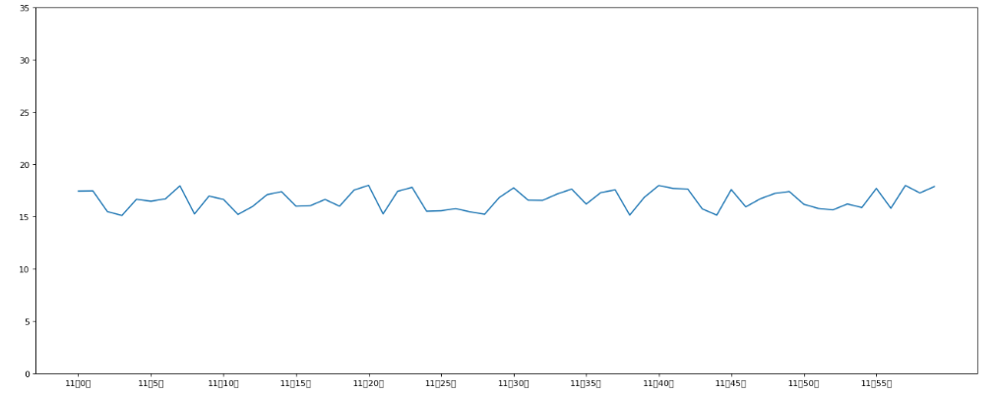

必须是一一对应的关系，否则横坐标会按照顺序来，与预期结果不一致。

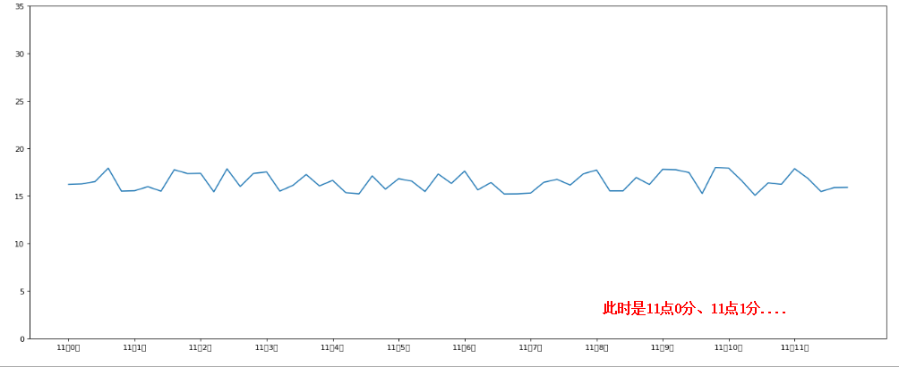

### 解决中文问题

下载中文字体(黑体，看准系统版本)

- 下载SimHei字体(或者其他的支持中文显示的字体也行)

mac的一次配置，一劳永逸
ubantu每创建一次新的虚拟环境，需要重新配置

#### 1)安装字体

- windows和mac下：双击安装
- linux下：拷贝字体到usr/share/fonts下：

```
sudo cp ~/SimHei.ttf /usr/share/fonts/SimHei.ttf
```

注) Linux如果用ubantu也可以通过双击安装

#### 2) 删除matplotlib缓存文件


**Mac系统的解决方案：**

- 删除~/.matplotlib中的缓存文件

```
cd ~/.matplotlib
rm -r *
```

**Linux系统的解决方案**

- 删除~/.cache/matplotlib中的缓存文件

```
cd ~/.cache/matplotlib
rm -r *
```

#### 3)修改配置文件matplotlibrc

**Mac系统的解决方案：**

- 修改配置文件matplotlibrc

```
vi~/.matplotlib/matplotlib rc
```

将文件内容修改为：

```
banckend:TkAgg
font.family          :  sans-serif
font.sans-serif          :  SimHei
axes.unicode_minus   :  False
```

**Linux系统的解决方案**

- 修改配置文件

```
sudo find -name matplotlibrc
```

返回结果：

```
./.virtualenvs/ai/lib/python3.5/site-packages/matplotlib/mpl-data/matplotlibrc
```

打开配置文件：

```
vi ./.virtualenvs/ai/lib/python3.5/site-packages/matplotlib/mpl-data/matplotlibrc
```

将配置文件中下面3项改为如下所示：

```
font.family          :  sans-serif
font.sans-serif          :  SimHei
axes.unicode_minus   :  False
```

### 添加网格显示

为了更加清楚的观察图形对应的值
添加代码：

```python
plt.grid(True, linestyle = "--", alpha = 0.5)
```

执行结果：

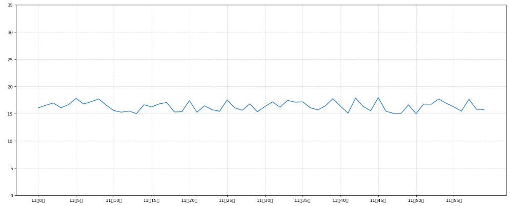

### 添加描述信息

添加x轴，y轴描述信息及标题

```python
plt.xlable("时间变化")
plt.ylable("温度变化")
plt.title("某城市11点到12点每分钟的温度变化状况")
```

执行结果：

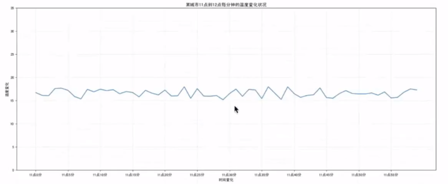

### 完善原始折线图（图像层）

**需求：再添加一个城市的温度变化**
收集到北京当天温度变化情况，温度在1度到3度。

#### 多次plot

怎么去添加另一个在同一坐标系当中的不同图形， **其实很简单只需要再次plot即可**， 但是需要区分线条， 如下：

准备数据，添加代码：

```python
y_beijing = [random.uniform(1, 3) for i in x]

plt.plot(x, y_beijing)

plt.title("上海、北京11点到12点每分钟的温度变化状况")
```

执行结果：

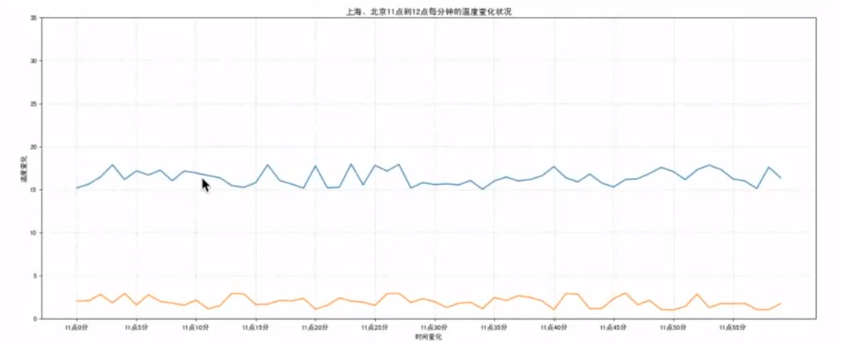

如果此时不想是默认的颜色，我们也可以进行改变。

```
plt.plot(x, y_shanghai, color = "r")
plt.plot(x, y_beijing, color = "b")
```

执行结果：

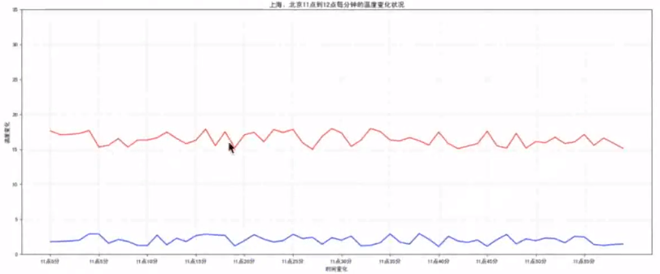

此时改变线条风格：

```
plt.plot(x, y_shanghai, color = "r", linestyle = "--")
```

执行结果：

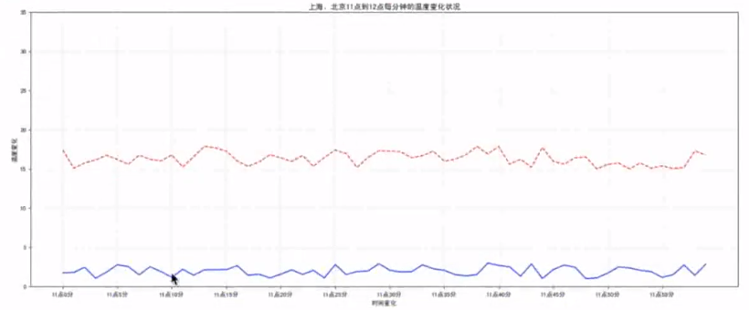

还有一些其它的风格，我们可以来看一下。

#### 设置图形风格

| 颜色字符 | 风格字符       |
| :------- | :------------- |
| r 红色   | - 实线         |
| g 绿色   | -- 虚线        |
| b 蓝色   | -. 点划线      |
| w 白色   | : 点虚线       |
| c 青色   | ' ' 留空、空格 |
| m 洋红   |                |
| y 黄色   |                |
| k 黑色   |                |

我们还需要给图加上图例来完善。

#### 显示图例

修改代码：

```
plt.plot(x, y_shanghai, color = "r", linestyle = "-.", label = "上海")
plt.plot(x, y_beijing, color = "b", label = "北京")

plt.legend()
```

执行结果：

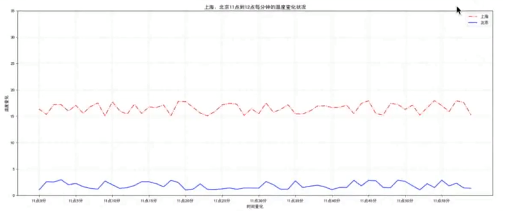

此时我们用的是默认的方式。

- 注意：如果只在plt.plot()中设置label还不能最终显示出图例， 还需要通过plt.legend()将图例显示出来。

我们也可以调整图例的位置。

```
plt.legend(loc = "lower left")
```

执行结果：

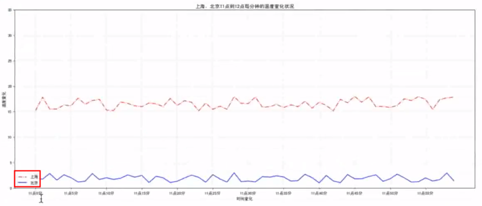

或者

```
plt.legend(loc = 4)
```

执行结果：

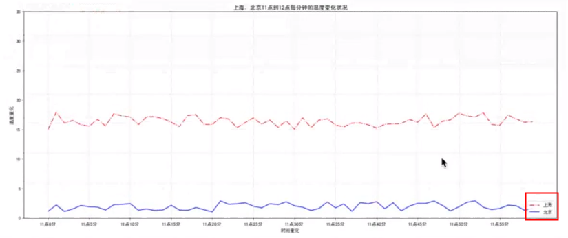

图例位置代码：

| Location String | Location Code |
| :-------------- | :------------ |
| 'best'          | 0             |
| 'upper right'   | 1             |
| 'upper left'    | 2             |
| 'lower left'    | 3             |
| 'lower right'   | 4             |
| 'right'         | 5             |
| 'center left'   | 6             |
| 'center right'  | 7             |
| 'lower center'  | 8             |
| 'upper center'  | 9             |
| 'center'        | 10            |

完整代码：

```python
import random
# 1、准备数据 x，y
x = range(60)
y_shanghai  = [random.uniform(15, 18) for i in x]
y_beijing = [random.uniform(1, 3) for i in x]

# 2、创建画布
plt.figure(figsize=(20, 8), dpi=80)

# 3、绘制图像
plt.plot(x, y_shanghai, color = "r", linestyle = "-.", label = "上海")
plt.plot(x, y_beijing, color = "b", label = "北京")

# 显示图例
plt.legend()

# 修改x,y刻度
# 准备x的刻度说明
x_lable = ["11点{}分".format(i) for i in x] 
plt.xticks(x[::5], x_lable[::5])
plt.yticks(range(0, 40, 5))

# 添加网格显示
plt.grid(True, linestyle = "--", alpha = 0.5)

# 添加描述信息
plt.xlable("时间变化")
plt.ylable("温度变化")
plt.title("上海、北京11点到12点每分钟的温度变化状况")

# 4、显示图
plt.show()
```

### 多个坐标系显示-plt.subplots(面向对象的画图方法)

如果我们想要将上海和北京的天气图显示在同一个图的不同坐标系当中，效果如下：

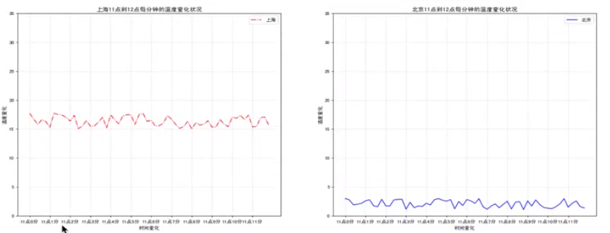

可以通过subplots函数实现（旧的版本中有subplot， 使用起来不方便）， 推荐subplots函数。

- matplotlib.pyplot.subplots(nrows=1,ncols=1, **fig_kw) 创建一个带有多个axes(坐标系/绘图区) 的图

现在是1行2列，我们对代码做出修改：

```python
figure, axes = plt.subplots(nrows=1, ncols=2, **fig_kw)
axes[0].方法名()
axes[1].方法名()
Parameters:

nrows, ncols : int, optional, default: 1, Number of rows/coLumns of the subplot grid.
**fig_kw : All additional keyword arguments are passed to the figure() call.

Returns:
fig : 图对象
ax :
    设置标题等方法不同：
    set_xticks
    set_yticks
    set_xlabel
    set_ylabel
```

关于axes子坐标系的更多方法：参考https://matplotlib.org/api/axes_api.html#matplotlib.axes.Axes

- 注意：**plt.函数名()** 相当于面向过程的画图方法，**axes.set_方法名()** 相当于面向对象的画图方法。

我们来对此需求编写代码：
收集到上海当天的温度变化情况，温度在15度到18度
收集到北京当天的温度变化情况，温度在1度到3度

```python
import random
# 1、准备数据 x，y
x = range(60)
y_shanghai  = [random.uniform(15, 18) for i in x]
y_beijing = [random.uniform(1, 3) for i in x]

# 2、创建画布
figure, axes = plt.subplots(nrows=1, ncols=2, figsize=(20, 8), dpi=80)

# 3、绘制图像
axes[0].plot(x, y_shanghai, color = "r", linestyle = "-.", label = "上海")
axes[1].plot(x, y_beijing, color = "b", label = "北京")

# 显示图例
axes[0].legend()
axes[1].legend()

# 修改x,y刻度
# 准备x的刻度说明
x_lable = ["11点{}分".format(i) for i in x] 
axes[0].set_xticks(x[::5], x_lable[::5])
axes[0].set_yticks(range(0, 40, 5))
axes[1].set_xticks(x[::5], x_lable[::5])
axes[1].set_yticks(range(0, 40, 5))

# 添加网格显示
axes[0].grid(True, linestyle = "--", alpha = 0.5)
axes[1].grid(True, linestyle = "--", alpha = 0.5)

# 添加描述信息
axes[0].set_xlable("时间变化")
axes[0].set_ylable("温度变化")
axes[0].set_title("上海11点到12点每分钟的温度变化状况")
axes[1].set_xlable("时间变化")
axes[1].set_ylable("温度变化")
axes[1].set_title("北京11点到12点每分钟的温度变化状况")
# 4、显示图
plt.show()
```

执行结果：

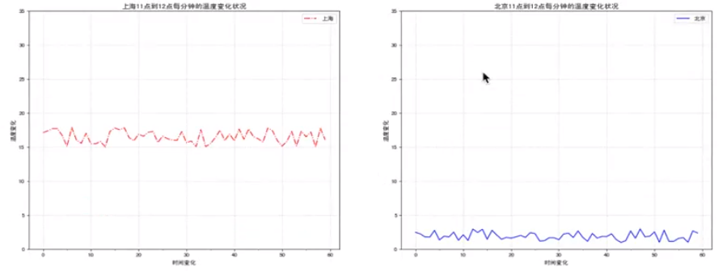

此时可以发现横坐标跟我们原本设置的不一致，此时是因为面向对象方法调用的问题，我们可以查询上面的API文档。
通过文档查询可以发现，`set_xticks`的第二个参数是bool值，所以我们需要修改，改为`axes.set_xticklabels `，可以添加字符串。


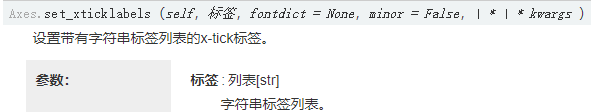

修改代码：

```python
# 修改x,y刻度
# 准备x的刻度说明
x_lable = ["11点{}分".format(i) for i in x] 
axes[0].set_xticks(x[::5])
axes[0].set_xticklabels(x_lable[::5])
axes[0].set_yticks(range(0, 40, 5))
axes[1].set_xticks(x[::5])
axes[1].set_xticklabels(x_lable[::5])
axes[1].set_yticks(range(0, 40, 5))
```

执行结果：


### 折线图的应用场景

* 呈现公司产品（不同区域）每天活跃用户数

* 呈现app每天下载数量

* 呈现产品新产品上线后，用户点击次数随时间的变化

* 拓展：**画各种数学函数图像**

  * *plt.plot()除了可以画折线图，也可以用于画各种数学函数图像*

  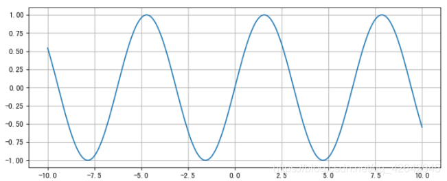

- 代码：

```py
import numpy as np
# 1）准备数据
x = np.linspace(-10, 10, 1000)
y = np.sin(x)
# 2）创建画布
plt.figure(figsize=(20, 8), dpi=100)
# 3）绘制函数图像
plt.plot(x, y)
# 添加网格显示
plt.grid()
# 4）显示图像
plt.show()
```

`numpy.linspace(start, stop, num=50, endpoint=True, retstep=False, dtype=None)`
在指定的间隔内返回均匀间隔的数字
返回num均匀分布的样本，在[start, stop]。
这个区间的端点可以任意的被排除在外。

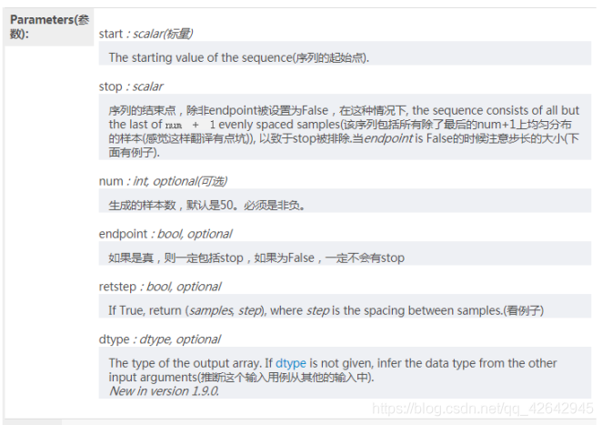

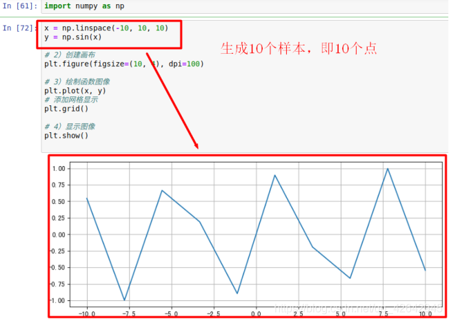

## 散点图(scatter)

### 常见图形种类及意义

Matplotlib能够绘制**折线图、散点图、柱状图、直方图、饼图。**

我们需要知道不同的统计图的意义，以此来决定选择哪种统计图来呈现我们的数据。


- **折线图**：以折线的上升或下降来表示统计数量的增减变化的统计图

  **特点：能够显示数据的变化趋势，反映事物的变化情况。(变化)<span style="color:#86ca5e;">【变化情况】</span>**

  api：plt.plot(x, y)

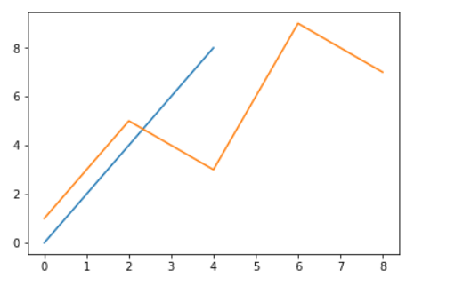

- **散点图：** 用两组数据构成多个坐标点，考察坐标点的分布,判断两变量之间是否存在某种关联或总结坐标点的分布模式。

  **特点：判断变量之间是否存在数量关联趋势,展示离群点(分布规律) <span style="color:#86ca5e;">【分布规律】</span>**

  api：plt.scatter(x, y)

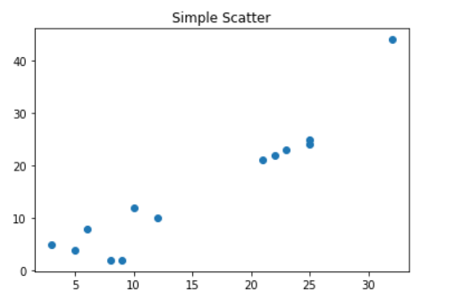

- **柱状图：** 排列在工作表的列或行中的数据可以绘制到柱状图中。

  **特点：绘制连离散的数据,能够一眼看出各个数据的大小,比较数据之间的差别。(统计/对比) <span style="color:#86ca5e;">【统计/对比】</span>**

  api：plt.bar(x, width, align='center', **kwargs) <span style="color:#86ca5e;">【x代表维度的值】</span>

```
Parameters:    
x : 需要传递的数据
 
width : 柱状图的宽度
 
align : 每个柱状图的位置对齐方式
    {‘center’, ‘edge’}, optional, default: ‘center’
 
**kwargs :
color:选择柱状图的颜色
```


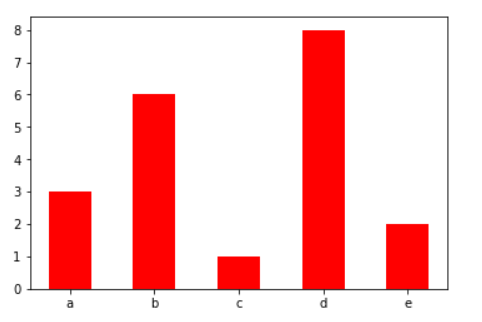

直方图：由一系列高度不等的纵向条纹或线段表示数据分布的情况。 一般用横轴表示数据范围，纵轴表示分布情况。

**特点：绘制连续性的数据展示一组或者多组数据的分布状况(统计) <span style="color:#86ca5e;">【正态分布】</span>**

api：matplotlib.pyplot.hist(x, bins=None)

```
Parameters:    
x : 需要传递的数据
bins : 组距
```

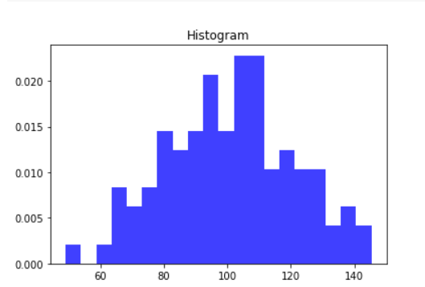

**饼图：** 用于表示不同分类的占比情况，通过弧度大小来对比各种分类。

**特点：分类数据的占比情况(占比) <span style="color:#86ca5e;">【占比】</span>**

api：plt.pie(x, labels=,autopct=,colors)

```
Parameters:  
x:数量，自动算百分比
labels:每部分名称
autopct:占比显示指定%1.2f%%
colors:每部分颜色
```

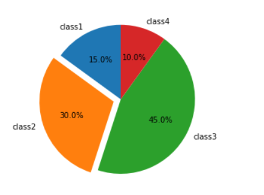

### 散点图绘制

需求：探究房屋面积和房屋价格的关系

房屋面积数据：

```
x = [225.98, 247.07, 253.14, 457.85, 241.58, 301.01,  20.67, 288.64,
       163.56, 120.06, 207.83, 342.75, 147.9 ,  53.06, 224.72,  29.51,
        21.61, 483.21, 245.25, 399.25, 343.35]
```

房屋价格数据：

```
y = [196.63, 203.88, 210.75, 372.74, 202.41, 247.61,  24.9 , 239.34,
       140.32, 104.15, 176.84, 288.23, 128.79,  49.64, 191.74,  33.1 ,
        30.74, 400.02, 205.35, 330.64, 283.45]
```

代码：

```python
# 1.准备数据
x = [225.98, 247.07, 253.14, 457.85, 241.58, 301.01,  20.67, 288.64,
       163.56, 120.06, 207.83, 342.75, 147.9 ,  53.06, 224.72,  29.51,
        21.61, 483.21, 245.25, 399.25, 343.35]
y = [196.63, 203.88, 210.75, 372.74, 202.41, 247.61,  24.9 , 239.34,
       140.32, 104.15, 176.84, 288.23, 128.79,  49.64, 191.74,  33.1 ,
        30.74, 400.02, 205.35, 330.64, 283.45]
 
# 2.创建画布
plt.figure(figsize=(20, 8), dpi=100)
 
# 3.绘制散点图
plt.scatter(x, y)
 
# 4.显示图像
plt.show()
```

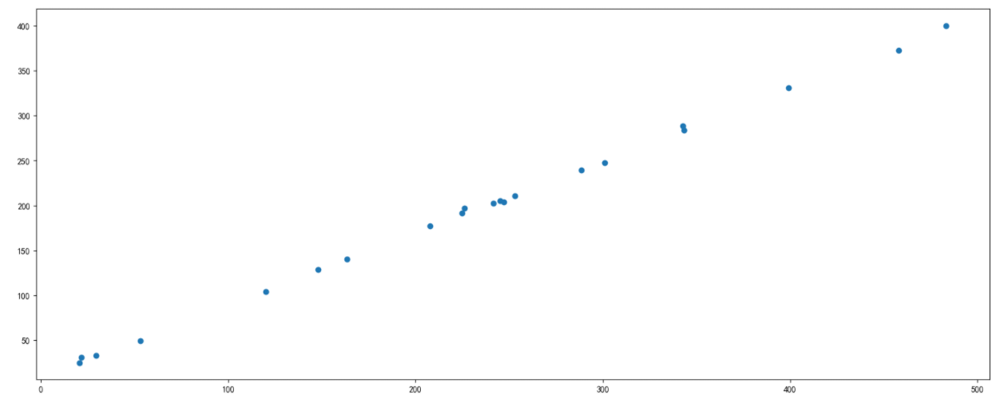

### 应用场景

* 探究不同变量之间的内在关系

## 柱状图（bar）

### **对比每部电影的票房收入**

电影数据如下图所示：

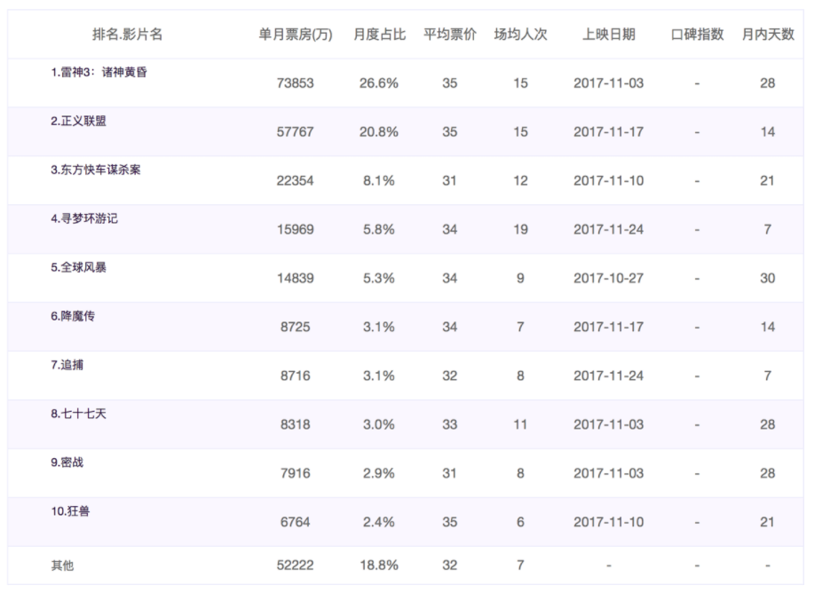

* 准备数据

  ```
  ['雷神3：诸神黄昏','正义联盟','东方快车谋杀案','寻梦环游记','全球风暴', '降魔传','追捕','七十七天','密战','狂兽','其它']
  [73853,57767,22354,15969,14839,8725,8716,8318,7916,6764,52222]
  ```

* 绘制

  * matplotlib.pyplot.bar(x, width, align='center', **kwargs)

    ```
    Parameters：
    x: sequence of scalars，柱状图横轴中心点
    y: 纵坐标
    
    width: scalar or array-like, optional（柱状图的宽度）
    
    align：{'center‘，'edge’}，optional, default：'center'
    Alignment of the bars to the x coordinates
    'center'：Center the base on the x positions
    'edge'：Align the left edges of the bars with the x positions（每个柱状图的位置对齐方式）
    
    **kwargs：
    color：选择柱状图的颜色
    
    Returns：
    '.BarContainer'
    Container with all the bars and optionally errorbars
    ```

  绘制柱状图

  ```python
  # 1.准备数据
  # 电影名字
  movie_name = ['雷神3：诸神黄昏','正义联盟','东方快车谋杀案','寻梦环游记','全球风暴','降魔传','追捕','七十七天','密战','狂兽','其它']
  # 横坐标
  x = range(len(movie_name))
  # 票房数据
  y = [73853,57767,22354,15969,14839,8725,8716,8318,7916,6764,52222]
   
  # 2.创建画布
  plt.figure(figsize=(20, 8), dpi=100)
   
  # 3.绘制柱状图
  plt.bar(x, y, width=0.5, color=['b','r','g','y','c','m','y','k','c','g','b'])
   
  # 3.1b修改x轴的刻度显示
  plt.xticks(x, movie_name)
   
  # 3.2 添加网格显示
  plt.grid(linestyle="--", alpha=0.5)
   
  # 3.3 添加标题
  plt.title("电影票房收入对比")
   
  # 4.显示图像
  plt.show()
  ```

  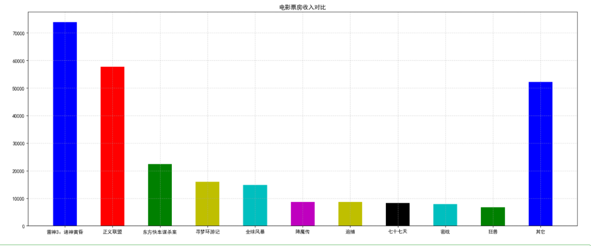

**需求-如何对比电影票房收入才更加有说服力？**

### **比较相同天数的票房**

有时候为了公平起见，我们需要对比不同电影首日和首周的票房

效果如下：

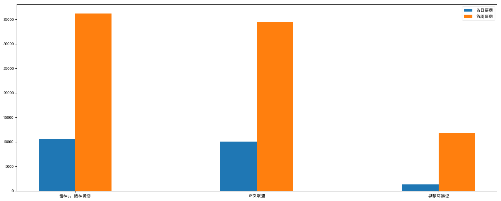

* 准备数据

  ```python
  movie_name = ['雷神3：诸神黄昏','正义联盟','寻梦环游记']
   
  first_day = [10587.6,10062.5,1275.7]
  first_weekend=[36224.9,34479.6,11830]
   
  数据来源: https://piaofang.maoyan.com/?ver=normal
  ```

* 绘制

  * 添加首日首周两部分的柱状图
  * x轴中文坐标位置调整

  ```python
  # 1、准备数据
  movie_name = ['雷神3：诸神黄昏','正义联盟','寻梦环游记']
  
  first_day = [10587.6,10062.5,1275.7]
  first_weekend=[36224.9,34479.6,11830]
  x = range(len(movie_name))
  
  # 2、创建画布
  plt.figure(figsize=(20, 8), dpi=80)
  
  # 3、绘制柱状图
  plt.bar(x, first_day, width=0.2, label="首日票房")
  # plt.bar([0.2, 1.2, 2.2], first_weekend, width=0.2, label="首周票房")
  plt.bar([i+0.2 for i in x], first_weekend, width=0.2, label="首周票房")
  
  # 显示图例
  plt.legend()
  
  # 修改刻度
  plt.xticks([0.1, 1.1, 2.1], movie_name)
  
  # 4、显示图像
  plt.show()
  ```

### 应用场景

* 数量统计
* 用户数量对比分析


## 直方图(histogram)

### 直方图介绍

直方图，形状类似柱状图却有着与柱状图完全不同的含义。直方图牵涉统计学的概念，首先要对数据进行分组，然后统计每个分组内数据元的数量。在坐标系中，横轴标出每个组的端点，纵轴表示频数，每个矩形的高代表对应的频数，称这样的统计图为频数分布直方图。

示例:

某校初三（1）班36位同学的身高的频数分布直方图如下图所示

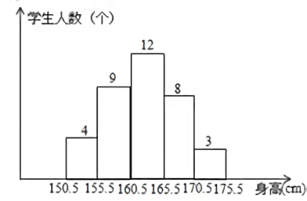

**相关概念：**

* 组数：在统计数据时，我们把数据按照不同的范围分成几个组，分成的组的个数称为组数
* 组距：每一组两个端点的差

### 直方图与柱状图的对比

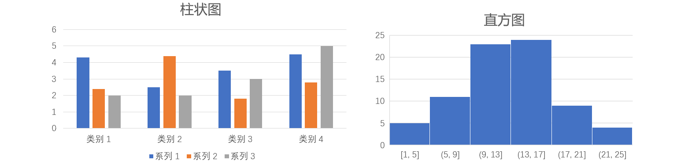

* 柱状图是以举行的长度表示每一组的频数或数量，其宽度（表示类别）则是固定的，**利于较小的数据集的分析**
* 直方图描述的是一组数据的频次分布，是以举行的长度表示每一组的频数或数量，宽度则表示各组的组距，因此其高度与宽度均有意义，利于**展示大量数据集的统计结果**。例如把年龄分成“0-5,5-10，......，80-85”17个组，统计一下中国人口年龄的分布情况。**直方图有助于我们知道数据的分布情况，诸如众数、中位数的大致位置、数据是否存在缺口或者异常值**。

**1.直方图展示数据的分布，柱状图比较数据的大小**

这是直方图与柱状图**最根本的区别**。举个例子，有10个苹果，每个苹果重量不同。如果使用直方图，就展示了重量在0-10g的苹果有多少个，10-20g的苹果有多少个；如果使用柱状图，则展示每个苹果的具体重量。

所以直方图展示的是一组数据中，在你划分的区间里，这些数据的**分布**情况，但是我们不知道在一个区间里，单个数据的具体大小。下图展现了游客在博物馆的游览时间，其中，将近40%的游客仅逗留了0-10分钟。但是我们无法知道这些游客中，每个人具体的游览时间是多少。

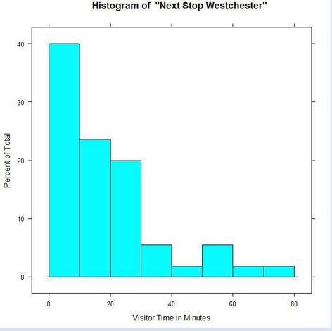

而在柱状图里，我们能看到的是每个数据的大小，并且进行比较。下图就比较了在12次展览中，参观者参观时间的中位数，我们能够知道参观的具体用时。

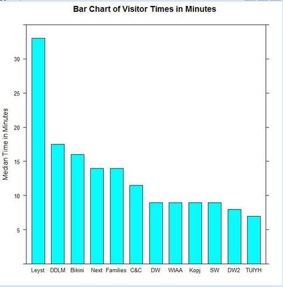

**2.直方图X轴为定量数据，柱状图X轴为分类数据。**

由图表的原理就决定了，X轴在直方图与柱状图中的用法是不一样的。在直方图中，X轴上的变量是一个个连续的区间，这些区间通常表现为数字，例如代表苹果重量的“0-10g，10-20g……”，代表时间长度的“0-10min，10-20min……”。而在柱状图中，X轴上的变量是一个个分类数据，例如不同的国家名称、不同的游戏类型。

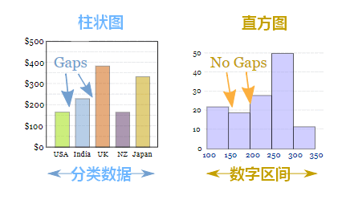

直方图上的每根柱子都是**不可移动的**，X轴上的区间是连续的、固定的。而柱状图上的每根柱子是可以随意排序的，有的情况下需要按照分类数据的名称排列，有的则需要按照数值的大小排列。

**3.直方图柱子无间隔，柱状图柱子有间隔**

因为直方图中的区间是连续的，因此柱子之间**不存在间隙**。而柱状图的柱子之间是存在间隔。还有一个值得注意的地方，在直方图中，第一根柱子应该和Y轴有一定的间隔，即使都是从“0”这个值开始的。因为X轴与Y轴上“0”的意义不同，而且很多直方图上的区间并不是从0开始的。

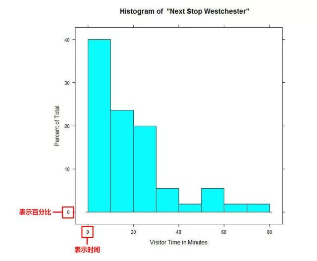

**4.直方图柱子宽度可不一，柱状图柱子宽度须一致**

柱状图柱子的宽度因为没有数值含义，所以宽度必须一致。但是在直方图中，柱子的宽度代表了区间的长度，根据区间的不同，柱子的宽度可以不同，但理论上应为单位长度的倍数。

例如，美国人口普查局（The U.S. Census Bureau）调查了12.4亿人的上班通勤时间，由于通勤时间在45-150分钟的人数太少，因此区间改为45-60分钟、60-90分钟、90-150分钟，其他组距则均为5。

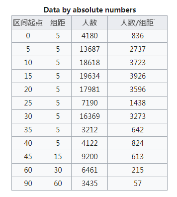

可以看到，Y轴的数据为“人数/组距”，在这种情况下，每个柱子的面积相加就等于调查的总人数，柱子的面积就有了意义。

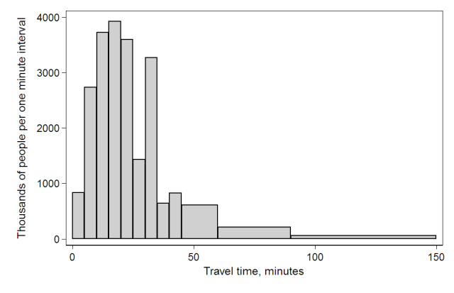

当上图的Y轴表达的是“区间人数/总人数/组距”，这个直方图就是我们初中学习的“频率分布直方图”，频率指的是“区间数量/总数量”。在这样的直方图中，所有柱子的面积相加等于1。

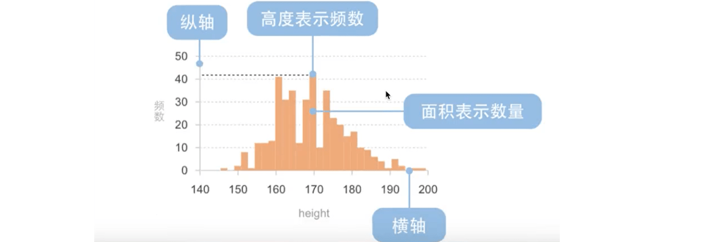

### 直方图绘制

**需求：电影时长分布状况**

现有250部电影的时长，希望统计出这些电影时长的分布状态比如时长为100分钟到120分钟电影的数量，出现的频率等信息，你应该如何呈现这些数据？

数据：

```
time = [131,  98, 125, 131, 124, 139, 131, 117, 128, 108, 135, 138, 131, 102, 107, 114, 119, 128, 121, 142, 127, 130, 124, 101, 110, 116, 117, 110, 128, 128, 115,  99, 136, 126, 134,  95, 138, 117, 111,78, 132, 124, 113, 150, 110, 117,  86,  95, 144, 105, 126, 130,126, 130, 126, 116, 123, 106, 112, 138, 123,  86, 101,  99, 136,123, 117, 119, 105, 137, 123, 128, 125, 104, 109, 134, 125, 127,105, 120, 107, 129, 116, 108, 132, 103, 136, 118, 102, 120, 114,105, 115, 132, 145, 119, 121, 112, 139, 125, 138, 109, 132, 134,156, 106, 117, 127, 144, 139, 139, 119, 140,  83, 110, 102,123,107, 143, 115, 136, 118, 139, 123, 112, 118, 125, 109, 119, 133,112, 114, 122, 109, 106, 123, 116, 131, 127, 115, 118, 112, 135,115, 146, 137, 116, 103, 144,  83, 123, 111, 110, 111, 100, 154,136, 100, 118, 119, 133, 134, 106, 129, 126, 110, 111, 109, 141,120, 117, 106, 149, 122, 122, 110, 118, 127, 121, 114, 125, 126,114, 140, 103, 130, 141, 117, 106, 114, 121, 114, 133, 137,  92,121, 112, 146,  97, 137, 105,  98, 117, 112,  81,  97, 139, 113,134, 106, 144, 110, 137, 137, 111, 104, 117, 100, 111, 101, 110,105, 129, 137, 112, 120, 113, 133, 112,  83,  94, 146, 133, 101,131, 116, 111,  84, 137, 115, 122, 106, 144, 109, 123, 116, 111,111, 133, 150]
```

效果：

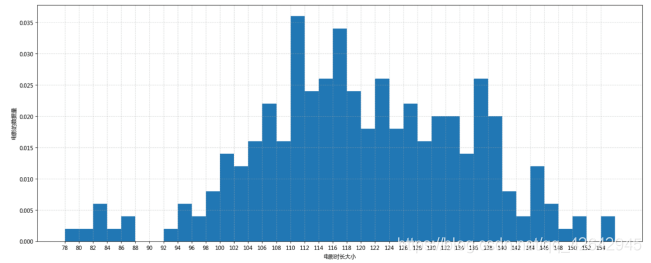

#### **直方图绘制api**

matplotlib.pyplot.hist(x, bins=None, normed=None, **kwargs)

```
Parameters:    
x : (n,) array or sequence of (n,) arrays

bins : integer or sequence or ‘auto’, optional # 组距
```

#### 绘制

- 设置组距
- 设置组数（通常对于数据较少的情况，分为5~12组，数据较多，更换图形显示方式）
  - 通常设置组数会有相应公式：组数 = 极差/组距= (max-min)/bins

**代码：**

```
# 1）准备数据
time = [131,  98, 125, 131, 124, 139, 131, 117, 128, 108, 135, 138, 131, 102, 107, 114, 119, 128, 121, 142, 127, 130, 124, 101, 110, 116, 117, 110, 128, 128, 115,  99, 136, 126, 134,  95, 138, 117, 111,78, 132, 124, 113, 150, 110, 117,  86,  95, 144, 105, 126, 130,126, 130, 126, 116, 123, 106, 112, 138, 123,  86, 101,  99, 136,123, 117, 119, 105, 137, 123, 128, 125, 104, 109, 134, 125, 127,105, 120, 107, 129, 116, 108, 132, 103, 136, 118, 102, 120, 114,105, 115, 132, 145, 119, 121, 112, 139, 125, 138, 109, 132, 134,156, 106, 117, 127, 144, 139, 139, 119, 140,  83, 110, 102,123,107, 143, 115, 136, 118, 139, 123, 112, 118, 125, 109, 119, 133,112, 114, 122, 109, 106, 123, 116, 131, 127, 115, 118, 112, 135,115, 146, 137, 116, 103, 144,  83, 123, 111, 110, 111, 100, 154,136, 100, 118, 119, 133, 134, 106, 129, 126, 110, 111, 109, 141,120, 117, 106, 149, 122, 122, 110, 118, 127, 121, 114, 125, 126,114, 140, 103, 130, 141, 117, 106, 114, 121, 114, 133, 137,  92,121, 112, 146,  97, 137, 105,  98, 117, 112,  81,  97, 139, 113,134, 106, 144, 110, 137, 137, 111, 104, 117, 100, 111, 101, 110,105, 129, 137, 112, 120, 113, 133, 112,  83,  94, 146, 133, 101,131, 116, 111,  84, 137, 115, 122, 106, 144, 109, 123, 116, 111,111, 133, 150]

# 2）创建画布
plt.figure(figsize=(10, 5), dpi=100)

# 3）绘制直方图
# 设置组距
distance = 2
# 计算组数
group_num = int((max(time) - min(time)) / distance)
# 绘制直方图
plt.hist(time, bins=group_num)

# 修改x轴刻度显示
plt.xticks(range(min(time), max(time))[::2] ,fontsize=8)

# 添加网格显示
plt.grid(linestyle="--", alpha=0.5)

# 添加x, y轴描述信息
plt.xlabel("电影时长大小")
plt.ylabel("电影的数据量")

# 4）显示图像
plt.show()
```

#### 直方图注意点

**1.注意组距**

组距会影响直方图呈现出来的数据分布，因此在绘制直方图的时候需要多次尝试改变组距。

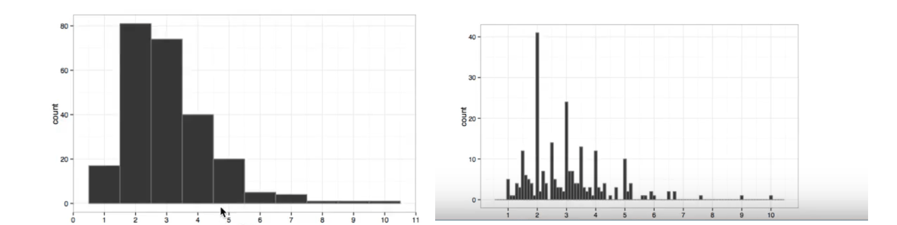

**2.注意Y轴所代表的变量**

Y轴上的变量可以是频次（数据出现了多少次）、频率（频次/总次数）、频率/组距，不同的变量会让直方图描述的数据分布意义不同。

#### 直方图的应用场景

- 用于表示分布情况
- 通过直方图还可以观察和估计哪些数据比较集中，异常或者孤立的数据分布在何处

例如：用户年龄分布，商品价格分布

## 饼图（pie）

### 饼图介绍

饼图用于表示不同分类的占比情况，通过弧度大小来对比各种分类。
饼图通过将个圆饼按照分类的占比划分成多个区块，整个圆饼代表数据的总量，每个区块（圆弧）表示该分类占总体的比例大小，所有区块（圆弧）的加和等于100%。

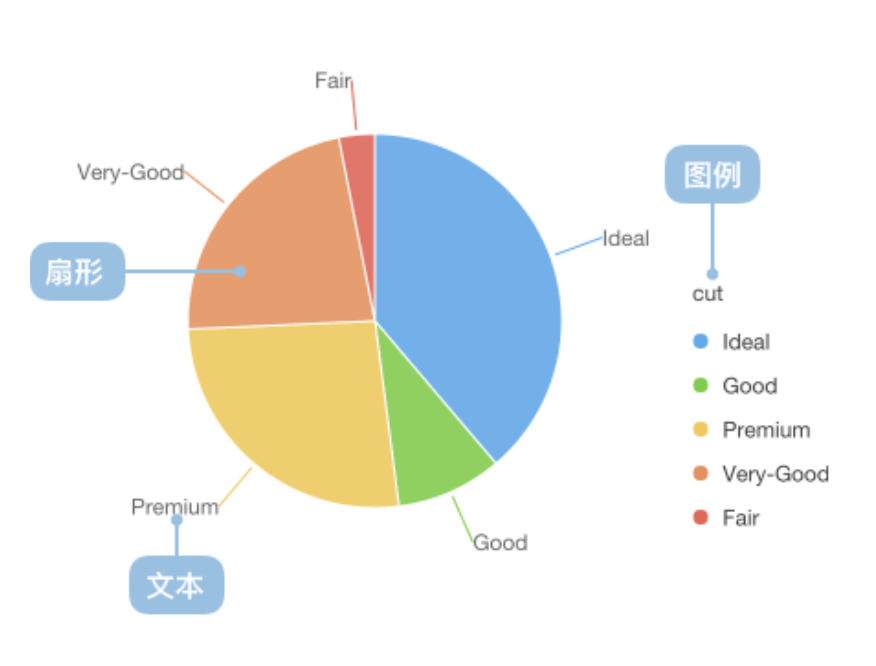

### 饼图绘制

**需求：显示不同的电影的排片占比**

电影排片：

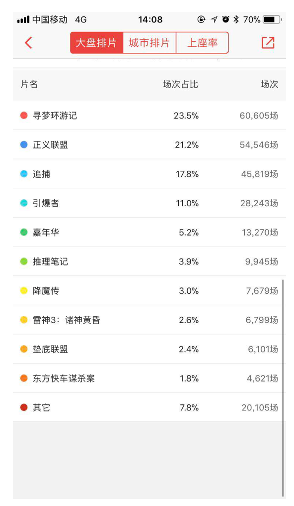

效果：

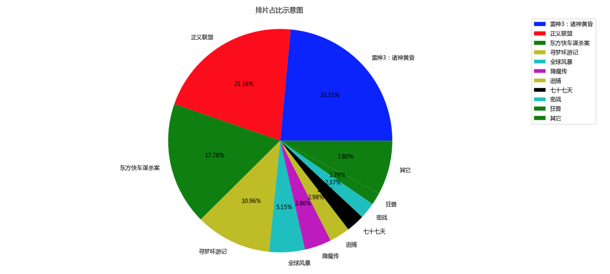

数据：

```
movie_name = ['雷神3：诸神黄昏','正义联盟','东方快车谋杀案','寻梦环游记','全球风暴','降魔传','追捕','七十七天','密战','狂兽','其它']

place_count = [60605,54546,45819,28243,13270,9945,7679,6799,6101,4621,20105]
```

#### 饼图api介绍

* 注意显示的百分比的位数

- plt.pie(x, labels=,autopct=,colors)
  - x:数量，自动算百分比
  - labels:每部分名称
  - autopct:占比显示指定%1.2f%%
  - colors:每部分颜色

代码：

```python
#1)准备数据
movie_name = ['雷神3：诸神黄昏','正义联盟','东方快车谋杀案','寻梦环游记','全球风暴','降魔传','追捕','七十七天','密战','狂兽','其它']

place_count = [60605,54546,45819,28243,13270,9945,7679,6799,6101,4621,20105]

#2)创建画布
plt.figure(figsize=(20, 8), dpi=100)

#3)绘制饼图
plt.pie(place_count, labels=movie_name, autopct='%1.2f%%', colors=['b','r','g','y','c','m','y','k','c','g','g'])
# 显示图例
plt.legeng()
# 指定显示的pie是正圆
#plt.axis('equal')

#4)显示图像
plt.title("排片占比示意图")
plt.show()
```

#### 添加axis

为了让显示的饼图保持圆形，需要添加axis保证长宽一样

```python
plt.axis('equal')
```

### 饼图应用场景

- 分类的占比情况（不超过9个分类）

例如：班级男女分布占比，公司销售额占比

## 总结

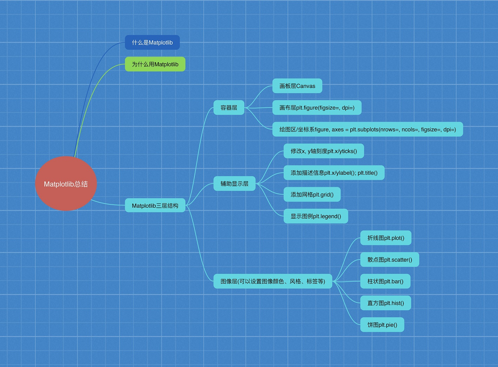

