## Numpy的优势

### Numpy介绍


Numpy（Numerical Python）是一个开源的Python科学计算库，**用于快速处理任意维度的数组**。

Numpy**支持常见的数组和矩阵操作**。对于同样的数值计算任务，使用Numpy比直接使用Python要简洁的多。

Numpy**使用ndarray对象来处理多维数组**，该对象是一个快速而灵活的大数据容器。

### ndarray介绍

```
NumPy provides an N-dimensional array type, the ndarray, which describes a collection of “items” of the same type.
```

NumPy提供了一个**N维数组类型ndarray**，它描述了**相同类型**的“items”的集合。

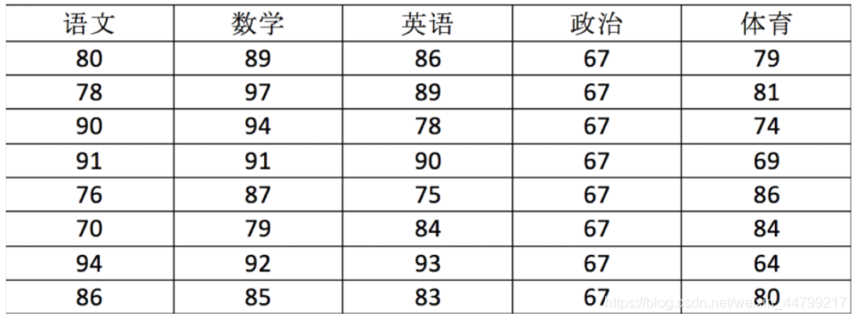

用ndarray进行存储：

```python
import numpy as np
 
# 创建ndarray
score = np.array(
[[80, 89, 86, 67, 79],
[78, 97, 89, 67, 81],
[90, 94, 78, 67, 74],
[91, 91, 90, 67, 69],
[76, 87, 75, 67, 86],
[70, 79, 84, 67, 84],
[94, 92, 93, 67, 64],
[86, 85, 83, 67, 80]])
 
score
```

返回结果：

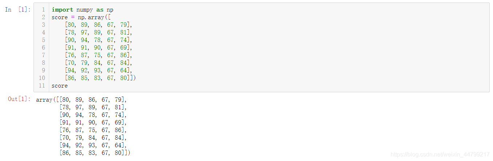

使用Python列表可以存储一维数组，通过列表的嵌套可以实现多维数组，那么为什么还需要使用Numpy的ndarray呢？

### ndarray与Python原生list运算效率对比

在这里我们通过一段代码运行来体会到ndarray的好处**【下方代码不能在pycharm中运行】**

```python
import random
import time
import numpy as np
a = []
for i in range(100000000):
    a.append(random.random())
 
# 通过%time魔法方法, 查看当前行的代码运行一次所花费的时间
%time sum1=sum(a)
 
b=np.array(a)
 
%time sum2=np.sum(b)
```

其中第一个时间显示的是使用原生Python计算时间,第二个内容是使用numpy计算时间:

```
CPU times: user 852 ms, sys: 262 ms, total: 1.11 s
Wall time: 1.13 s
CPU times: user 133 ms, sys: 653 µs, total: 133 ms
Wall time: 134 ms
```

从中我们看到ndarray的计算速度要快很多，节约了时间。

**机器学习的最大特点就是大量的数据运算**，那么如果没有一个快速的解决方案，那可能现在python也在机器学习领域达不到好的效果。

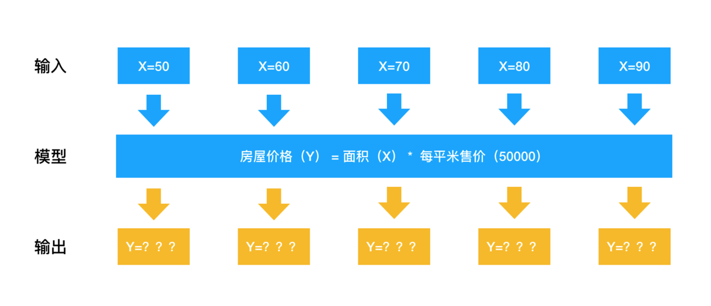

Numpy专门针对ndarray的操作和运算进行了设计，所以数组的存储效率和输入输出性能远优于Python中的嵌套列表，数组越大，Numpy的优势就越明显。

**思考：**

**ndarray为什么可以这么快？**

### ndarray的优势

####  1.内存块风格

ndarray到底跟原生python列表有什么不同呢，请看一张图：

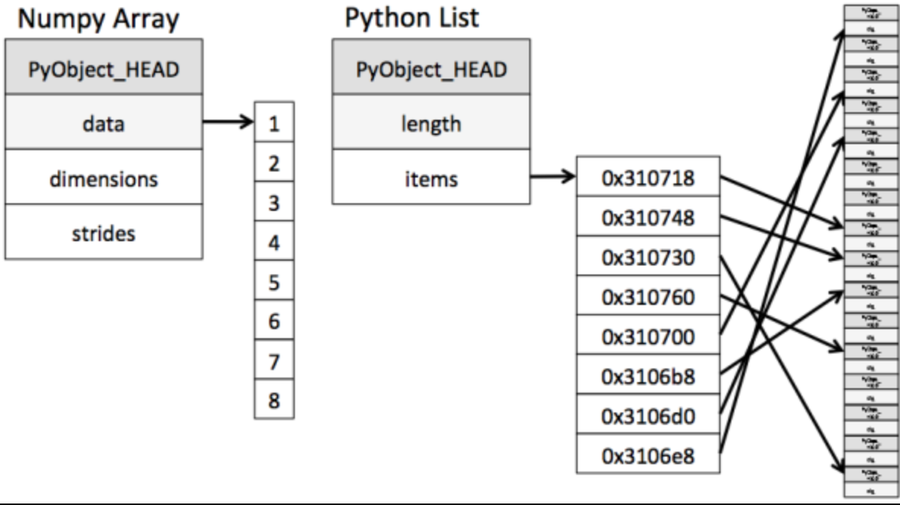

从图中我们可以看出ndarray在存储数据的时候，数据与数据的地址都是连续的，这样就给使得批量操作数组元素时速度更快。

这是因为ndarray中的所有元素的类型都是相同的，而Python列表中的元素类型是任意的，所以ndarray在存储元素时内存可以连续，而python原生list就只能通过寻址方式找到下一个元素，这虽然也导致了在通用性能方面Numpy的ndarray不及Python原生list，但在科学计算中，Numpy的ndarray就可以省掉很多循环语句，代码使用方面比Python原生list简单的多。

#### 2.ndarray支持并行化运算（向量化运算）

numpy内置了并行运算功能，当系统有多个核心时，做某种计算时，numpy会自动做并行计算

#### 3.效率远高于纯Python代码

Numpy底层使用C语言编写，内部解除了GIL（全局解释器锁），其对数组的操作速度不受Python解释器的限制，所以，其效率远高于纯Python代码。

## 认识N维数组-ndarray属性

### ndarray的属性

数组属性反映了数组本身固有的信息。

|     属性名字     |          属性解释          |
| :--------------: | :------------------------: |
|  ndarray.shape   |       数组维度的元组       |
|   ndarray.ndim   |          数组维数          |
|   ndarray.size   |      数组中的元素数量      |
| ndarray.itemsize | 一个数组元素的长度（字节） |
|  ndarray.dtype   |       数组元素的类型       |

### ndarray的形状

首先创建一些数组。

```python
# 创建不同形状的数组
>>> a = np.array([[1,2,3],[4,5,6]])
>>> b = np.array([1,2,3,4])
>>> c = np.array([[[1,2,3],[4,5,6]],[[1,2,3],[4,5,6]]])
```

分别打印出形状

```python
>>> a.shape
>>> b.shape
>>> c.shape

(2, 3)  # 二维数组
(4,)    # 一维数组
(2, 2, 3) # 三维数组
```

如何理解数组的形状？

二维数组：


三维数组：


### ndarray的类型

```python
>>> type(score.dtype)

<type 'numpy.dtype'>
```

dtype是numpy.dtype类型，先看看对于数组来说都有哪些类型

|     名称      |                       描述                        | 简写  |
| :-----------: | :-----------------------------------------------: | :---: |
|    np.bool    |      用一个字节存储的布尔类型（True或False）      |  'b'  |
|    np.int8    |             一个字节大小，-128 至 127             |  'i'  |
|   np.int16    |               整数，-32768 至 32767               | 'i2'  |
|   np.int32    |              整数，-2^31 至 2^32 -1               | 'i4'  |
|   np.int64    |              整数，-2^63 至 2^63 - 1              | 'i8'  |
|   np.uint8    |               无符号整数，0 至 255                |  'u'  |
|   np.uint16   |              无符号整数，0 至 65535               | 'u2'  |
|   np.uint32   |             无符号整数，0 至 2^32 - 1             | 'u4'  |
|   np.uint64   |             无符号整数，0 至 2^64 - 1             | 'u8'  |
|  np.float16   | 半精度浮点数：16位，正负号1位，指数5位，精度10位  | 'f2'  |
|  np.float32   | 单精度浮点数：32位，正负号1位，指数8位，精度23位  | 'f4'  |
|  np.float64   | 双精度浮点数：64位，正负号1位，指数11位，精度52位 | 'f8'  |
| np.complex64  |     复数，分别用两个32位浮点数表示实部和虚部      | 'c8'  |
| np.complex128 |     复数，分别用两个64位浮点数表示实部和虚部      | 'c16' |
|  np.object_   |                    python对象                     |  'O'  |
|  np.string_   |                      字符串                       |  'S'  |
|  np.unicode_  |                    unicode类型                    |  'U'  |

**创建数组的时候指定类型**

```python
>>> a = np.array([[1, 2, 3],[4, 5, 6]], dtype=np.float32)
>>> a.dtype
dtype('float32')

>>> arr = np.array(['python', 'tensorflow', 'scikit-learn', 'numpy'], dtype = np.string_)
>>> arr
array([b'python', b'tensorflow', b'scikit-learn', b'numpy'], dtype='|S12')
```

- 注意：若不指定，整数默认int64，小数默认float64

## 基本操作

### 生成数组的方法

### 生成0和1的数组

- np.empty(shape[, dtype, order]) empty_like(a[, dtype, order, subok])

* np.eye(N[, M, k, dtype, order])
* np.identity(n[, dtype])
* **np.ones(shape[, dtype, order])**
* np.ones_like(a[, dtype, order, subok])
* **np.zeros(shape[, dtype, order]) zeros_like(a[, dtype, order, subok])**
* np.full(shape, fill_value[, dtype, order])
* np.full_like(a, fill_value[, dtype, order, subok])

```python
ones = np.ones([4,8])
ones
```

返回结果:

```python
array([[1., 1., 1., 1., 1., 1., 1., 1.],
       [1., 1., 1., 1., 1., 1., 1., 1.],
       [1., 1., 1., 1., 1., 1., 1., 1.],
       [1., 1., 1., 1., 1., 1., 1., 1.]])
np.zeros_like(ones)
```

返回结果:

```python
array([[0., 0., 0., 0., 0., 0., 0., 0.],
       [0., 0., 0., 0., 0., 0., 0., 0.],
       [0., 0., 0., 0., 0., 0., 0., 0.],
       [0., 0., 0., 0., 0., 0., 0., 0.]])
```

### 从现有数组生成

#### 生成方式

* **np.array(object[, dtype, copy, order, subok, ndmin])**

* **np.asarray(a[, dtype, order])**
* np.asanyarray(a[, dtype, order]) ascontiguousarray(a[, dtype])
* np.asmatrix(data[, dtype])
* **np.copy(a[, order])**

```python
a = np.array([[1,2,3],[4,5,6]])
# 从现有的数组当中创建
a1 = np.array(a)
# 相当于索引的形式，并没有真正的创建一个新的
a2 = np.asarray(a)
```

#### 关于array和asarray的不同


### 生成固定范围的数组

#### np.linspace (start, stop, num, endpoint)

- 创建等差数组 — 指定数量
- 参数:
  - start:序列的起始值
  - stop:序列的终止值
  - num:要生成的等间隔样例数量，默认为50
  - endpoint:序列中是否包含stop值，默认为ture

```python
# 生成等间隔的数组
np.linspace(0, 100, 11)
```

返回结果：

```python
array([  0.,  10.,  20.,  30.,  40.,  50.,  60.,  70.,  80.,  90., 100.])
```

#### np.arange(start,stop, step, dtype)

- 创建等差数组 — 指定步长
- 参数
  - step:步长,默认值为1

```python
np.arange(10, 50, 2)
```

返回结果：

```python
array([10, 12, 14, 16, 18, 20, 22, 24, 26, 28, 30, 32, 34, 36, 38, 40, 42,
       44, 46, 48])
```

#### np.logspace(start,stop, num)

- 创建等比数列
- 参数:
  - num:要生成的等比数列数量，默认为50

```python
# 生成10^x
np.logspace(0, 2, 3)
```

返回结果:

```shell
array([  1.,  10., 100.])
```

### 生成随机数组

#### 均匀分布

- np.random模块

  - 均匀分布

    - np.random.rand(d0, d1, ..., dn)

      返回**[0.0，1.0)**内的一组均匀分布的数。

    - **numpy.random.uniform(low=0.0,high=1.0,size=None)**

      功能：从一个均匀分布[low,high)中随机采样，注意定义域是左闭右开，即包含low，不包含high.

      参数介绍: 
        low: 采样下界，float类型，默认值为0；
        high: 采样上界，float类型，默认值为1；
        size: 输出样本数目，为int或元组(tuple)类型，例如，size=(m,n,k), 则输出m*n*k个样本，缺省时输出1个值。

      返回值：ndarray类型，其形状和参数size中描述一致。

    - np.random.randint(low, high=None, size=None, dtype='l')

      从一个均匀分布中随机采样，生成一个整数或N维整数数组，取数范围：若high不为None时，取[low,high)之间随机整数，否则取值[0,low)之间随机整数。

##### 补充：均匀分布 

均匀分布（Uniform Distribution)是概率统计中的重要分布之一。顾名思义，均匀，表示可能性相等的含义。均匀分布在自然情况下极为罕见，而人工栽培的有一定株行距的植物群落即是均匀分布。

```python
# 生成均匀分布的随机数
x1 = np.random.uniform(-1, 1, 100000000)
```

返回结果：

```text
array([ 0.22411206,  0.31414671,  0.85655613, ..., -0.92972446,
0.95985223,  0.23197723])
```

画图看分布状况：

```python
import matplotlib.pyplot as plt
 
# 生成均匀分布的随机数
x1 = np.random.uniform(-1, 1, 100000000)
 
# 画图看分布状况
# 1）创建画布
plt.figure(figsize=(10, 10), dpi=100)
 
# 2）绘制直方图
plt.hist(x1, 1000)
 
# 3）显示图像
plt.show()
```

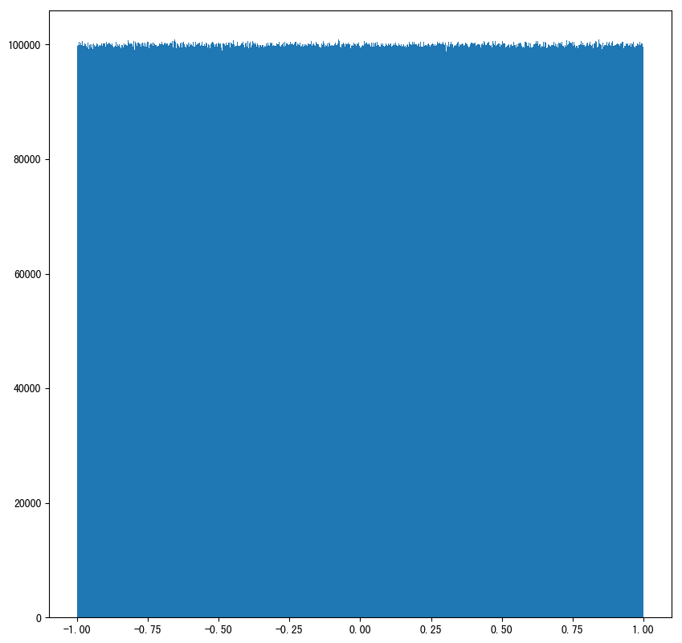

#### 正态分布

- np.random.randn(*d0, d1, …, dn*)

  功能：从标准正态分布中返回一个或多个样本值

- **np.random.normal(/*loc=0.0/*, /*scale=1.0/*, /*size=None/*)**

  loc：float

   此概率分布的均值（对应着整个分布的中心centre）

  scale：float

   此概率分布的标准差（对应于分布的宽度，scale越大越矮胖，scale越小，越瘦高）

  size：int or tuple of ints

   输出的shape，默认为None，只输出一个值

- np.random.standard_normal(*size=None*)

  返回指定形状的标准正态分布的数组。

##### 补充：正态分布（理解）

##### a. 什么是正态分布

正态分布是一种概率分布。正态分布是具有两个参数μ和σ的连续型随机变量的分布，第一参数μ是服从正态分布的随机变量的均值，第二个参数σ是此随机变量的标准差，所以正态分布记作**N(μ，σ )**。

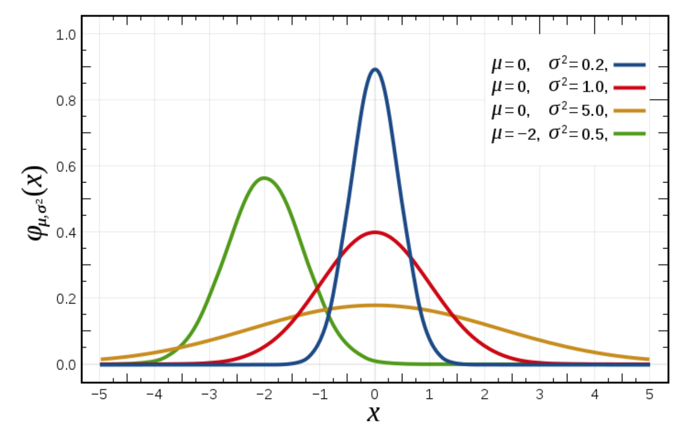

##### b. 正态分布的应用

生活、生产与科学实验中很多随机变量的概率分布都可以近似地用正态分布来描述。

##### c. 正态分布特点

**μ决定了其位置，其标准差σ**决定了分布的幅度。当μ = 0,σ = 1时的正态分布是标准正态分布。

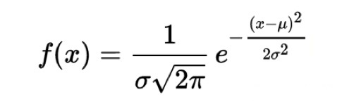

标准差如何来？

- ###### 方差

是在概率论和统计方差衡量一组数据时离散程度的度量


其中M为平均值，n为数据总个数，σ 为标准差，σ ^2可以理解一个整体为方差

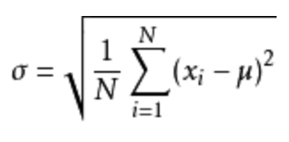

- ###### **标准差与方差的意义**

可以理解成数据的一个离散程度的衡量


##### 举例1：生成均值为1.75，标准差为1的正态分布数据，100000000个

```python
x1 = np.random.normal(1.75, 1, 100000000)
```

返回结果：

```python
array([2.90646763, 1.46737886, 2.21799024, ..., 1.56047411, 1.87969135,
       0.9028096 ])
# 生成均匀分布的随机数
x1 = np.random.normal(1.75, 1, 100000000)

# 画图看分布状况
# 1）创建画布
plt.figure(figsize=(20, 10), dpi=100)

# 2）绘制直方图
plt.hist(x1, 1000)

# 3）显示图像
plt.show()
```

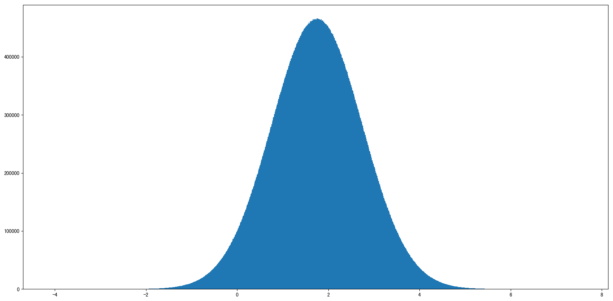

例如：我们可以模拟生成一组股票的涨跌幅的数据

##### 举例2：随机生成4支股票1周的交易日涨幅数据

4支股票，**一周(5天)**的涨跌幅数据，如何获取？

- 随机生成涨跌幅在某个正态分布内，比如均值0，方差1

##### 股票涨跌幅数据的创建

```python
# 创建符合正态分布的4只股票5天的涨跌幅数据
stock_change = np.random.normal(0, 1, (4, 5))
stock_change
```

返回结果：

```python
array([[ 0.0476585 ,  0.32421568,  1.50062162,  0.48230497, -0.59998822],
       [-1.92160851,  2.20430374, -0.56996263, -1.44236548,  0.0165062 ],
       [-0.55710486, -0.18726488, -0.39972172,  0.08580347, -1.82842225],
       [-1.22384505, -0.33199305,  0.23308845, -1.20473702, -0.31753223]])
```

### 数组的索引、切片

一维、二维、三维的数组如何索引？

- 直接进行索引,切片
- 对象[:, :] -- 先行后列

二维数组索引方式：

- 举例：获取第一个股票的前3个交易日的涨跌幅数据

```python
# 二维的数组，两个维度 
stock_change[0, 0:3]
```

返回结果：

```python
array([-0.03862668, -1.46128096, -0.75596237])
```

- 三维数组索引方式：

```python
# 三维
a1 = np.array([ [[1,2,3],[4,5,6]], [[12,3,34],[5,6,7]]])
# 返回结果
array([[[ 1,  2,  3],
        [ 4,  5,  6]],

       [[12,  3, 34],
        [ 5,  6,  7]]])
# 索引、切片
>>> a1[0, 0, 1]   # 输出: 2
```

### 形状修改

#### ndarray.reshape(shape, order)

- 返回一个具有相同数据域，但shape不一样的**视图**
- 行、列不进行互换

```python
# 在转换形状的时候，一定要注意数组的元素匹配
stock_change.reshape([5, 4])
stock_change.reshape([-1,10])  # 数组的形状被修改为: (2, 10), -1: 表示通过待计算
```

#### ndarray.resize(new_shape)

- 修改数组本身的形状（需要保持元素个数前后相同）
- 行、列不进行互换

```python
stock_change.resize([5, 4])

# 查看修改后结果
stock_change.shape
(5, 4)
```

#### ndarray.T

- 数组的转置
- 将数组的行、列进行互换

```python
stock_change.T.shape
(4, 5)
```

### 类型修改

#### ndarray.astype(type)

- 返回修改了类型之后的数组

```python
stock_change.astype(np.int32)
```

#### ndarray.tostring([order])或者ndarray.tobytes([order])

- 构造包含数组中原始数据字节的Python字节

```python
arr = np.array([[[1, 2, 3], [4, 5, 6]], [[12, 3, 34], [5, 6, 7]]])
arr.tostring()
```

#### jupyter输出太大可能导致崩溃问题【了解】

如果遇到

```
IOPub data rate exceeded.
    The notebook server will temporarily stop sending output
    to the client in order to avoid crashing it.
    To change this limit, set the config variable
    `--NotebookApp.iopub_data_rate_limit`.
```

这个问题是在jupyer当中对输出的字节数有限制，需要去修改配置文件

创建配置文件

```python
jupyter notebook --generate-config
vi ~/.jupyter/jupyter_notebook_config.py
```

取消注释,多增加

```python
## (bytes/sec) Maximum rate at which messages can be sent on iopub before they
#  are limited.
c.NotebookApp.iopub_data_rate_limit = 10000000
```

**但是不建议这样去修改，jupyter输出太大会崩溃**

### 数组的去重

#### np.unique()

```python
temp = np.array([[1, 2, 3, 4],[3, 4, 5, 6]])
>>> np.unique(temp)
array([1, 2, 3, 4, 5, 6])
```

## ndarray运算

### 逻辑运算

```python
# 生成10名同学，5门功课的数据
>>> score = np.random.randint(40, 100, (10, 5))

# 取出最后4名同学的成绩，用于逻辑判断
>>> test_score = score[6:, 0:5]

# 逻辑判断, 如果成绩大于60就标记为True 否则为False
>>> test_score > 60
array([[ True,  True,  True, False,  True],
       [ True,  True,  True, False,  True],
       [ True,  True, False, False,  True],
       [False,  True,  True,  True,  True]])

# BOOL赋值, 将满足条件的设置为指定的值-布尔索引
>>> test_score[test_score > 60] = 1
>>> test_score
array([[ 1,  1,  1, 52,  1],
       [ 1,  1,  1, 59,  1],
       [ 1,  1, 44, 44,  1],
       [59,  1,  1,  1,  1]])
```

### 通用判断函数

- np.all()

```python
# 判断前两名同学的成绩[0:2, :]是否全及格
>>> np.all(score[0:2, :] > 60)
False
```

- np.any()

```python
# 判断前两名同学的成绩[0:2, :]是否有大于90分的
>>> np.any(score[0:2, :] > 80)
True
```

### np.where（三元运算符）

通过使用np.where能够进行更加复杂的运算

- np.where()

```python
# 判断前四名学生,前四门课程中，成绩中大于60的置为1，否则为0
temp = score[:4, :4]
np.where(temp > 60, 1, 0)
```

- 复合逻辑需要结合np.logical_and和np.logical_or使用

```python
# 判断前四名学生,前四门课程中，成绩中大于60且小于90的换为1，否则为0
np.where(np.logical_and(temp > 60, temp < 90), 1, 0)

# 判断前四名学生,前四门课程中，成绩中大于90或小于60的换为1，否则为0
np.where(np.logical_or(temp > 90, temp < 60), 1, 0)
```

### 统计运算

**如果想要知道学生成绩最大的分数，或者做小分数应该怎么做？**

### 统计指标

在数据挖掘/机器学习领域，统计指标的值也是我们分析问题的一种方式。常用的指标如下：

- min(a, axis)
  - Return the minimum of an array or minimum along an axis.
- max(a, axis])
  - Return the maximum of an array or maximum along an axis.
- median(a, axis)
  - Compute the median along the specified axis.
- mean(a, axis, dtype)
  - Compute the arithmetic mean along the specified axis.
- std(a, axis, dtype)
  - Compute the standard deviation along the specified axis.
- var(a, axis, dtype)
  - Compute the variance along the specified axis.

### 案例：学生成绩统计运算

进行统计的时候，**axis 轴的取值并不一定，Numpy中不同的API轴的值都不一样，在这里，axis 0代表列, axis 1代表行去进行统计**

```python
# 接下来对于前四名学生,进行一些统计运算
# 指定列 去统计
temp = score[:4, 0:5]
print("前四名学生,各科成绩的最大分：{}".format(np.max(temp, axis=0)))
print("前四名学生,各科成绩的最小分：{}".format(np.min(temp, axis=0)))
print("前四名学生,各科成绩波动情况：{}".format(np.std(temp, axis=0)))
print("前四名学生,各科成绩的平均分：{}".format(np.mean(temp, axis=0)))
```

结果：

```
前四名学生,各科成绩的最大分：[96 97 72 98 89]
前四名学生,各科成绩的最小分：[55 57 45 76 77]
前四名学生,各科成绩波动情况：[16.25576821 14.92271758 10.40432602  8.0311892   4.32290412]
前四名学生,各科成绩的平均分：[78.5  75.75 62.5  85.   82.25]
```

如果需要统计出某科最高分对应的是哪个同学？

- np.argmax(temp, axis=)
- np.argmin(temp, axis=)

```python
print("前四名学生，各科成绩最高分对应的学生下标：{}".format(np.argmax(temp, axis=0)))
```

结果：

```
前四名学生，各科成绩最高分对应的学生下标：[0 2 0 0 1]
```

## 数组间运算

### 场景

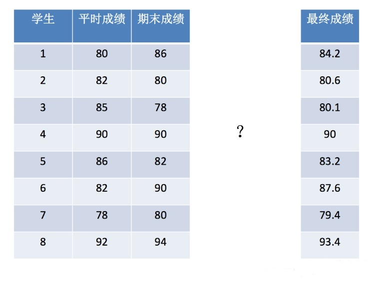

数据：

```
[[80,86], [82,80], [85,78], [90,90], [86,82], [82,90], [78,80], [92,94]]
```

### 数组与数的运算

```python
arr = np.array([[1, 2, 3, 2, 1, 4], [5, 6, 1, 2, 3, 1]])
arr + 1
arr / 2

# 可以对比python列表的运算，看出区别
a = [1, 2, 3, 4, 5]
a * 3
```

### 数组与数组的运算

```python
arr1 = np.array([[1, 2, 3, 2, 1, 4], [5, 6, 1, 2, 3, 1]])
arr2 = np.array([[1, 2, 3, 4], [3, 4, 5, 6]])
```

上面这个能进行运算吗，结果是不行的！

#### 广播机制

**执行 broadcast 的前提在于，两个 ndarray 执行的是 element-wise的运算，而不是矩阵乘法的运算，矩阵乘法运算时需要维度之间严格匹配。Broadcast机制的功能是为了方便不同形状的array（numpy库的核心数据结构）进行数学运算。**

当操作两个数组时，numpy会逐个比较它们的shape（构成的元组tuple），只有在下述情况下，两个数组才能够进行数组与数组

- 维度相等
- shape（其中相对应的一个地方为1）

例如：

```text
Image (3d array): 256  x 256 x 3 
Scale (1d array): 			   3 
Result (3d array): 256 x 256 x 3 

A      (4d array): 9 x 1 x 7 x 1 
B      (3d array):     8 x 1 x 5 
Result (4d array): 9 x 8 x 7 x 5 

A (2d array):      5 x 4 
B (1d array):          1 
Result (2d array): 5 x 4 

A (2d array):      15 x 3 x 5 
B (1d array):      15 x 1 x 1 
Result (2d array): 15 x 3 x 5
```

如果是下面这样，则不匹配：

```text
A (1d array): 		10 
B (1d array): 		12 

A (2d array): 	  2 x 1 
B (3d array): 8 x 4 x 3
```

**思考：下面两个ndarray是否能够进行运算**

```python
arr=np.array([[1,2,3,2,1,4],[5,6,1,2,3,1]])
arr2=np.array([1],[3])
```

### 矩阵运算

现在再次回到最开始的学生成绩问题：

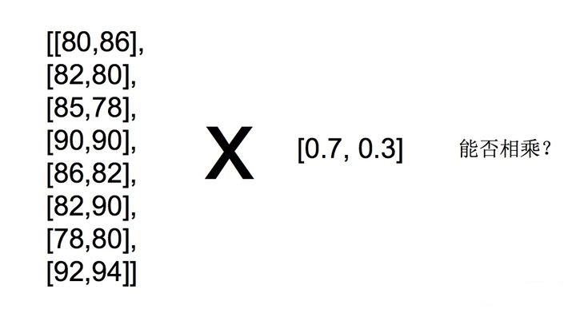

**思考：如何能够直接得出每个学生的成绩？**

### 什么是矩阵

矩阵，英文matrix，**和array的区别矩阵必须是2维的，但是array可以是多维的。**

- np.mat()

- - 将数组转换成矩阵类型

```text
a = np.array([[80, 86],
[82, 80],
[85, 78],
[90, 90],
[86, 82],
[82, 90],
[78, 80],
[92, 94]])
b = np.array([[0.7], [0.3]])
 
np.mat(a)
```

### 矩阵乘法运算

矩阵乘法的两个关键：

- 形状改变
- 运算规则

形状改变：

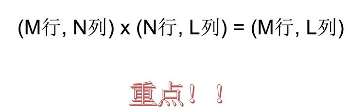

必须符合上面的式子，否则运算出错。

运算规则：

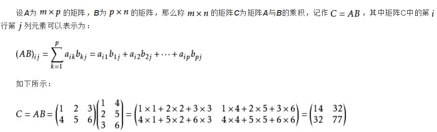

**矩阵乘法api：**

- np.matmul
- np.dot

```text
>>> a = np.array([[80, 86],
[82, 80],
[85, 78],
[90, 90],
[86, 82],
[82, 90],
[78, 80],
[92, 94]])
>>> b = np.array([[0.7], [0.3]])
 
>>> np.matmul(a, b)
array([[81.8],
       [81.4],
       [82.9],
       [90. ],
       [84.8],
       [84.4],
       [78.6],
       [92.6]])
>>> np.dot(a,b)
array([[81.8],
       [81.4],
       [82.9],
       [90. ],
       [84.8],
       [84.4],
       [78.6],
       [92.6]])
```

## 合并、分割

### 合并、分割的用处

#### 合并

* numpy.concatenate((a1, a2, …), axis=0) **可以在水平/垂直方向上合并**
* numpy.hstack(tup) Stack arrays in sequence horizontally  **(column wise)，水平合并**
* numpy.vstack(tup) Stack arrays in sequence vertically  **(row wise)，垂直合并**

示例：

np.hstack()

```python
a=np.array((1,2,3))
b=np.array((2,3,4))
np.hstack((a,b))

array([1, 2, 3, 2, 3, 4])
```


```python
a=np.array([[1],[2],[3]])
b=np.array([[2],[3],[4]])
np.hstack((a,b))

array([[1, 2],
       [2, 3],
       [3, 4]])
```

np.vstack()

```python
a=np.array((1,2,3))
b=np.array((2,3,4))
np.hstack((a,b))

array([[1, 2, 3],
       [2, 3, 4]])
```

```python
a=np.array([[1],[2],[3]])
b=np.array([[2],[3],[4]])
np.vstack((a,b))

array([[1],
       [2],
       [3],
       [2],
       [3],
       [4]])
```

np.concatenate()

```python
a=np.array([[1,2],[3,4]])
b=np.array([[5,6]])
np.concatenate((a,b))

array([[1, 2],
       [3, 4],
       [5, 6]])

np.concatenate((a,b.T),axis=1)
array([[1, 2, 5],
       [3, 4, 6]])
```

#### 分割

* **numpy.split(ary, indices_or_sections, axis=0) Split an array into multiple sub-arrays.**

```python
>>x=np.arange(9.0)

array([0., 1., 2., 3., 4., 5., 6., 7., 8.])

>>np.split(x,3)

[array([0., 1., 2.]), array([3., 4., 5.]), array([6., 7., 8.])]

>> x=np.arange(8.0)

array([0., 1., 2., 3., 4., 5., 6., 7.])

>>np.split(x,[3,5,6,10])

[array([0., 1., 2.]),
 array([3., 4.]),
 array([5.]),
 array([6., 7.]),
 array([], dtype=float64)]
```

## IO操作与数据处理

### 问题

大多数数据并不是我们自己构造的，而是存在文件当中，需要我们用工具获取。
但是Numpy其实并不适合用来读取和处理数据，因此我们这里了解相关API，以及Numpy不方便的地方即可。

### Numpy读取

* genfromtxt(fname[, dtype, comments, …]) Load data from a text file, with missing values handled as specified.

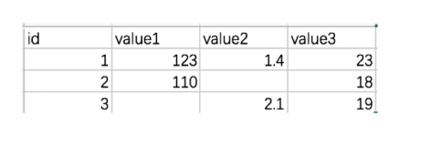

```python
# 读取数据
test = np.genfromtxt("test.csv", delimiter=',')
```

返回结果：

```python
array([[  nan,   nan,   nan,   nan],
       [  1. , 123. ,   1.4,  23. ],
       [  2. , 110. ,   nan,  18. ],
       [  3. ,   nan,   2.1,  19. ]])
```

### 如何处理缺失值

* #### 什么是缺失值

什么时候numpy中会出现nan：当我们读取本地的文件为float的时候，如果有缺失(或者为None)，就会出现nan

* #### 缺失值处理

那么，在一组数据中单纯的把nan替换为0，合适么？会带来什么样的影响？

比如，全部替换为0后，替换之前的平均值如果大于0，替换之后的均值肯定会变小，所以更一般的方式是把缺失的数值替换为均值（中值）或者是直接删除有缺失值的一行
所以：

- 如何计算一组数据的中值或者是均值
- 如何删除有缺失数据的那一行（列）**在pandas中介绍**

```python
t中存在nan值，如何操作把其中的nan填充为每一列的均值
t = array([[ 0., 1., 2., 3., 4., 5.],
[ 6., 7., nan, 9., 10., 11.],
[ 12., 13., 14., nan, 16., 17.],
[ 18., 19., 20., 21., 22., 23.]])
```

处理逻辑：

```python
def fill_nan_by_column_mean(t):
    for i in range(t.shape[1]):
        nan_num=np.count_nonzero(t[:,i][t[:,i]!=t[:,i]]) #计算非nan的个数
        if nan_num>0: #存在nan值
            nan_col = t[:,i]
            now_col_not_nan = now_col[np.isnan(now_col)==False].sum() #求和
            now_col_mean = now_col_nan / (t.shape[0] - nan_num) #和/个数
            now_col[np.isnan(now_col)]=now_col_mean #赋值给now_col
            t[:,i] = now_col #赋值给t，即更新t的当前列
```