## Pandas介绍


- 2008年WesMcKinney开发出的库
- 专门用于数据挖掘的开源python库
- **以Numpy为基础，借力Numpy模块在计算方面性能高的优势**
- **基于matplotlib，能够简便的画图**
- **独特的数据结构**

### 为什么使用Pandas

Numpy已经能够帮助我们处理数据，能够结合matplotlib解决部分数据展示等问题，那么pandas学习的目的在什么地方呢？

- **便捷的数据处理能力**

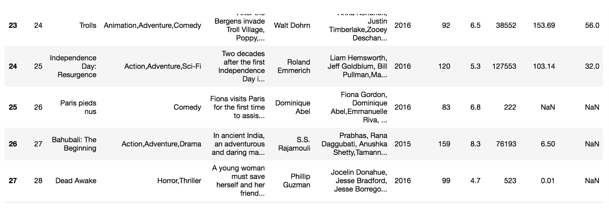


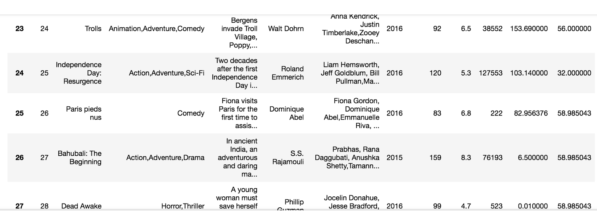

- **读取文件方便**
- **封装了Matplotlib、Numpy的画图和计算**

### 案例

```python
# 导入pandas

import pandas as pd
```

回忆我们在numpy当中创建的股票涨跌幅数据形式？**

```python
# 创建一个符合正太分布的10个股票5天的涨跌幅数据
stock_change = np.random.normal(0, 1, (10, 5))

array([[-0.06544031, -1.30931491, -1.45451514,  0.57973008,  1.48602405],
       [-1.73216741, -0.83413717,  0.45861517, -0.80391793, -0.46878575],
       [ 0.21805567,  0.19901371,  0.7134683 ,  0.5484263 ,  0.38623412],
       [-0.42207879, -0.33702398,  0.42328531, -1.23079202,  1.32843773],
       [-1.72530711,  0.07591832, -1.91708358, -0.16535818,  1.07645091],
       [-0.81576845, -0.28675278,  1.20441981,  0.73365951, -0.06214496],
       [-0.98820861, -1.01815231, -0.95417342, -0.81538991,  0.50268175],
       [-0.10034128,  0.61196204, -0.06850331,  0.74738433,  0.143011  ],
       [ 1.00026175,  0.34241958, -2.2529711 ,  0.93921064,  1.14080312],
       [ 2.52064693,  1.55384756,  1.72252984,  0.61270132,  0.60888092]])
```

**但是这样的数据形式很难看到存储的是什么的样的数据，并也很难获取相应的数据，比如需要获取某个指定股票的数据，就很难去获取！！**

#### 问题：如何让数据更有意义的显示？处理刚才的股票数据

```python
# 使用Pandas中的数据结构
stock_day_rise = pd.DataFrame(stock_change)
```

效果：


- 增加行索引

```python
# 构造行索引序列
stock_code = ['股票' + str(i) for i in range(stock_day_rise.shape[0])]

# 添加行索引
data = pd.DataFrame(stock_change, index=stock_code)
```

- 增加列索引

股票的日期是一个时间的序列，我们要实现从前往后的时间还要考虑每月的总天数等，不方便。使用pd.date_range()：用于生成一组连续的时间序列(暂时了解)

```
date_range(start=None,end=None, periods=None, freq='B')

    start:开始时间

    end:结束时间

    periods:时间天数

    freq:递进单位，默认1天,'B'默认略过周末
# 生成一个时间的序列，略过周末非交易日
date = pd.date_range('2017-01-01', periods=stock_day_rise.shape[1], freq='B')

# index代表行索引，columns代表列索引
data = pd.DataFrame(stock_change, index=stock_code, columns=date)
```

### DataFrame

#### DataFrame结构

DataFrame对象既有行索引，又有列索引

- 行索引，表明不同行，横向索引，叫index，0轴，axis=0
- 列索引，表名不同列，纵向索引，叫columns，1轴，axis=1

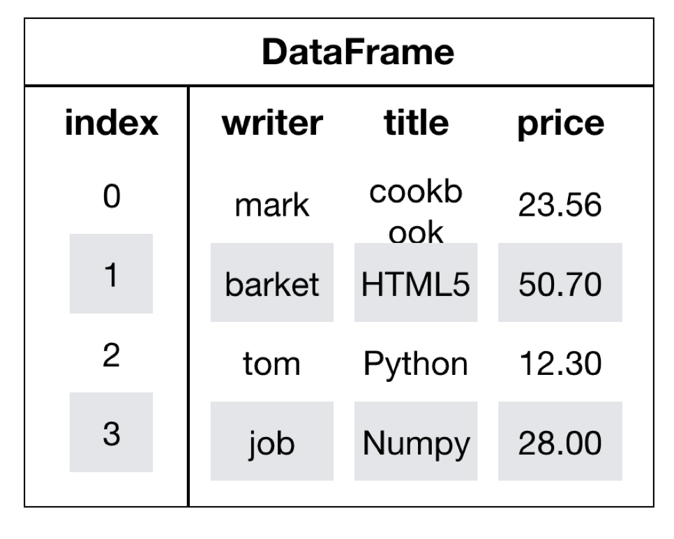

#### DataFrame的属性

- **shape**

```python
data.shape
# 结果
(10, 5)
```

- **index**

DataFrame的行索引列表

```python
data.index

Index(['股票0', '股票1', '股票2', '股票3', '股票4', '股票5', '股票6', '股票7', '股票8', '股票9'], dtype='object')
```

- **columns**

DataFrame的列索引列表

```python
data.columns

DatetimeIndex(['2017-01-02', '2017-01-03', '2017-01-04', '2017-01-05',
               '2017-01-06'],
              dtype='datetime64[ns]', freq='B')
```

- **values**

直接获取其中array的值

```python
data.values

array([[-0.06544031, -1.30931491, -1.45451514,  0.57973008,  1.48602405],
       [-1.73216741, -0.83413717,  0.45861517, -0.80391793, -0.46878575],
       [ 0.21805567,  0.19901371,  0.7134683 ,  0.5484263 ,  0.38623412],
       [-0.42207879, -0.33702398,  0.42328531, -1.23079202,  1.32843773],
       [-1.72530711,  0.07591832, -1.91708358, -0.16535818,  1.07645091],
       [-0.81576845, -0.28675278,  1.20441981,  0.73365951, -0.06214496],
       [-0.98820861, -1.01815231, -0.95417342, -0.81538991,  0.50268175],
       [-0.10034128,  0.61196204, -0.06850331,  0.74738433,  0.143011  ],
       [ 1.00026175,  0.34241958, -2.2529711 ,  0.93921064,  1.14080312],
       [ 2.52064693,  1.55384756,  1.72252984,  0.61270132,  0.60888092]])
```

- **T**

转置

```
data.T
```

结果

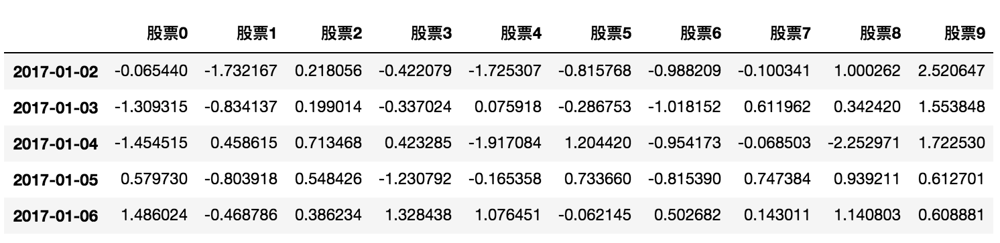

- **head(5)**：显示前5行内容

如果不补充参数，默认5行。填入参数N则显示前N行

```python
data.head(5)

2017-01-02 00:00:00    2017-01-03 00:00:00    2017-01-04 00:00:00    2017-01-05 00:00:00    2017-01-06 00:00:00
股票0    -0.065440    -1.309315    -1.454515    0.579730    1.486024
股票1    -1.732167    -0.834137    0.458615    -0.803918    -0.468786
股票2    0.218056    0.199014    0.713468    0.548426    0.386234
股票3    -0.422079    -0.337024    0.423285    -1.230792    1.328438
股票4    -1.725307    0.075918    -1.917084    -0.165358    1.076451
```

- **tail(5)**:显示后5行内容

如果不补充参数，默认5行。填入参数N则显示后N行

```python
data.tail(5)

 2017-01-02 00:00:00    2017-01-03 00:00:00    2017-01-04 00:00:00    2017-01-05 00:00:00    2017-01-06 00:00:00
股票5    -0.815768    -0.286753    1.204420    0.733660    -0.062145
股票6    -0.988209    -1.018152    -0.954173    -0.815390    0.502682
股票7    -0.100341    0.611962    -0.068503    0.747384    0.143011
股票8    1.000262    0.342420    -2.252971    0.939211    1.140803
股票9    2.520647    1.553848    1.722530    0.612701    0.608881
```

### DatatFrame索引的设置

#### **修改行列索引值**

```python
stock_code = ["股票_" + str(i) for i in range(stock_day_rise.shape[0])]

# 必须整体全部修改
data.index = stock_code
```

结果

```python
2017-01-02 00:00:00    2017-01-03 00:00:00    2017-01-04 00:00:00    2017-01-05 00:00:00    2017-01-06 00:00:00
股票_0    -0.065440    -1.309315    -1.454515    0.579730    1.486024
股票_1    -1.732167    -0.834137    0.458615    -0.803918    -0.468786
股票_2    0.218056    0.199014    0.713468    0.548426    0.386234
股票_3    -0.422079    -0.337024    0.423285    -1.230792    1.328438
股票_4    -1.725307    0.075918    -1.917084    -0.165358    1.076451
股票_5    -0.815768    -0.286753    1.204420    0.733660    -0.062145
股票_6    -0.988209    -1.018152    -0.954173    -0.815390    0.502682
股票_7    -0.100341    0.611962    -0.068503    0.747384    0.143011
股票_8    1.000262    0.342420    -2.252971    0.939211    1.140803
股票_9    2.520647    1.553848    1.722530    0.612701    0.608881
```

注意：以下修改方式是错误的

```
# 错误修改方式
data.index[3] = '股票_3'
```

#### 重设索引

- reset_index(drop=False)
  - 设置新的下标索引
  - drop:默认为False，不删除原来索引，如果为True,删除原来的索引值

```python
# 重置索引,drop=False
data.reset_index()

    index    2017-01-02 00:00:00    2017-01-03 00:00:00    2017-01-04 00:00:00    2017-01-05 00:00:00    2017-01-06 00:00:00
0    股票_0    -0.065440    -1.309315    -1.454515    0.579730    1.486024
1    股票_1    -1.732167    -0.834137    0.458615    -0.803918    -0.468786
2    股票_2    0.218056    0.199014    0.713468    0.548426    0.386234
3    股票_3    -0.422079    -0.337024    0.423285    -1.230792    1.328438
4    股票_4    -1.725307    0.075918    -1.917084    -0.165358    1.076451
5    股票_5    -0.815768    -0.286753    1.204420    0.733660    -0.062145
6    股票_6    -0.988209    -1.018152    -0.954173    -0.815390    0.502682
7    股票_7    -0.100341    0.611962    -0.068503    0.747384    0.143011
8    股票_8    1.000262    0.342420    -2.252971    0.939211    1.140803
9    股票_9    2.520647    1.553848    1.722530    0.612701    0.608881
# 重置索引,drop=True
data.reset_index(drop=True)

2017-01-02 00:00:00    2017-01-03 00:00:00    2017-01-04 00:00:00    2017-01-05 00:00:00    2017-01-06 00:00:00
0    -0.065440    -1.309315    -1.454515    0.579730    1.486024
1    -1.732167    -0.834137    0.458615    -0.803918    -0.468786
2    0.218056    0.199014    0.713468    0.548426    0.386234
3    -0.422079    -0.337024    0.423285    -1.230792    1.328438
4    -1.725307    0.075918    -1.917084    -0.165358    1.076451
5    -0.815768    -0.286753    1.204420    0.733660    -0.062145
6    -0.988209    -1.018152    -0.954173    -0.815390    0.502682
7    -0.100341    0.611962    -0.068503    0.747384    0.143011
8    1.000262    0.342420    -2.252971    0.939211    1.140803
9    2.520647    1.553848    1.722530    0.612701    0.608881
```

#### 以某列值设置为新的索引

- set_index(*keys*, *drop=True*)
  - **keys** : 列索引名成或者列索引名称的列表
  - **drop** : boolean, default True.当做新的索引，删除原来的列
- **设置新索引案例**

1、创建

```python
df = pd.DataFrame({'month': [1, 4, 7, 10],
                    'year': [2012, 2014, 2013, 2014],
                    'sale':[55, 40, 84, 31]})

   month  sale  year
0  1      55    2012
1  4      40    2014
2  7      84    2013
3  10     31    2014
```

2、以月份设置新的索引

```python
df.set_index('month')
       sale  year
month
1      55    2012
4      40    2014
7      84    2013
10     31    2014
```

3、设置多个索引，以年和月份

```python
df.set_index(['year', 'month'])
            sale
year  month
2012  1     55
2014  4     40
2013  7     84
2014  10    31
```

> 注：通过刚才的设置，这样DataFrame就变成了一个具有MultiIndex的DataFrame。

### MultiIndex与Panel

打印刚才的df的行索引结果

```python
df.index

MultiIndex(levels=[[1, 2], [1, 4, 7, 10]],
           labels=[[0, 0, 1, 1], [0, 1, 2, 3]],
           names=['year', 'month'])
```

#### MultiIndex

多级或分层索引对象。

- index属性
  - names:levels的名称
  - levels：每个level的元组值

```python
df.index.names
FrozenList(['year', 'month'])

df.index.levels
FrozenList([[1, 2], [1, 4, 7, 10]])
```

#### Panel

- class `pandas.Panel`(*data=None*, *items=None*, *major_axis=None*, *minor_axis=None*, *copy=False*, *dtype=None*)
  - 存储3维数组的Panel结构

```python
p = pd.Panel(np.arange(24).reshape(4,3,2),
                 items=list('ABCD'),
                 major_axis=pd.date_range('20130101', periods=3),
                 minor_axis=['first', 'second'])
p

<class 'pandas.core.panel.Panel'>
Dimensions: 4 (items) x 3 (major_axis) x 2 (minor_axis)
Items axis: A to D
Major_axis axis: 2013-01-01 00:00:00 to 2013-01-03 00:00:00
Minor_axis axis: first to second
```

- *items* - `axis 0`，每个项目对应于内部包含的数据帧(DataFrame)。
- *major_axis* - `axis 1`，它是每个数据帧(DataFrame)的索引(行)。
- *minor_axis* - `axis 2`，它是每个数据帧(DataFrame)的列。

查看panel数据:

```
p[:,:,"first"]
p["B",:,:]
```

> **注：Pandas从版本0.20.0开始弃用：推荐的用于表示3D数据的方法是通过DataFrame上的MultiIndex方法**

**如果获取DataFrame中某个股票的不同时间数据？这样的结构是什么样的？**

### Series结构

什么是Series结构呢，我们直接看下面的图：


- series结构只有行索引

我们将之前的涨跌幅数据进行转置，然后获取'股票0'的所有数据

```python
# series
type(data['2017-01-02'])
pandas.core.series.Series

# 这一步相当于是series去获取行索引的值
data['2017-01-02']['股票_0']
-0.18753158283513574
```

#### 创建series

通过已有数据创建

- 指定内容，默认索引

```python
pd.Series(np.arange(10))
```

- 指定索引

```python
pd.Series([6.7,5.6,3,10,2], index=[1,2,3,4,5])
```

通过字典数据创建

```python
pd.Series({'red':100, ''blue':200, 'green': 500, 'yellow':1000})
```

#### series获取属性和值

- index
- values

## 基本数据操作

为了更好的理解这些基本操作，我们将读取一个真实的股票数据。关于文件操作，后面在介绍，这里只先用一下API

```python
# 读取文件
data = pd.read_csv("./data/stock_day.csv")

# 删除一些列，让数据更简单些，再去做后面的操作
data = data.drop(["ma5","ma10","ma20","v_ma5","v_ma10","v_ma20"], axis=1)
```

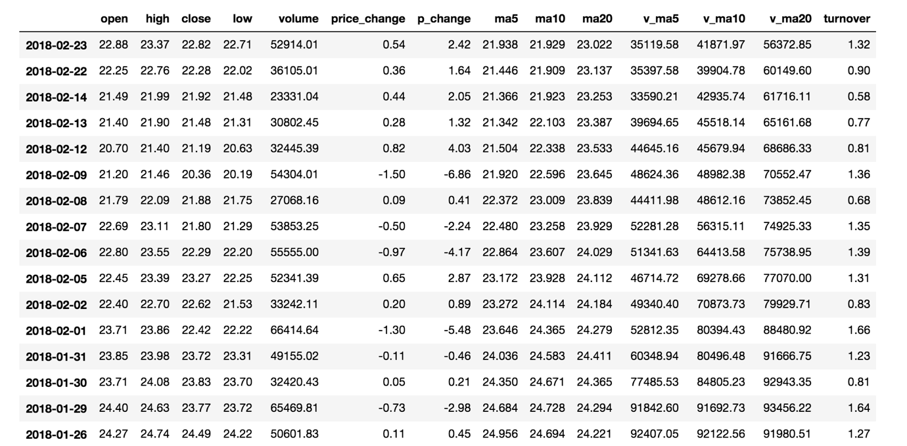

### 索引操作

Numpy当中我们已经讲过使用索引选取序列和切片选择，pandas也支持类似的操作，也可以直接使用列名、行名

称，甚至组合使用。

#### **直接使用行列索引(先列后行)**

获取'2018-02-27'这天的'open'的结果

```python
# 直接使用行列索引名字的方式（先列后行）
data['open']['2018-02-27']
23.53

# 不支持的操作
# 错误
data['2018-02-27']['open']
# 错误
data[:1, :2]
```

#### **结合loc或者iloc使用索引**

获取从'2018-02-27':'2018-02-22'，'open'的结果

```python
# 使用loc:只能指定行列索引的名字
data.loc['2018-02-27':'2018-02-22', 'open']

2018-02-27    23.53
2018-02-26    22.80
2018-02-23    22.88
Name: open, dtype: float64

# 使用iloc可以通过索引的下标去获取
# 获取前100天数据的'open'列的结果
data.iloc[0:100, 0:2].head()

            open    high    close    low
2018-02-27    23.53    25.88    24.16    23.53
2018-02-26    22.80    23.78    23.53    22.80
2018-02-23    22.88    23.37    22.82    22.71
```

#### **使用ix组合索引**

> Warning:Starting in 0.20.0, the `.ix` indexer is deprecated, in favor of the more strict `.iloc` and `.loc` indexers.

获取行第1天到第4天，['open', 'close', 'high', 'low']这个四个指标的结果

```python
# 使用ix进行下表和名称组合做引
data.ix[0:4, ['open', 'close', 'high', 'low']]

# 推荐使用loc和iloc来获取的方式
data.loc[data.index[0:4], ['open', 'close', 'high', 'low']]
data.iloc[0:4, data.columns.get_indexer(['open', 'close', 'high', 'low'])]

            open    close    high    low
2018-02-27    23.53    24.16    25.88    23.53
2018-02-26    22.80    23.53    23.78    22.80
2018-02-23    22.88    22.82    23.37    22.71
2018-02-22    22.25    22.28    22.76    22.02
```

### 赋值操作

对DataFrame当中的close列进行重新赋值为1

```python
# 直接修改原来的值
data['close'] = 1
# 或者
data.close = 1
```

### 排序

排序有两种形式，一种对于索引进行排序，一种对于内容进行排序

- 使用df.sort_values(by=, ascending=)
  - 单个键或者多个键进行排序,默认升序
  - ascending=False:降序
  - ascending=True:升序

```python
# 按照涨跌幅大小进行排序 , 使用ascending指定按照大小排序
data = data.sort_values(by='p_change', ascending=False).head()

            open    high    close    low        volume price_change p_change turnover
2015-08-28    15.40    16.46    16.46    15.00    117827.60    1.50    10.03    4.03
2015-05-21    27.50    28.22    28.22    26.50    121190.11    2.57    10.02    4.15
2016-12-22    18.50    20.42    20.42    18.45    150470.83    1.86    10.02    3.77
2015-08-04    16.20    17.35    17.35    15.80    94292.63    1.58    10.02    3.23
2016-07-07    18.66    18.66    18.66    18.41    48756.55    1.70    10.02    1.67

# 按照过个键进行排序
data = data.sort_values(by=['open', 'high'])
            open    high    close    low        volume price_change p_change turnover
2015-06-15    34.99    34.99    31.69    31.69    199369.53    -3.52    -10.00    6.82
2015-06-12    34.69    35.98    35.21    34.01    159825.88    0.82    2.38    5.47
2015-06-10    34.10    36.35    33.85    32.23    269033.12    0.51    1.53    9.21
2017-11-01    33.85    34.34    33.83    33.10    232325.30    -0.61    -1.77    5.81
2015-06-11    33.17    34.98    34.39    32.51    173075.73    0.54    1.59    5.92
```

- 使用df.sort_index给索引进行排序

这个股票的日期索引原来是从大到小，现在重新排序，从小到大

```python
# 对索引进行排序
data.sort_index()

            open    high    close    low    volume    price_change    p_change    turnover
2015-03-02    12.25    12.67    12.52    12.20    96291.73    0.32    2.62    3.30
2015-03-03    12.52    13.06    12.70    12.52    139071.61    0.18    1.44    4.76
2015-03-04    12.80    12.92    12.90    12.61    67075.44    0.20    1.57    2.30
2015-03-05    12.88    13.45    13.16    12.87    93180.39    0.26    2.02    3.19
2015-03-06    13.17    14.48    14.28    13.13    179831.72    1.12    8.51    6.16
```

- 使用series.sort_values(ascending=True)进行排序

series排序时，只有一列，不需要参数

```python
data['p_change'].sort_values(ascending=True).head()

2015-09-01   -10.03
2015-09-14   -10.02
2016-01-11   -10.02
2015-07-15   -10.02
2015-08-26   -10.01
Name: p_change, dtype: float64
```

- 使用series.sort_index()进行排序

与df一致

```python
# 对索引进行排序
data['p_change'].sort_index().head()

2015-03-02    2.62
2015-03-03    1.44
2015-03-04    1.57
2015-03-05    2.02
2015-03-06    8.51
Name: p_change, dtype: float64
```

## DataFrame运算

### 算术运算

- add(other)

比如进行数学运算加上具体的一个数字

```python
data['open'].add(1)

2018-02-27    24.53
2018-02-26    23.80
2018-02-23    23.88
2018-02-22    23.25
2018-02-14    22.49
```

- sub(other)

如果想要得到每天的涨跌大小？求出每天 close- open价格差

```python
# 1、筛选两列数据
close = data['close']
open1 = data['open']
# 2、收盘价减去开盘价
data['m_price_change'] = close.sub(open1)
data.head()

            open     high   close   low   volume  price_change  p_change  turnover my_price_change
2018-02-27    23.53    25.88    24.16    23.53    95578.03    0.63    2.68    2.39    0.63
2018-02-26    22.80    23.78    23.53    22.80    60985.11    0.69    3.02    1.53    0.73
2018-02-23    22.88    23.37    22.82    22.71    52914.01    0.54    2.42    1.32    -0.06
2018-02-22    22.25    22.76    22.28    22.02    36105.01    0.36    1.64    0.90    0.03
2018-02-14    21.49    21.99    21.92    21.48    23331.04    0.44    2.05    0.58    0.43
```

### 逻辑运算

#### 逻辑运算符号<、 >、|、 &

- 例如筛选p_change > 2的日期数据
  - data['p_change'] > 2返回逻辑结果

```python
data['p_change'] > 2

2018-02-27     True
2018-02-26     True
2018-02-23     True
2018-02-22    False
2018-02-14     True
```

```python
# 逻辑判断的结果可以作为筛选的依据
data[data['p_change'] > 2]

pen    high    close    low    volume    price_change    p_change    turnover    my_price_change
2018-02-27    23.53    25.88    24.16    23.53    95578.03    0.63    2.68    2.39    0.63
2018-02-26    22.80    23.78    23.53    22.80    60985.11    0.69    3.02    1.53    0.73
2018-02-23    22.88    23.37    22.82    22.71    52914.01    0.54    2.42    1.32    -0.06
2018-02-14    21.49    21.99    21.92    21.48    23331.04    0.44    2.05    0.58    0.43
2018-02-12    20.70    21.40    21.19    20.63    32445.39    0.82    4.03    0.81    0.49
```

- 完成一个多个逻辑判断， 筛选p_change > 2并且open > 15

```python
data[(data['p_change'] > 2) & (data['open'] > 15)]

open    high    close    low    volume    price_change    p_change    turnover    my_price_change
2017-11-14    28.00    29.89    29.34    27.68    243773.23    1.10    3.90    6.10    1.34
2017-10-31    32.62    35.22    34.44    32.20    361660.88    2.38    7.42    9.05    1.82
2017-10-27    31.45    33.20    33.11    31.45    333824.31    0.70    2.16    8.35    1.66
2017-10-26    29.30    32.70    32.41    28.92    501915.41    2.68    9.01    12.56    3.11
```

#### 逻辑运算函数

- query(expr)
  - expr:查询字符串

通过query使得刚才的过程更加方便简单

```python
data.query("p_change > 2 & turnover > 15")
```

- isin(values)

例如判断'turnover'是否为4.19, 2.39

```python
# 可以指定值进行一个判断，从而进行筛选操作
data[data['turnover'].isin([4.19, 2.39])]

open    high    close    low    volume    price_change    p_change    turnover    my_price_change
2018-02-27    23.53    25.88    24.16    23.53    95578.03    0.63    2.68    2.39    0.63
2017-07-25    23.07    24.20    23.70    22.64    167489.48    0.67    2.91    4.19    0.63
2016-09-28    19.88    20.98    20.86    19.71    95580.75    0.98    4.93    2.39    0.98
2015-04-07    16.54    17.98    17.54    16.50    122471.85    0.88    5.28    4.19    1.00
```

### 统计运算

#### describe()

综合分析: 能够直接得出很多统计结果,`count`, `mean`, `std`, `min`, `max` 等

```python
# 计算平均值、标准差、最大值、最小值
data.describe()
```

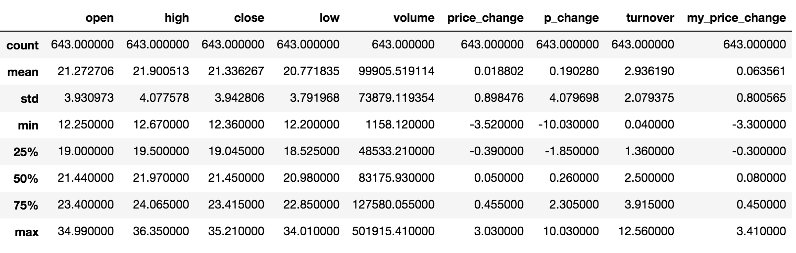

#### 统计函数

Numpy当中已经详细介绍，在这里我们演示min(最小值), max(最大值), mean(平均值), median(中位数), var(方差), std(标准差),mode(众数)结果,

| `count`  | Number of non-NA observations                  |
| -------- | ---------------------------------------------- |
| `sum`    | **Sum of values**                              |
| `mean`   | **Mean of values**                             |
| `median` | Arithmetic median of values                    |
| `min`    | **Minimum**                                    |
| `max`    | **Maximum**                                    |
| `mode`   | Mode                                           |
| `abs`    | Absolute Value                                 |
| `prod`   | Product of values                              |
| `std`    | **Bessel-corrected sample standard deviation** |
| `var`    | **Unbiased variance**                          |
| `idxmax` | compute the index labels with the maximum      |
| `idxmin` | compute the index labels with the minimum      |

**对于单个函数去进行统计的时候，坐标轴还是按照这些默认为“columns” (axis=0, default)，如果要对行“index” 需要指定(axis=1)**

- max()、min()

```python
# 使用统计函数：0 代表列求结果， 1 代表行求统计结果
data.max(0)

open                   34.99
high                   36.35
close                  35.21
low                    34.01
volume             501915.41
price_change            3.03
p_change               10.03
turnover               12.56
my_price_change         3.41
dtype: float64
```

- std()、var()

```python
# 方差
data.var(0)

open               1.545255e+01
high               1.662665e+01
close              1.554572e+01
low                1.437902e+01
volume             5.458124e+09
price_change       8.072595e-01
p_change           1.664394e+01
turnover           4.323800e+00
my_price_change    6.409037e-01
dtype: float64

# 标准差
data.std(0)

open                   3.930973
high                   4.077578
close                  3.942806
low                    3.791968
volume             73879.119354
price_change           0.898476
p_change               4.079698
turnover               2.079375
my_price_change        0.800565
dtype: float64
```

- median()：中位数

中位数为将数据从小到大排列，在最中间的那个数为中位数。如果没有中间数，取中间两个数的平均值。

```python
df = pd.DataFrame({'COL1' : [2,3,4,5,4,2],
                   'COL2' : [0,1,2,3,4,2]})

df.median()

COL1    3.5
COL2    2.0
dtype: float64
```

- idxmax()、idxmin()

```python
# 求出最大值的位置
data.idxmax(axis=0)

open               2015-06-15
high               2015-06-10
close              2015-06-12
low                2015-06-12
volume             2017-10-26
price_change       2015-06-09
p_change           2015-08-28
turnover           2017-10-26
my_price_change    2015-07-10
dtype: object


# 求出最小值的位置
data.idxmin(axis=0)

open               2015-03-02
high               2015-03-02
close              2015-09-02
low                2015-03-02
volume             2016-07-06
price_change       2015-06-15
p_change           2015-09-01
turnover           2016-07-06
my_price_change    2015-06-15
dtype: object
```

### 累计统计函数

| 函数      | 作用                        |
| --------- | --------------------------- |
| `cumsum`  | **计算前1/2/3/…/n个数的和** |
| `cummax`  | 计算前1/2/3/…/n个数的最大值 |
| `cummin`  | 计算前1/2/3/…/n个数的最小值 |
| `cumprod` | 计算前1/2/3/…/n个数的积     |

**那么这些累计统计函数怎么用？**

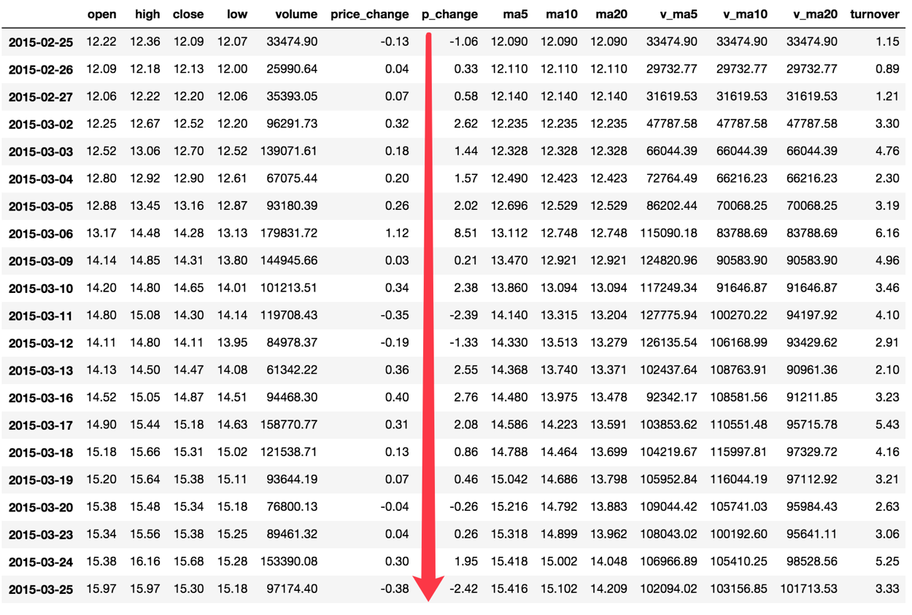

以上这些函数可以对series和dataframe操作

这里我们按照时间的从前往后来进行累计

- 排序

```python
# 排序之后，进行累计求和
data = data.sort_index()
```

- 对p_change进行求和

```python
stock_rise = data['p_change']
# plot方法集成了前面直方图、条形图、饼图、折线图
stock_rise.cumsum()

2015-03-02      2.62
2015-03-03      4.06
2015-03-04      5.63
2015-03-05      7.65
2015-03-06     16.16
2015-03-09     16.37
2015-03-10     18.75
2015-03-11     16.36
2015-03-12     15.03
2015-03-13     17.58
2015-03-16     20.34
2015-03-17     22.42
2015-03-18     23.28
2015-03-19     23.74
2015-03-20     23.48
2015-03-23     23.74
```

**那么如何让这个连续求和的结果更好的显示呢？**

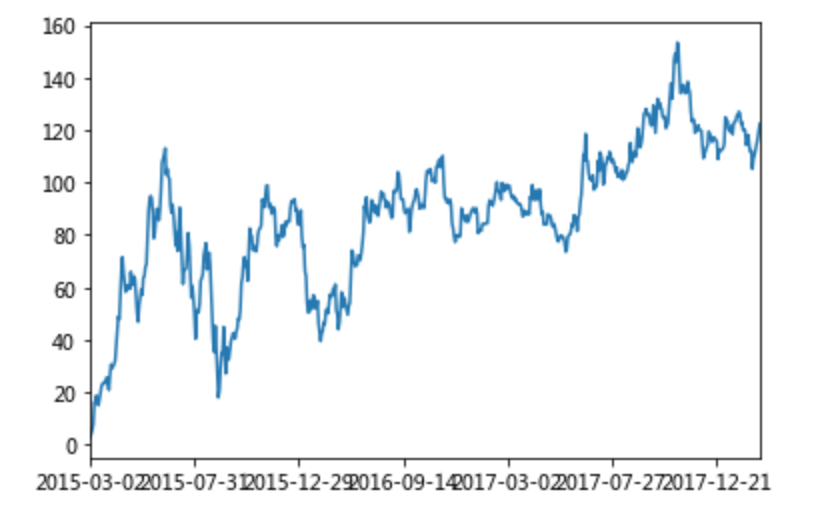

如果要使用plot函数，需要导入matplotlib.

```python
import matplotlib.pyplot as plt
# plot显示图形
stock_rise.cumsum().plot()
# 需要调用show，才能显示出结果
plt.show()
```

> 关于plot，稍后会介绍API的选择

### 自定义运算

- apply(func, axis=0)
  - func:自定义函数
  - axis=0:默认是列，axis=1为行进行运算
- 定义一个对列，最大值-最小值的函数

```python
data[['open', 'close']].apply(lambda x: x.max() - x.min(), axis=0)

open     22.74
close    22.85
dtype: float64
```

## Pandas画图

### pandas.DataFrame.plot

- `DataFrame.plot`(*x=None*, *y=None*, *kind='line'*)
  - x : label or position, default None
  - y : label, position or list of label, positions, default None
    - Allows plotting of one column versus another
  - kind : str
    - ‘line’ : line plot (default)
    - ‘bar’ : vertical bar plot
    - ‘barh’ : horizontal bar plot
      - 关于“barh”的解释：
      - http://pandas.pydata.org/pandas-docs/stable/reference/api/pandas.DataFrame.plot.barh.html
    - ‘hist’ : histogram
    - ‘pie’ : pie plot
    - ‘scatter’ : scatter plot

> 更多参数细节：https://pandas.pydata.org/pandas-docs/stable/generated/pandas.DataFrame.plot.html?highlight=plot#pandas.DataFrame.plot

### pandas.Series.plot

> 更多参数细节：https://pandas.pydata.org/pandas-docs/stable/generated/pandas.Series.plot.html?highlight=plot#pandas.Series.plot

## 文件读取与存储

我们的数据大部分存在于文件当中，所以pandas会支持复杂的IO操作，pandas的API支持众多的文件格式，如CSV、SQL、XLS、JSON、HDF5。

> 注：最常用的HDF5和CSV文件


### CSV

#### read_csv

- pandas.read_csv(filepath_or_buffer, sep =',' )
  - filepath_or_buffer:文件路径
  - usecols:指定读取的列名，列表形式

读取之前的股票的数据

```python
# 读取文件,并且指定只获取'open', 'close'指标
data = pd.read_csv("./data/stock_day.csv", usecols=['open', 'close'])

            open    high    close
2018-02-27    23.53    25.88    24.16
2018-02-26    22.80    23.78    23.53
2018-02-23    22.88    23.37    22.82
2018-02-22    22.25    22.76    22.28
2018-02-14    21.49    21.99    21.92
```

#### to_csv

- DataFrame.to_csv(path_or_buf=None, sep=', ’, columns=None, header=True, index=True, mode='w', encoding=None)
  - path_or_buf :string or file handle, default None
  - sep :character, default ‘,’
  - columns :sequence, optional
  - mode:'w'：重写, 'a' 追加
  - index:是否写进行索引
  - header :boolean or list of string, default True,是否写进列索引值

#### 案例

- 保存'open'列的数据

```python
# 选取10行数据保存,便于观察数据
data[:10].to_csv("./data/test.csv", columns=['open'])
```

- 读取，查看结果

```python
pd.read_csv("./data/test.csv")

     Unnamed: 0    open
0    2018-02-27    23.53
1    2018-02-26    22.80
2    2018-02-23    22.88
3    2018-02-22    22.25
4    2018-02-14    21.49
5    2018-02-13    21.40
6    2018-02-12    20.70
7    2018-02-09    21.20
8    2018-02-08    21.79
9    2018-02-07    22.69
```

会发现将索引存入到文件当中，变成单独的一列数据。如果需要删除，可以指定index参数,删除原来的文件，重新保存一次。

```python
# index:存储不会讲索引值变成一列数据
data[:10].to_csv("./data/test.csv", columns=['open'], index=False)
```

### HDF5

#### read_hdf与to_hdf

**HDF5文件的读取和存储需要指定一个键，值为要存储的DataFrame**

- pandas.read_hdf(path_or_buf，key =None，** kwargs)

  从h5文件当中读取数据

  - path_or_buffer:文件路径
  - key:读取的键
  - return:Theselected object

- DataFrame.to_hdf(path_or_buf, *key*, **/*kwargs*)

#### 案例

- 读取文件

```python
day_eps_ttm = pd.read_hdf("./data/stock_data/day/day_eps_ttm.h5")
```

如果读取的时候出现以下错误


需要安装安装tables模块避免不能读取HDF5文件

```python
pip install tables
```


- 存储文件

```python
day_eps_ttm.to_hdf("./data/test.h5", key="day_eps_ttm")
```

再次读取的时候, 需要指定键的名字

```python
new_eps = pd.read_hdf("./data/test.h5", key="day_eps_ttm")
```

### JSON

JSON是我们常用的一种数据交换格式，前面在前后端的交互经常用到，也会在存储的时候选择这种格式。所以我们需要知道Pandas如何进行读取和存储JSON格式。

#### read_json

- pandas.read_json(path_or_buf=None, orient=None, typ='frame', lines=False)

  - 将JSON格式准换成默认的Pandas DataFrame格式

  - orient : string,Indication of expected JSON string format.

    - 'split' : dict like {index -> [index], columns -> [columns], data -> [values]}

      - split 将索引总结到索引，列名到列名，数据到数据。将三部分都分开了

    - 'records' : list like [{column -> value}, ... , {column -> value}]

      - records 以`columns：values`的形式输出

    - 'index' : dict like {index -> {column -> value}}

      - index 以`index：{columns：values}...`的形式输出

    - 'columns' : dict like {column -> {index -> value}}

      ,默认该格式

      - colums 以`columns:{index:values}`的形式输出

    - 'values' : just the values array

      - values 直接输出值

  - lines : boolean, default False

    - 按照每行读取json对象

  - typ : default ‘frame’， 指定转换成的对象类型series或者dataframe

#### read_josn 案例

- 数据介绍

这里使用一个新闻标题讽刺数据集，格式为json。`is_sarcastic`：1讽刺的，否则为0；`headline`：新闻报道的标题；`article_link`：链接到原始新闻文章。存储格式为：

```jso
{"article_link": "https://www.huffingtonpost.com/entry/versace-black-code_us_5861fbefe4b0de3a08f600d5", "headline": "former versace store clerk sues over secret 'black code' for minority shoppers", "is_sarcastic": 0}
{"article_link": "https://www.huffingtonpost.com/entry/roseanne-revival-review_us_5ab3a497e4b054d118e04365", "headline": "the 'roseanne' revival catches up to our thorny political mood, for better and worse", "is_sarcastic": 0}
```

- 读取

orient指定存储的json格式，lines指定按照行去变成一个样本

```python
json_read = pd.read_json("./data/Sarcasm_Headlines_Dataset.json", orient="records", lines=True)
```

结果为：


#### to_json

* DataFrame.to_json(*path_or_buf=None*, *orient=None*, *lines=False*)
  * 将Pandas 对象存储为json格式
  * *path_or_buf=None*：文件地址
  * orient:存储的json形式，{‘split’,’records’,’index’,’columns’,’values’}
  * lines:一个对象存储为一行

#### 案例

- 存储文件

```python
json_read.to_json("./data/test.json", orient='records')
```

结果

```
[{"article_link":"https:////www.huffingtonpost.com//entry//versace-black-code_us_5861fbefe4b0de3a08f600d5","headline":"former versace store clerk sues over secret 'black code' for minority shoppers","is_sarcastic":0},{"article_link":"https:////www.huffingtonpost.com//entry//roseanne-revival-review_us_5ab3a497e4b054d118e04365","headline":"the 'roseanne' revival catches up to our thorny political mood, for better and worse","is_sarcastic":0},{"article_link":"https:////local.theonion.com//mom-starting-to-fear-son-s-web-series-closest-thing-she-1819576697","headline":"mom starting to fear son's web series closest thing she will have to grandchild","is_sarcastic":1},{"article_link":"https:////politics.theonion.com//boehner-just-wants-wife-to-listen-not-come-up-with-alt-1819574302","headline":"boehner just wants wife to listen, not come up with alternative debt-reduction ideas","is_sarcastic":1},{"article_link":"https:////www.huffingtonpost.com//entry//jk-rowling-wishes-snape-happy-birthday_us_569117c4e4b0cad15e64fdcb","headline":"j.k. rowling wishes snape happy birthday in the most magical way","is_sarcastic":0},{"article_link":"https:////www.huffingtonpost.com//entry//advancing-the-worlds-women_b_6810038.html","headline":"advancing the world's women","is_sarcastic":0},....]
```

- 修改lines参数为True

```python
json_read.to_json("./data/test.json", orient='records', lines=True)
```

结果

```
{"article_link":"https:////www.huffingtonpost.com//entry//versace-black-code_us_5861fbefe4b0de3a08f600d5","headline":"former versace store clerk sues over secret 'black code' for minority shoppers","is_sarcastic":0}
{"article_link":"https:////www.huffingtonpost.com//entry//roseanne-revival-review_us_5ab3a497e4b054d118e04365","headline":"the 'roseanne' revival catches up to our thorny political mood, for better and worse","is_sarcastic":0}
{"article_link":"https:////local.theonion.com//mom-starting-to-fear-son-s-web-series-closest-thing-she-1819576697","headline":"mom starting to fear son's web series closest thing she will have to grandchild","is_sarcastic":1}
{"article_link":"https:////politics.theonion.com//boehner-just-wants-wife-to-listen-not-come-up-with-alt-1819574302","headline":"boehner just wants wife to listen, not come up with alternative debt-reduction ideas","is_sarcastic":1}
{"article_link":"https:////www.huffingtonpost.com//entry//jk-rowling-wishes-snape-happy-birthday_us_569117c4e4b0cad15e64fdcb","headline":"j.k. rowling wishes snape happy birthday in the most magical way","is_sarcastic":0}...
```

### 拓展

**优先选择使用HDF5文件存储**

- HDF5在存储的时候支持压缩，**使用的方式是blosc，这个是速度最快**的也是pandas默认支持的
- 使用压缩可以**提磁盘利用率，节省空间**
- HDF5还是跨平台的，可以轻松迁移到hadoop 上面

## 高级处理-缺失值处理

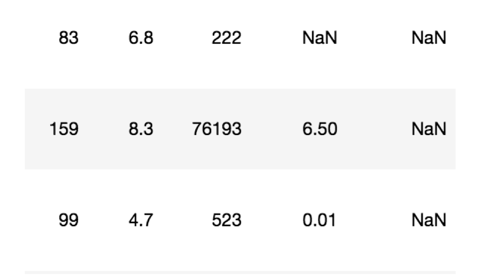

### 如何处理nan

- 判断数据是否为NaN：
  - pd.isnull(df),
  - pd.notnull(df)
- 处理方式：
  - 存在缺失值nan,并且是np.nan:
    - 1、删除存在缺失值的:dropna(axis='rows')
      - 注：不会修改原数据，需要接受返回值
    - 2、替换缺失值:fillna(value, inplace=True)
      - value:替换成的值
      - inplace:True:会修改原数据，False:不替换修改原数据，生成新的对象
  - 不是缺失值nan，有默认标记的

### 电影数据的缺失值处理

- 电影数据文件获取

```python
# 读取电影数据
movie = pd.read_csv("./data/IMDB-Movie-Data.csv")
989    Martyrs    Horror    A young woman's quest for revenge against the ...    Pascal Laugier    Morjana Alaoui, Mylène Jampanoï, Catherine Bég...    2008    99    7.1    63785    NaN    89.0
990    Selma    Biography,Drama,History    A chronicle of Martin Luther King's campaign t...    Ava DuVernay    David Oyelowo, Carmen Ejogo, Tim Roth, Lorrain...    2014    128    7.5    67637    52.07    NaN
```

#### 判断缺失值是否存在

- pd.notnull()

```
pd.notnull(movie)
Rank    Title    Genre    Description    Director    Actors    Year    Runtime (Minutes)    Rating    Votes    Revenue (Millions)    Metascore
0    True    True    True    True    True    True    True    True    True    True    True    True
1    True    True    True    True    True    True    True    True    True    True    True    True
2    True    True    True    True    True    True    True    True    True    True    True    True
3    True    True    True    True    True    True    True    True    True    True    True    True
4    True    True    True    True    True    True    True    True    True    True    True    True
5    True    True    True    True    True    True    True    True    True    True    True    True
6    True    True    True    True    True    True    True    True    True    True    True    True
7    True    True    True    True    True    True    True    True    True    True    False    True
np.all(pd.notnull(movie))
```

#### 存在缺失值nan,并且是np.nan

- 1、删除

pandas删除缺失值，使用dropna的前提是，缺失值的类型必须是np.nan

```python
# 不修改原数据
movie.dropna()

# 可以定义新的变量接受或者用原来的变量名
data = movie.dropna()
```

- 2、替换缺失值

```python
# 替换存在缺失值的样本的两列
# 替换填充平均值，中位数
# movie['Revenue (Millions)'].fillna(movie['Revenue (Millions)'].mean(), inplace=True)
```

替换所有缺失值：

```python
for i in movie.columns:
    if np.all(pd.notnull(movie[i])) == False:
        print(i)
        movie[i].fillna(movie[i].mean(), inplace=True)
```

#### 不是缺失值nan，有默认标记的

数据是这样的：


```python
wis = pd.read_csv("https://archive.ics.uci.edu/ml/machine-learning-databases/breast-cancer-wisconsin/breast-cancer-wisconsin.data")
```

以上数据在读取时，可能会报如下错误：

```
URLError: <urlopen error [SSL: CERTIFICATE_VERIFY_FAILED] certificate verify failed (_ssl.c:833)>
```

解决办法：

```python
# 全局取消证书验证
import ssl
ssl._create_default_https_context = ssl._create_unverified_context
```

**处理思路分析：**

- 1、先替换‘?’为np.nan
  - df.replace(to_replace=, value=)
    - to_replace:替换前的值
    - value:替换后的值

```python
# 把一些其它值标记的缺失值，替换成np.nan
wis = wis.replace(to_replace='?', value=np.nan)
```

- 2、在进行缺失值的处理

```python
# 删除
wis = wis.dropna()
```

## 高级处理-数据离散化

### 为什么要离散化

连续属性离散化的目的是为了简化数据结构，**数据离散化技术可以用来减少给定连续属性值的个数**。离散化方法经常作为数据挖掘的工具。

### 什么是数据的离散化

**连续属性的离散化就是在连续属性的值域上，将值域划分为若干个离散的区间，最后用不同的符号或整数** **值代表落在每个子区间中的属性值。**

离散化有很多种方法，这使用一种最简单的方式去操作

- 原始人的身高数据：165，174，160，180，159，163，192，184
- 假设按照身高分几个区间段：150~165, 165~180,180~195

这样我们将数据分到了三个区间段，我可以对应的标记为矮、中、高三个类别，最终要处理成一个"哑变量"矩阵

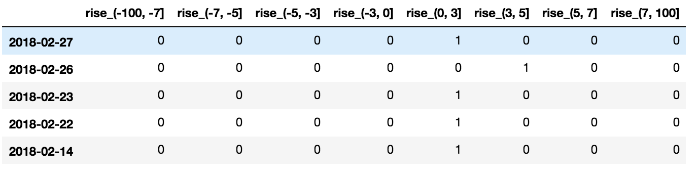

### 股票的涨跌幅离散化

我们对股票每日的"p_change"进行离散化

#### 读取股票的数据

先读取股票的数据，筛选出p_change数据

```python
data = pd.read_csv("./data/stock_day.csv")
p_change= data['p_change']
```

#### 将股票涨跌幅数据进行分组

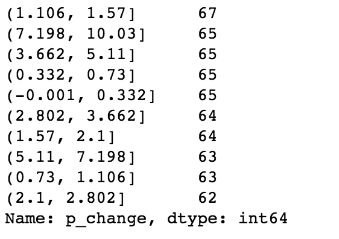

使用的工具：

- pd.qcut(data, bins)：
  - 对数据进行分组将数据分组 一般会与value_counts搭配使用，统计每组的个数
- series.value_counts()：统计分组次数

```python
# 自行分组
qcut = pd.qcut(p_change, 10)
# 计算分到每个组数据个数
qcut.value_counts()
```

自定义区间分组：

- pd.cut(data, bins)

```python
# 自己指定分组区间
bins = [-100, -7, -5, -3, 0, 3, 5, 7, 100]
p_counts = pd.cut(p_change, bins)
```

#### 股票涨跌幅分组数据变成one-hot编码

- **什么是one-hot编码**

把每个类别生成一个布尔列，这些列中只有一列可以为这个样本取值为1.其又被称为热编码。

把下图中左边的表格转化为使用右边形式进行表示：

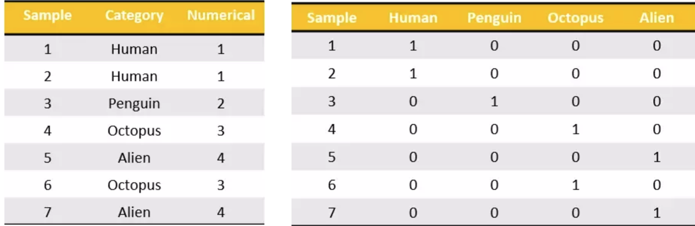

- pandas.get_dummies(*data*, *prefix=None*)
  - data:array-like, Series, or DataFrame
  - prefix:分组名字

```python
# 得出one-hot编码矩阵
dummies = pd.get_dummies(p_counts, prefix="rise")
```


## 高级处理-合并

**如果你的数据由多张表组成，那么有时候需要将不同的内容合并在一起分析**

### pd.concat实现数据合并

- pd.concat([data1, data2], axis=1)
  - 按照行或列进行合并,axis=0为列索引，axis=1为行索引

比如我们将刚才处理好的one-hot编码与原数据合并

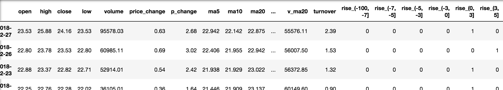

```python
# 按照行索引进行
pd.concat([data, dummies], axis=1)
```

### pd.merge

- pd.merge(left, right, how='inner', on=None, left_on=None, right_on=None)
  - 可以指定按照两组数据的共同键值对合并或者左右各自
  - `left`: A DataFrame object
  - `right`: Another DataFrame object
  - `on`: Columns (names) to join on. Must be found in both the left and right DataFrame objects.
  - left_on=None, right_on=None：指定左右键

| Merge method | SQL Join Name      | Description                               |
| ------------ | ------------------ | ----------------------------------------- |
| `left`       | `LEFT OUTER JOIN`  | Use keys from left frame only             |
| `right`      | `RIGHT OUTER JOIN` | Use keys from right frame only            |
| `outer`      | `FULL OUTER JOIN`  | Use union of keys from both frames        |
| `inner`      | `INNER JOIN`       | Use intersection of keys from both frames |

### pd.merge合并

```
left = pd.DataFrame({'key1': ['K0', 'K0', 'K1', 'K2'],
                        'key2': ['K0', 'K1', 'K0', 'K1'],
                        'A': ['A0', 'A1', 'A2', 'A3'],
                        'B': ['B0', 'B1', 'B2', 'B3']})

right = pd.DataFrame({'key1': ['K0', 'K1', 'K1', 'K2'],
                        'key2': ['K0', 'K0', 'K0', 'K0'],
                        'C': ['C0', 'C1', 'C2', 'C3'],
                        'D': ['D0', 'D1', 'D2', 'D3']})

# 默认内连接
result = pd.merge(left, right, on=['key1', 'key2'])
```

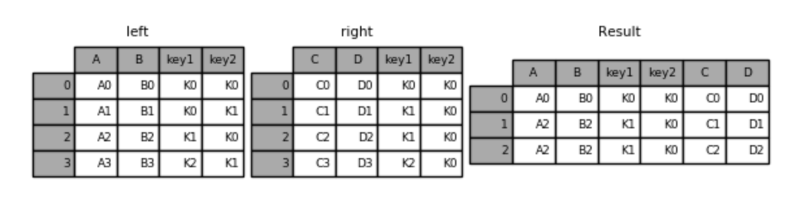

* 左连接

```python
result = pd.merge(left, right, how='left', on=['key1', 'key2'])
```

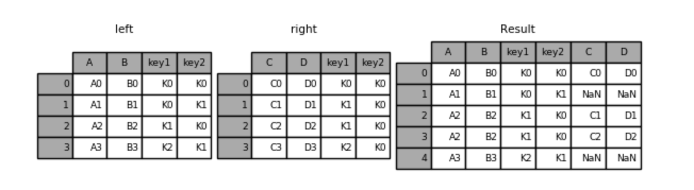

- 右连接

```python
result = pd.merge(left, right, how='right', on=['key1', 'key2'])
```


- 外链接

```python
result = pd.merge(left, right, how='outer', on=['key1', 'key2'])
```


## 高级处理-交叉表与透视表

### 交叉表与透视表什么作用

**探究股票的涨跌与星期几有关？**

**以下图当中表示，week代表星期几，1,0代表这一天股票的涨跌幅是好还是坏，里面的数据代表比例**

**可以理解为所有时间为星期一等等的数据当中涨跌幅好坏的比例**

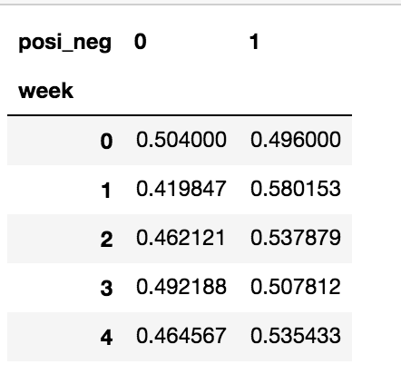


### 使用crosstab(交叉表)实现上图

- 交叉表：

  交叉表用于计算一列数据对于另外一列数据的分组个数(寻找两个列之间的关系)

  - pd.crosstab(value1, value2)
  - DataFrame.pivot_table([], index=[])

### 案例分析

#### 数据准备

- 准备两列数据，星期数据以及涨跌幅是好是坏数据
- 进行交叉表计算

```python
# 寻找星期几跟股票张得的关系
# 1、先把对应的日期找到星期几
date = pd.to_datetime(data.index).weekday
data['week'] = date

# 2、假如把p_change按照大小去分个类0为界限
data['posi_neg'] = np.where(data['p_change'] > 0, 1, 0)

# 通过交叉表找寻两列数据的关系
count = pd.crosstab(data['week'], data['posi_neg'])
```

但是我们看到count只是每个星期日子的好坏天数，并没有得到比例，该怎么去做？

- 对于每个星期一等的总天数求和，运用除法运算求出比例

```python
# 算数运算，先求和
sum = count.sum(axis=1).astype(np.float32)

# 进行相除操作，得出比例
pro = count.div(sum, axis=0)
```

#### 查看效果

使用plot画出这个比例，使用stacked的柱状图

```python
pro.plot(kind='bar', stacked=True)
plt.show()
```

#### 使用pivot_table(透视表)实现

使用透视表，刚才的过程更加简单

```python
# 通过透视表，将整个过程变成更简单一些
data.pivot_table(['posi_neg'], index='week')
```

## 高级处理-分组与聚合

**分组与聚合通常是分析数据的一种方式，通常与一些统计函数一起使用，查看数据的分组情况**

想一想其实刚才的交叉表与透视表也有分组的功能，所以算是分组的一种形式，只不过他们主要是计算次数或者计算比例！！看其中的效果：

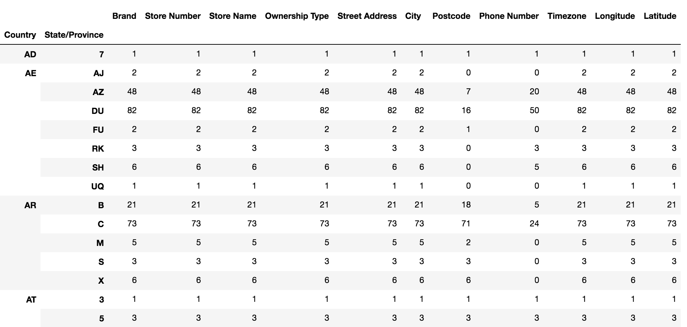

### 什么分组与聚合

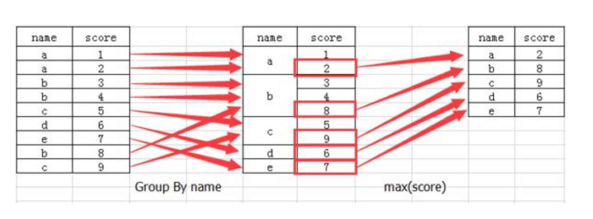

### 分组API

- DataFrame.groupby(key, as_index=False)
  - key:分组的列数据，可以多个
- 案例:不同颜色的不同笔的价格数据

```python
col =pd.DataFrame({'color': ['white','red','green','red','green'], 'object': ['pen','pencil','pencil','ashtray','pen'],'price1':[5.56,4.20,1.30,0.56,2.75],'price2':[4.75,4.12,1.60,0.75,3.15]})

color    object    price1    price2
0    white    pen    5.56    4.75
1    red    pencil    4.20    4.12
2    green    pencil    1.30    1.60
3    red    ashtray    0.56    0.75
4    green    pen    2.75    3.15
```

- 进行分组，对颜色分组，price进行聚合

```python
# 分组，求平均值
col.groupby(['color'])['price1'].mean()
col['price1'].groupby(col['color']).mean()

color
green    2.025
red      2.380
white    5.560
Name: price1, dtype: float64

# 分组，数据的结构不变
col.groupby(['color'], as_index=False)['price1'].mean()

color    price1
0    green    2.025
1    red    2.380
2    white    5.560
```

### 星巴克零售店铺数据

现在我们有一组关于全球星巴克店铺的统计数据，如果我想知道美国的星巴克数量和中国的哪个多，或者我想知道中国每个省份星巴克的数量的情况，那么应该怎么办？

> 数据来源：https://www.kaggle.com/starbucks/store-locations/data

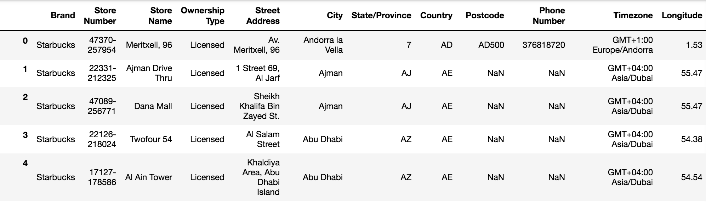

#### 数据获取

从文件中读取星巴克店铺数据

```python
# 导入星巴克店的数据
starbucks = pd.read_csv("./data/starbucks/directory.csv")
```

#### 进行分组聚合

```python
# 按照国家分组，求出每个国家的星巴克零售店数量
count = starbucks.groupby(['Country']).count()
```

**画图显示结果**

```python
count['Brand'].plot(kind='bar', figsize=(20, 8))
plt.show()
```


假设我们加入省市一起进行分组

```python
# 设置多个索引，set_index()
starbucks.groupby(['Country', 'State/Province']).count()
```


**仔细观察这个结构，与我们前面讲的哪个结构类似？？**

与前面的MultiIndex结构类似

## 案例

### 需求

**现在我们有一组从2006年到2016年1000部最流行的电影数据，数据来源：https://www.kaggle.com/damianpanek/sunday-eda/data**

- 问题1：我们想知道这些电影数据中评分的平均分，导演的人数等信息，我们应该怎么获取？
- 问题2：对于这一组电影数据，如果我们想rating，runtime的分布情况，应该如何呈现数据？
- 问题3：对于这一组电影数据，如果我们希望统计电影分类(genre)的情况，应该如何处理数据？

### 实现

首先获取导入包，获取数据

```
%matplotlib inline
import pandas  as pd 
import numpy as np
from matplotlib import pyplot as plt
#文件的路径
path = "./data/IMDB-Movie-Data.csv"
#读取文件
df = pd.read_csv(path)
```

#### 问题一

**我们想知道这些电影数据中评分的平均分，导演的人数等信息，我们应该怎么获取？**

- 得出评分的平均分

使用mean函数

```python
df["Rating"].mean()
```

- 得出导演人数信息

求出唯一值，然后进行形状获取

```python
## 导演的人数
# df["Director"].unique().shape[0]
np.unique(df["Director"]).shape[0]

644
```

#### 问题二

**对于这一组电影数据，如果我们想Rating，Runtime (Minutes)的分布情况，应该如何呈现数据？**

- 直接呈现，以直方图的形式

选择分数列数据，进行plot

```python
df["Rating"].plot(kind='hist',figsize=(20,8))
```

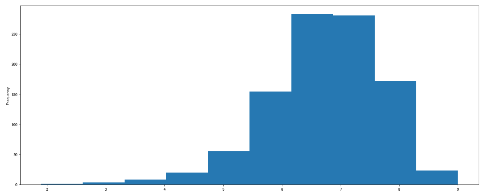

- Rating进行分布展示

进行绘制直方图

```python
plt.figure(figsize=(20,8),dpi=80)
plt.hist(df["Rating"].values,bins=20)
plt.show()
```

修改刻度的间隔

```python
# 求出最大最小值
max_ = df["Rating"].max()
min_ = df["Rating"].min()

# 生成刻度列表
t1 = np.linspace(min_,max_,num=21)

# [ 1.9    2.255  2.61   2.965  3.32   3.675  4.03   4.385  4.74   5.095  5.45   5.805  6.16   6.515  6.87   7.225  7.58   7.935  8.29   8.645  9.   ]

# 修改刻度
plt.xticks(t1)

# 添加网格
plt.grid()
```

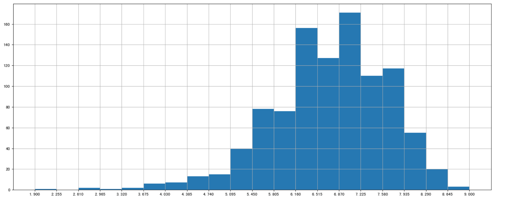

- Runtime (Minutes)进行分布展示

进行绘制直方图

```python
plt.figure(figsize=(20,8),dpi=80)
plt.hist(df["Runtime (Minutes)"].values,bins=20)
plt.show()
```

修改间隔

```python
# 求出最大最小值
max_ = df["Runtime (Minutes)"].max()
min_ = df["Runtime (Minutes)"].min()

# # 生成刻度列表
t1 = np.linspace(min_,max_,num=21)

# 修改刻度
plt.xticks(np.linspace(min_,max_,num=21))

# 添加网格
plt.grid()
```

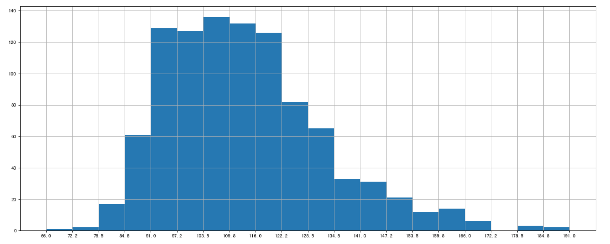

#### 问题三

**对于这一组电影数据，如果我们希望统计电影分类(genre)的情况，应该如何处理数据？**

- 思路分析
  - 思路
    - 1、创建一个全为0的dataframe，列索引置为电影的分类，temp_df
    - 2、遍历每一部电影，temp_df中把分类出现的列的值置为1
    - 3、求和
- 1、创建一个全为0的dataframe，列索引置为电影的分类，temp_df

```python
# 进行字符串分割
temp_list = [i.split(",") for i in df["Genre"]]
# 获取电影的分类
genre_list = np.unique([i for j in temp_list for i in j]) 

# 增加新的列
temp_df = pd.DataFrame(np.zeros([df.shape[0],genre_list.shape[0]]),columns=genre_list)
```

- 2、遍历每一部电影，temp_df中把分类出现的列的值置为1

```python
for i in range(1000):
    #temp_list[i] ['Action','Adventure','Animation']
    temp_df.ix[i,temp_list[i]]=1
print(temp_df.sum().sort_values())
```

- 3、求和,绘图

```python
temp_df.sum().sort_values(ascending=False).plot(kind="bar",figsize=(20,8),fontsize=20,colormap="cool")


Musical        5.0
Western        7.0
War           13.0
Music         16.0
Sport         18.0
History       29.0
Animation     49.0
Family        51.0
Biography     81.0
Fantasy      101.0
Mystery      106.0
Horror       119.0
Sci-Fi       120.0
Romance      141.0
Crime        150.0
Thriller     195.0
Adventure    259.0
Comedy       279.0
Action       303.0
Drama        513.0
dtype: float64
```

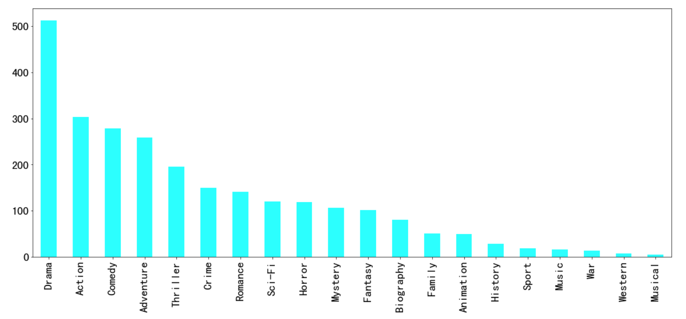

## Pandas中文API

[Pandas API解析](https://www.gairuo.com/p/pandas-overview)